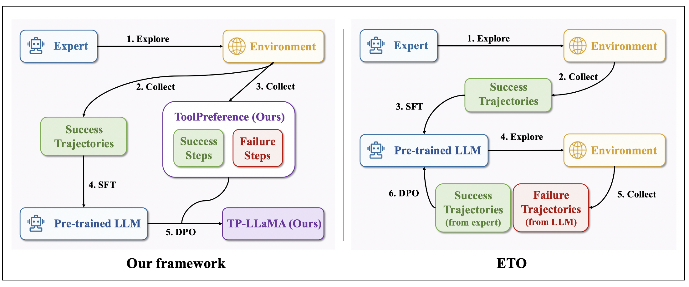
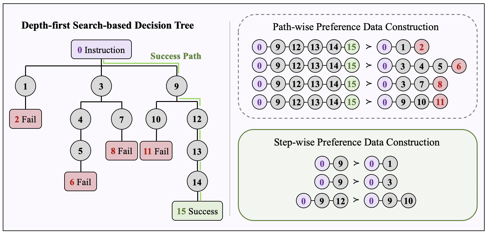

# 提升大型语言模型工具增强能力：从推理树错误中汲取智慧

发布时间：2024年06月11日

`Agent

这篇论文主要讨论了工具增强的大型语言模型（LLMs）如何通过使用API形式的工具来提升其在复杂任务中的推理能力，并将其作为智能代理与现实世界互动。论文中提到的ToolLLaMA模型和TP-LLaMA模型都是为了优化LLM在工具使用推理任务中的表现，通过改进决策树的使用和推理轨迹的优化来提高模型的泛化能力和推理效率。这些内容更符合Agent分类，因为它们关注的是如何使LLM更像一个智能代理，能够有效地使用工具来解决现实世界的问题。` `人工智能` `自动化决策`

> Advancing Tool-Augmented Large Language Models: Integrating Insights from Errors in Inference Trees

# 摘要

> 工具增强的大型语言模型（LLMs）通过API形式的工具提升复杂任务的推理能力，成为与现实世界互动的智能代理。Qin等人在2024年提出的ToolLLaMA模型采用深度优先搜索决策树（DFSDT）方法，利用超过16000个真实世界API，显著提升了规划和推理性能。但该模型仅在训练中使用决策树的成功路径进行监督微调，未充分利用思维树的潜力。为此，我们提出了一种基于决策树偏好数据的推理轨迹优化框架。首先，我们从思维树中提取了之前被忽视的失败探索，构建了名为ToolPreference的逐步偏好数据集。在训练中，我们先用专家轨迹微调LLM，再通过直接偏好优化更新策略，形成了TP-LLaMA模型。实验证明，TP-LLaMA通过从推理错误中学习，在多种测试场景中大幅超越基线，展现出更强的泛化能力和推理效率，尤其适合处理复杂的工具使用推理任务。

> Tool-augmented large language models (LLMs) leverage tools, often in the form of APIs, to enhance their reasoning capabilities on complex tasks, thus taking on the role of intelligent agents interacting with the real world. The recently introduced ToolLLaMA model by Qin et al. [2024] utilizes the depth-first search-based decision tree (DFSDT) method for reasoning with $16000+$ real-world APIs, which effectively improves the planning and inferencing performance of tool-augmented LLMs compared to traditional chain reasoning approaches. However, their approach only employs successful paths from decision trees (also called inference trees) for supervised fine-tuning (SFT) during training, which does not fully exploit the advantages of the tree of thought. In this study, we propose an inference trajectory optimization framework based on the preference data extracted from decision trees to address this limitation. We first introduce a novel method for constructing preference data from the tree of thought, capitalizing on the failed explorations previously overlooked in the trees. Specifically, we generate an effective step-wise preference dataset, named ToolPreference, for tool use based on the ToolBench dataset. In the subsequent training phase, we first fine-tune the LLM with tool-usage expert trajectories and then use these step-wise preference pairs for direct preference optimization (DPO) to update the policy of the LLM, resulting in our ToolPrefer-LLaMA (TP-LLaMA) model. Our experiments demonstrate that by obtaining insights from errors in inference trees, TP-LLaMA significantly outperforms the baselines across almost all test scenarios by a large margin and exhibits better generalization capabilities with unseen APIs. At the same time, TP-LLaMA has also demonstrated superior reasoning efficiency compared to the baselines, making it more suitable for complex tool-usage reasoning tasks.

[Arxiv](https://arxiv.org/abs/2406.07115)