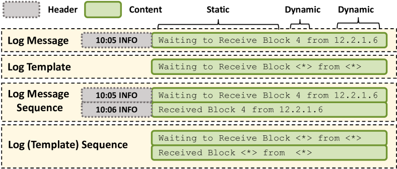
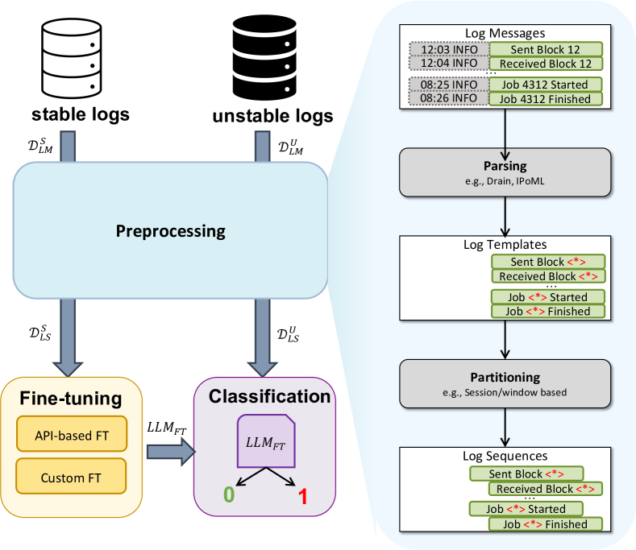
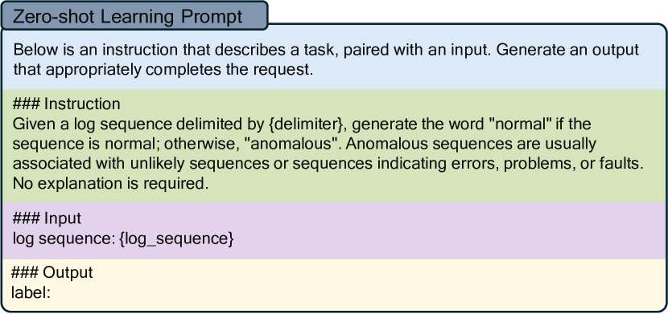
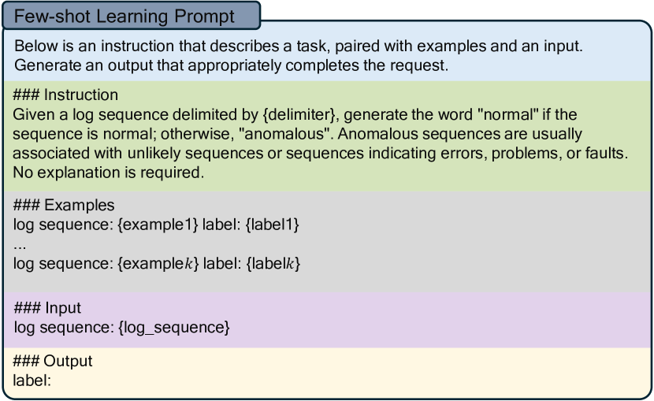

# 利用GPT模型识别不稳定日志中的异常行为

发布时间：2024年06月11日

`LLM应用

这篇论文主要探讨了大型语言模型（LLMs）在软件工程中的应用，特别是在基于日志的异常检测方面的应用。论文通过实验比较了经过精细调整的LLM与其他模型在处理不稳定日志数据时的异常检测能力，并发现LLMs能够更好地理解多样的模式和上下文，从而在数据不足的情况下表现更优。这与LLM应用分类相符，因为它关注的是LLMs在特定应用场景（软件工程中的异常检测）的实际效果和性能比较。` `软件工程` `异常检测`

> Anomaly Detection on Unstable Logs with GPT Models

# 摘要

> 基于日志的异常检测是提高软件密集型系统可靠性的研究热点。然而，软件更新导致日志不稳定，进而影响异常检测等下游分析。面对新版本软件日志数据的不足，检测异常变得尤为困难。大型语言模型（LLMs）在软件工程中的应用已带来革新。本文通过实验比较了精细调整的LLM与其它模型在不稳定日志上的异常检测能力。我们发现，LLMs通过大规模数据预训练，能更好地理解多样模式和上下文，有助于缓解数据不足问题。实验表明，GPT-3在不稳定日志上的表现略优于传统监督方法，且随着日志变化，优势更明显。尽管如此，这种优势的实际意义尚不明确。此外，与提示工程相比，精细调整在稳定和不稳定日志上均展现出更优性能，为LLMs在该领域的应用提供了新视角。

> Log-based anomaly detection has been widely studied in the literature as a way to increase the dependability of software-intensive systems. In reality, logs can be unstable due to changes made to the software during its evolution. This, in turn, degrades the performance of downstream log analysis activities, such as anomaly detection. The critical challenge in detecting anomalies on these unstable logs is the lack of information about the new logs, due to insufficient log data from new software versions. The application of Large Language Models (LLMs) to many software engineering tasks has revolutionized various domains. In this paper, we report on an experimental comparison of a fine-tuned LLM and alternative models for anomaly detection on unstable logs. The main motivation is that the pre-training of LLMs on vast datasets may enable a robust understanding of diverse patterns and contextual information, which can be leveraged to mitigate the data insufficiency issue in the context of software evolution. Our experimental results on the two-version dataset of LOGEVOL-Hadoop show that the fine-tuned LLM (GPT-3) fares slightly better than supervised baselines when evaluated on unstable logs. The difference between GPT-3 and other supervised approaches tends to become more significant as the degree of changes in log sequences increases. However, it is unclear whether the difference is practically significant in all cases. Lastly, our comparison of prompt engineering (with GPT-4) and fine-tuning reveals that the latter provides significantly superior performance on both stable and unstable logs, offering valuable insights into the effective utilization of LLMs in this domain.

[Arxiv](https://arxiv.org/abs/2406.07467)