# 大型语言模型能否胜任统计学家的角色？

发布时间：2024年06月11日

`LLM应用

这篇论文主要关注大型语言模型（LLMs）在统计分析任务中的应用，特别是通过引入一个新的基准StatQA来评估这些模型在处理复杂统计任务的能力。论文通过实验比较了不同LLMs的性能，并分析了它们与人类在处理统计任务时的错误类型差异，提出了结合人类和LLMs的优势以改进性能的可能性。因此，这篇论文更偏向于LLM的应用研究，而不是理论探讨或Agent、RAG相关的研究。` `统计分析` `科学研究`

> Are Large Language Models Good Statisticians?

# 摘要

> 大型语言模型（LLMs）在数学、物理和化学等科学任务中表现出色，但在处理复杂统计任务方面仍有待深入研究。为此，我们推出了StatQA，一个专为评估LLMs在统计分析任务中表现的新基准，包含11,623个定制示例，特别关注假设检验方法。实验表明，即使是最先进的模型如GPT-4o，其最佳性能也仅为64.83%，显示出改进的巨大空间。有趣的是，经过微调的LLMs在性能上显著优于开源模型和基于上下文学习的方法。人类与LLMs的错误类型比较揭示了显著差异：LLMs常犯适用性错误，而人类则容易混淆统计任务。这表明，结合两者的专长可能带来互补优势，值得进一步探索其合作潜力。

> Large Language Models (LLMs) have demonstrated impressive capabilities across a range of scientific tasks including mathematics, physics, and chemistry. Despite their successes, the effectiveness of LLMs in handling complex statistical tasks remains systematically under-explored. To bridge this gap, we introduce StatQA, a new benchmark designed for statistical analysis tasks. StatQA comprises 11,623 examples tailored to evaluate LLMs' proficiency in specialized statistical tasks and their applicability assessment capabilities, particularly for hypothesis testing methods. We systematically experiment with representative LLMs using various prompting strategies and show that even state-of-the-art models such as GPT-4o achieve a best performance of only 64.83%, indicating significant room for improvement. Notably, while open-source LLMs (e.g. LLaMA-3) show limited capability, those fine-tuned ones exhibit marked improvements, outperforming all in-context learning-based methods (e.g. GPT-4o). Moreover, our comparative human experiments highlight a striking contrast in error types between LLMs and humans: LLMs primarily make applicability errors, whereas humans mostly make statistical task confusion errors. This divergence highlights distinct areas of proficiency and deficiency, suggesting that combining LLM and human expertise could lead to complementary strengths, inviting further investigation into their collaborative potential.

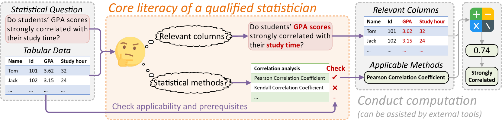

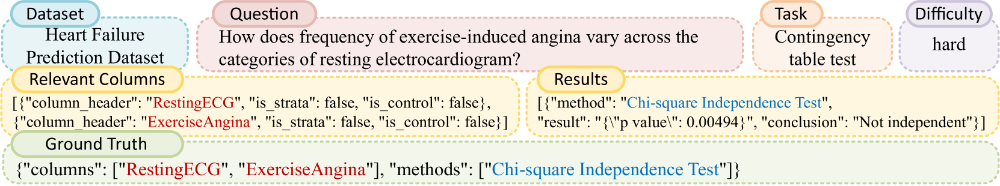

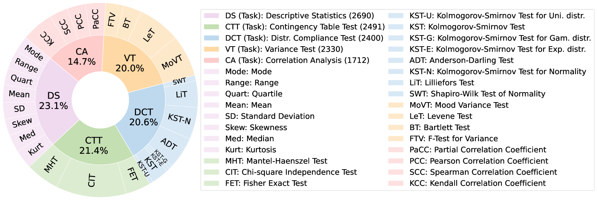

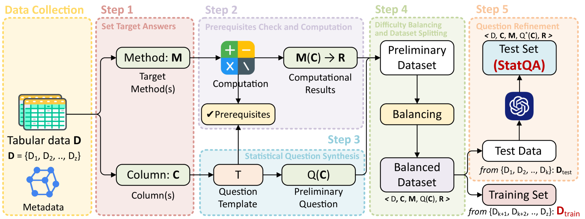

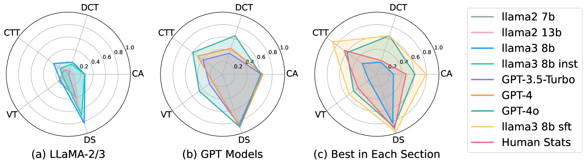

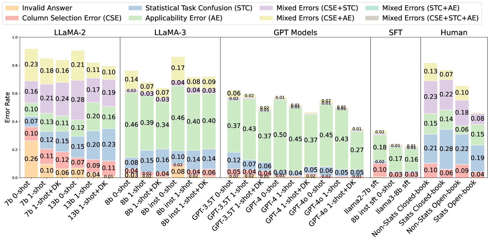

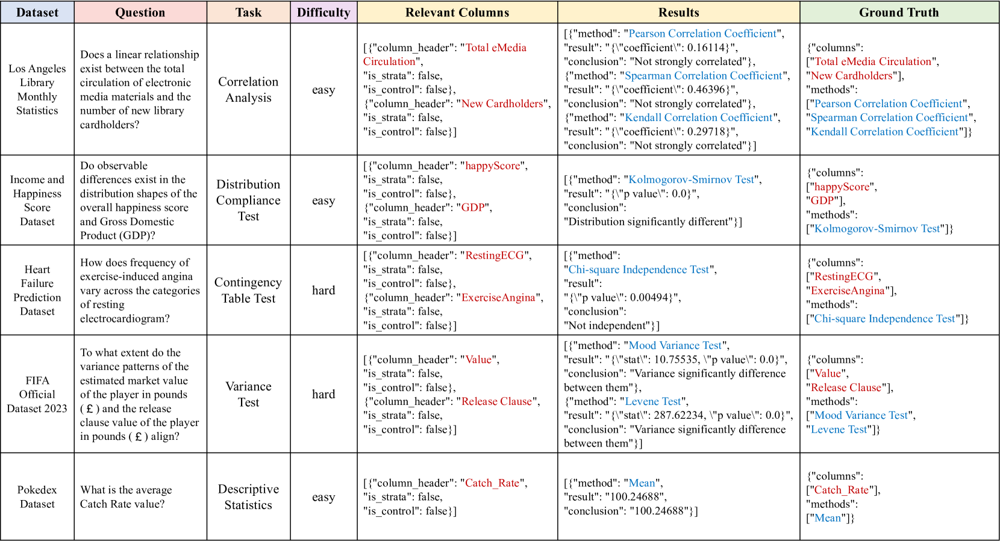

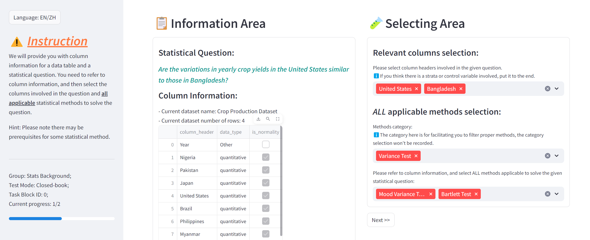

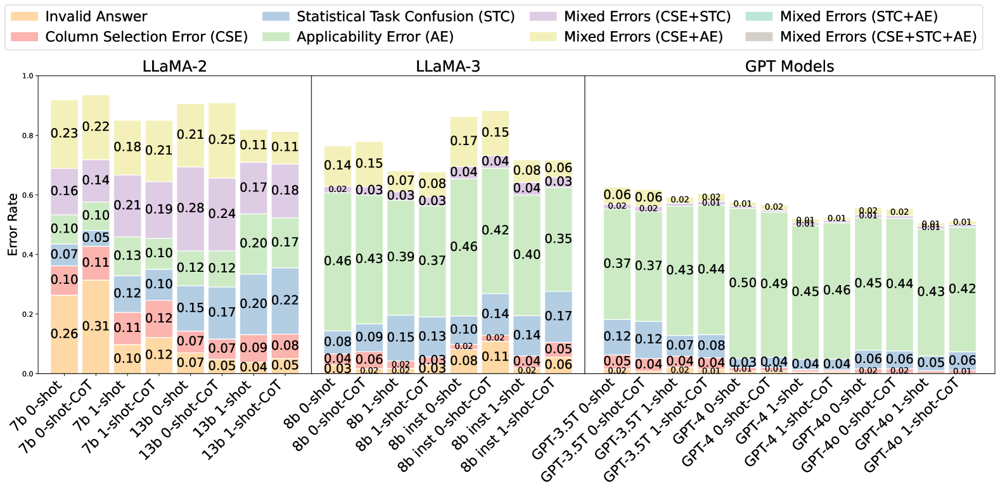

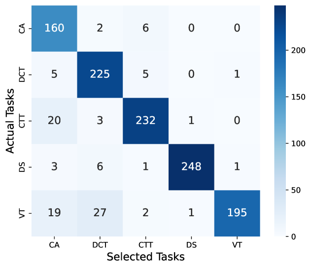

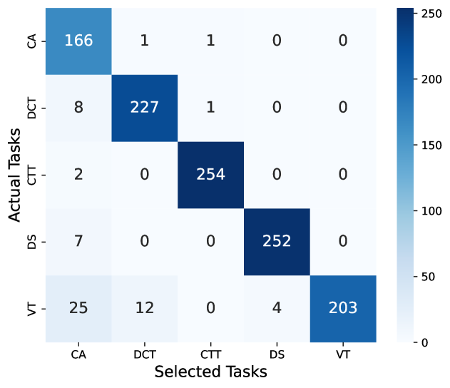

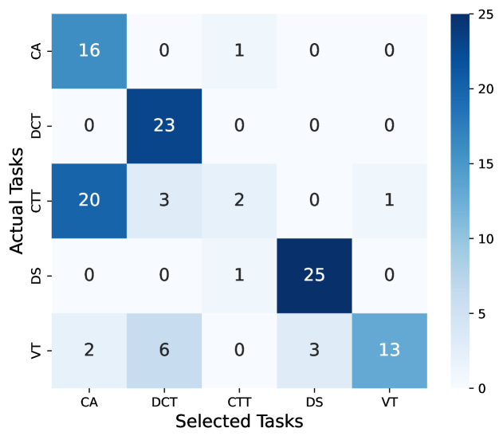

[Arxiv](https://arxiv.org/abs/2406.07815)