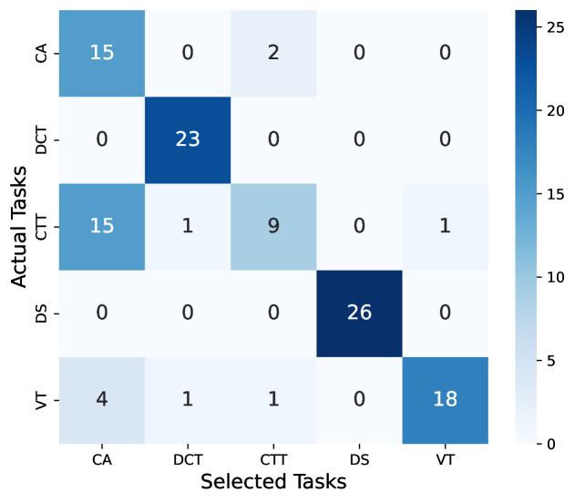

# 大型语言模型能否胜任统计学家的角色？

发布时间：2024年06月11日

`LLM应用

这篇论文关注的是大型语言模型（LLMs）在统计分析任务中的应用，特别是通过创建一个名为StatQA的新基准来评估这些模型在处理复杂统计任务方面的表现。论文中提到了实验结果和与人类表现的对比，强调了LLMs在特定任务上的局限性和改进空间。因此，这篇论文属于“LLM应用”类别，因为它探讨了LLMs在特定领域（统计分析）的实际应用和性能评估。` `统计分析` `科学研究`

> Are Large Language Models Good Statisticians?

# 摘要

> 大型语言模型（LLMs）在数学、物理和化学等科学领域展现了卓越能力，但在处理复杂统计任务方面，其效能尚未得到充分探索。为此，我们推出了StatQA，一个专为评估LLMs在统计分析任务中表现的新基准，包含11,623个定制示例，特别关注假设检验方法。实验表明，即使是最先进的模型如GPT-4o，其最佳表现也仅达64.83%，显示出改进的巨大空间。值得注意的是，经过微调的LLMs在性能上显著超越了开源模型和基于上下文学习的方法。通过对比人类实验，我们发现LLMs和人类在错误类型上存在显著差异：LLMs常犯适用性错误，而人类则易混淆统计任务。这种差异揭示了各自的优势与不足，暗示了结合两者可能带来的互补优势，激发了对它们合作潜力的进一步研究。

> Large Language Models (LLMs) have demonstrated impressive capabilities across a range of scientific tasks including mathematics, physics, and chemistry. Despite their successes, the effectiveness of LLMs in handling complex statistical tasks remains systematically under-explored. To bridge this gap, we introduce StatQA, a new benchmark designed for statistical analysis tasks. StatQA comprises 11,623 examples tailored to evaluate LLMs' proficiency in specialized statistical tasks and their applicability assessment capabilities, particularly for hypothesis testing methods. We systematically experiment with representative LLMs using various prompting strategies and show that even state-of-the-art models such as GPT-4o achieve a best performance of only 64.83%, indicating significant room for improvement. Notably, while open-source LLMs (e.g. LLaMA-3) show limited capability, those fine-tuned ones exhibit marked improvements, outperforming all in-context learning-based methods (e.g. GPT-4o). Moreover, our comparative human experiments highlight a striking contrast in error types between LLMs and humans: LLMs primarily make applicability errors, whereas humans mostly make statistical task confusion errors. This divergence highlights distinct areas of proficiency and deficiency, suggesting that combining LLM and human expertise could lead to complementary strengths, inviting further investigation into their collaborative potential.

[Arxiv](https://arxiv.org/abs/2406.07815)