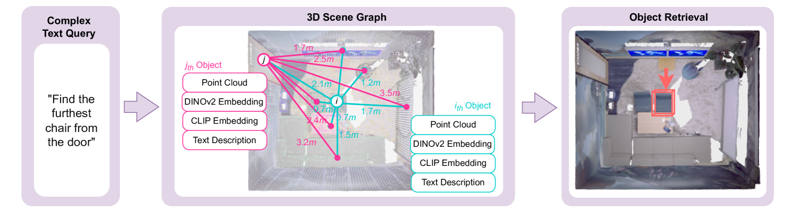
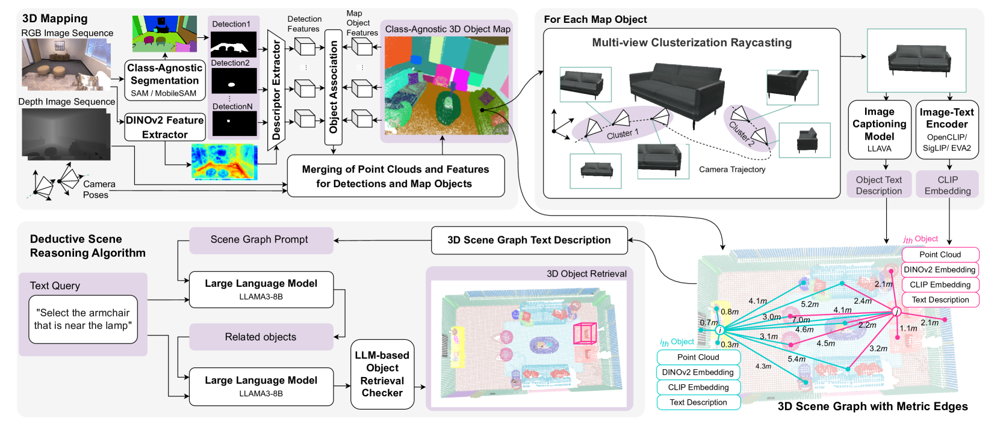
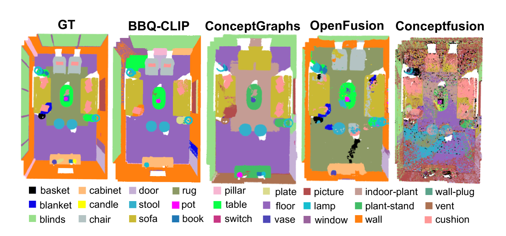
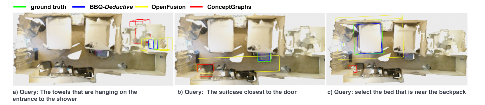
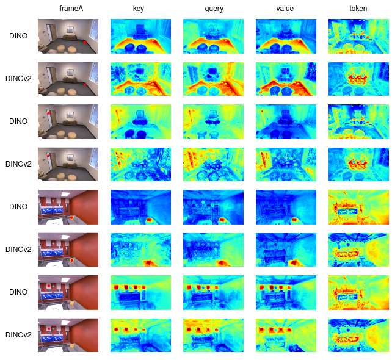
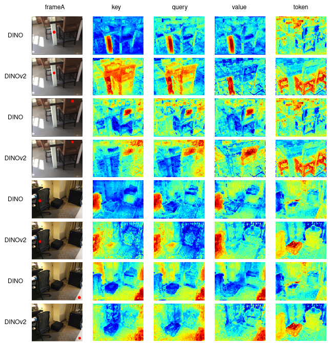
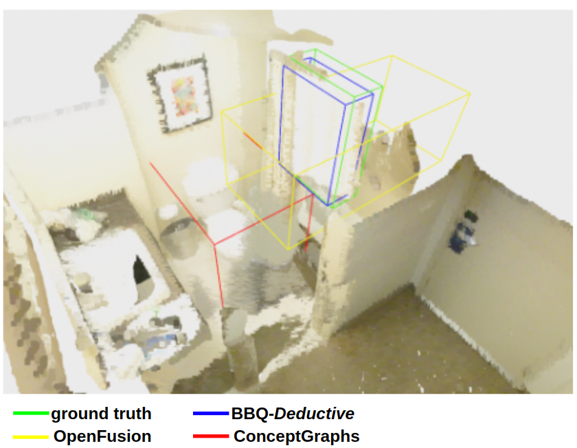
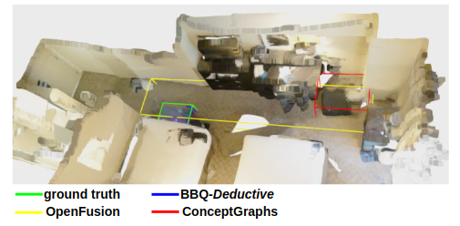
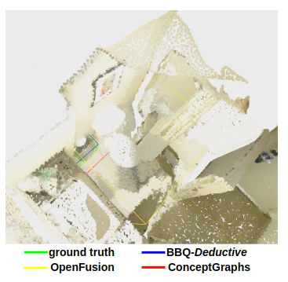

# 超越简单查询：利用3D场景图实现开放词汇下的对象检索

发布时间：2024年06月11日

`Agent

这篇论文介绍了一种名为BBQ的新方法，用于自然语言中的对象定位，这对于自主代理来说是一个挑战。BBQ方法通过构建3D场景空间图，并结合大型语言模型与演绎场景推理，实现了人机交互。这种方法特别适用于需要理解对象关系的模糊描述，并在多个数据集上展示了优于现有方法的性能。由于其重点在于开发一种用于自主代理的先进技术，以提高其在复杂环境中的交互和理解能力，因此该论文应归类于Agent。` `机器人技术` `3D视觉`

> Beyond Bare Queries: Open-Vocabulary Object Retrieval with 3D Scene Graph

# 摘要

> 自然语言中的对象定位对自主代理构成挑战。现有基于CLIP的方法虽能用简单查询检索3D对象，却难以应对需理解对象关系的模糊描述。为此，我们推出了BBQ（超越简单查询）方法，它通过构建3D场景空间图，并结合大型语言模型与演绎场景推理，实现了人机交互。BBQ利用DINO驱动的关联生成3D对象，通过高级射线投射技术将其映射至2D，并借助视觉语言模型将它们定义为图节点。在Replica和ScanNet数据集上，BBQ精准地绘制了以对象为中心的3D地图，并在开放词汇3D语义分割中超越了其他零样本方法。特别是在包含多个同语义实体的场景中，利用空间关系尤为有效。在Sr3D和Nr3D测试中，BBQ通过复杂查询检索对象的能力显著优于其他顶尖方法，且处理速度是同类方法的三倍，使其成为智能机器人项目的理想选择。我们已在linukc.github.io/bbq/公开了代码。

> Locating objects referred to in natural language poses a significant challenge for autonomous agents. Existing CLIP-based open-vocabulary methods successfully perform 3D object retrieval with simple (bare) queries but cannot cope with ambiguous descriptions that demand an understanding of object relations. To tackle this problem, we propose a modular approach called BBQ (Beyond Bare Queries), which constructs 3D scene spatial graph representation with metric edges and utilizes a large language model as a human-to-agent interface through our deductive scene reasoning algorithm. BBQ employs robust DINO-powered associations to form 3D objects, an advanced raycasting algorithm to project them to 2D, and a vision-language model to describe them as graph nodes. On Replica and ScanNet datasets, we show that the designed method accurately constructs 3D object-centric maps. We have demonstrated that their quality takes a leading place for open-vocabulary 3D semantic segmentation against other zero-shot methods. Also, we show that leveraging spatial relations is especially effective for scenes containing multiple entities of the same semantic class. On Sr3D and Nr3D benchmarks, our deductive approach demonstrates a significant improvement, enabling retrieving objects by complex queries compared to other state-of-the-art methods. Considering our design solutions, we achieved a processing speed approximately x3 times faster than the closest analog. This promising performance enables our approach for usage in applied intelligent robotics projects. We make the code publicly available at linukc.github.io/bbq/.

[Arxiv](https://arxiv.org/abs/2406.07113)