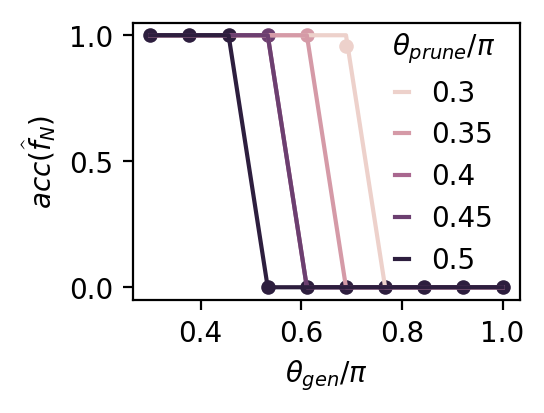
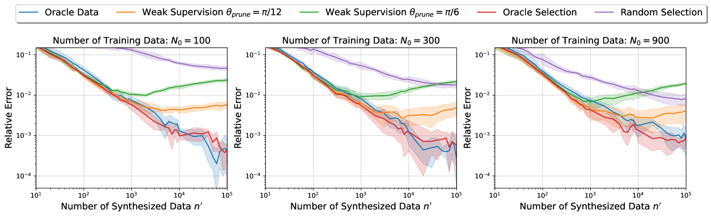
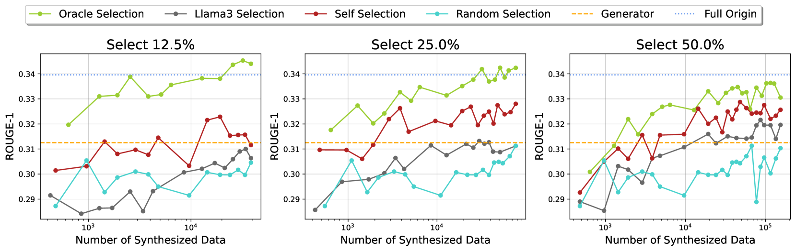
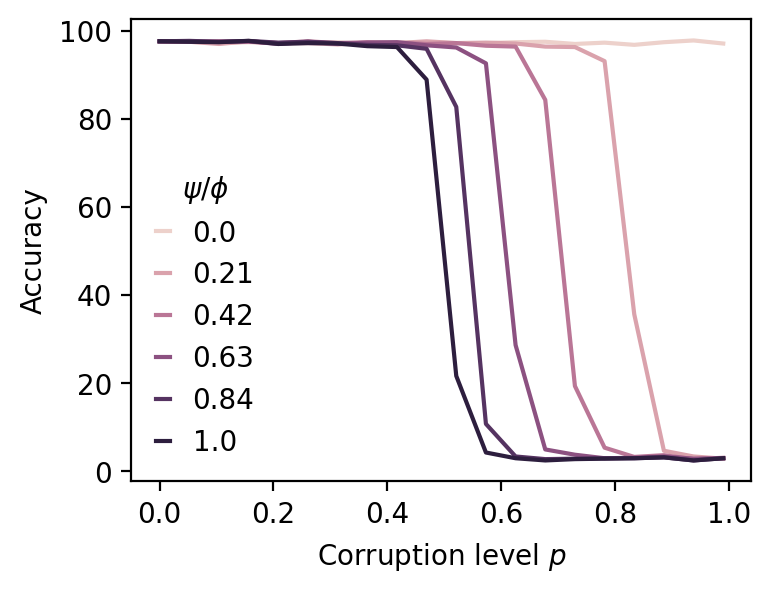
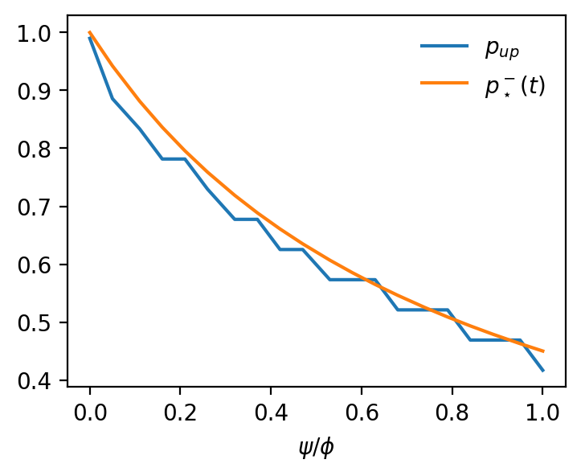

# 超越模型崩溃：在利用合成数据进行规模扩展时，强化策略不可或缺。

发布时间：2024年06月11日

`LLM理论

理由：这篇论文主要探讨了大型语言模型（LLM）在合成数据上微调时可能遇到的模型崩溃问题，并提出了通过反馈增强的合成数据训练来避免这一问题的方法。论文进行了理论分析，并通过实例展示了理论预测的实际应用。这些内容更偏向于LLM的理论研究和方法论探讨，而不是具体的应用、Agent行为或RAG（检索增强生成）技术。因此，将其归类为LLM理论是合适的。` `机器学习`

> Beyond Model Collapse: Scaling Up with Synthesized Data Requires Reinforcement

# 摘要

> 生成模型合成的数据正成为精细调整大型语言模型的新选择，但这也带来了模型崩溃的风险——即模型在合成数据上微调后性能下降。鉴于区分好坏示例比创造高质量样本更为简单，我们探讨了如何通过合成数据的反馈来避免模型崩溃。我们理论分析了在反馈增强的合成数据训练下，高斯混合分类模型如何达到最优性能，并进行了有限情况下的模拟验证。通过变压器计算矩阵特征值和大型语言模型进行新闻摘要这两个实例，我们展示了理论预测的实际应用，这两个任务在模型生成的数据训练时均遭遇了模型崩溃。实验表明，通过反馈增强的合成数据训练，无论是剔除错误预测还是精选多个猜测中的最佳，都能有效防止模型崩溃，从而证实了RLHF等方法的实用性。

> Synthesized data from generative models is increasingly considered as an alternative to human-annotated data for fine-tuning Large Language Models. This raises concerns about model collapse: a drop in performance of models fine-tuned on generated data. Considering that it is easier for both humans and machines to tell between good and bad examples than to generate high-quality samples, we investigate the use of feedback on synthesized data to prevent model collapse. We derive theoretical conditions under which a Gaussian mixture classification model can achieve asymptotically optimal performance when trained on feedback-augmented synthesized data, and provide supporting simulations for finite regimes. We illustrate our theoretical predictions on two practical problems: computing matrix eigenvalues with transformers and news summarization with large language models, which both undergo model collapse when trained on model-generated data. We show that training from feedback-augmented synthesized data, either by pruning incorrect predictions or by selecting the best of several guesses, can prevent model collapse, validating popular approaches like RLHF.

[Arxiv](https://arxiv.org/abs/2406.07515)