# CAAP：利用上下文感知动作规划提示，仅通过前端UI解决计算机任务

发布时间：2024年06月11日

`Agent

这篇论文主要介绍了一种基于大型语言模型（LLM）的代理，该代理能够通过截图识别环境，并运用情境学习减少对大量演示数据的依赖。它采用了一种情境感知行动规划（CAAP）策略，使代理能够从多角度细致分析情境，并在多种任务上取得了高成功率。这种方法特别适用于需要跨应用协调的任务，展示了自动化代理技术的重大进步。因此，这篇论文应归类于Agent分类，因为它主要关注的是开发和应用一种新型的自动化代理技术。` `自动化` `软件开发`

> CAAP: Context-Aware Action Planning Prompting to Solve Computer Tasks with Front-End UI Only

# 摘要

> 软件机器人已在RPA中广泛用于自动化重复性计算机任务。随着具备高级推理能力的LLMs的兴起，这些代理现在能够处理更为复杂甚至全新的任务。但现有基于LLM的自动化技术多依赖HTML源码，限制了其在网络环境之外的应用，且HTML信息常不准确或不完整，降低了代理的实用性。我们开发了一种基于LLM的代理，它仅通过截图识别环境，并运用情境学习减少对大量演示数据的依赖。我们的情境感知行动规划（CAAP）策略促使代理从多角度细致分析情境。通过此方法，我们在67种MiniWoB++问题上的成功率达到94.4%，每种问题仅需1.48个演示。此方法尤其适用于需要跨应用协调的任务，展现了自动化代理技术的重大进步。相关代码和模型已公开于https://github.com/caap-agent/caap-agent。

> Software robots have long been deployed in Robotic Process Automation (RPA) to automate mundane and repetitive computer tasks. The advent of Large Language Models (LLMs) with advanced reasoning capabilities has set the stage for these agents to now undertake more complex and even previously unseen tasks. However, the LLM-based automation techniques in recent literature frequently rely on HTML source codes for input, limiting their application to web environments. Moreover, the information contained in HTML codes is often inaccurate or incomplete, making the agent less reliable for practical applications. We propose an LLM-based agent that functions solely on the basis of screenshots for recognizing environments, while leveraging in-context learning to eliminate the need for collecting large datasets of human demonstration. Our strategy, named Context-Aware Action Planning (CAAP) prompting encourages the agent to meticulously review the context in various angles. Through our proposed methodology, we achieve a success rate of 94.4% on 67~types of MiniWoB++ problems, utilizing only 1.48~demonstrations per problem type. Our method offers the potential for broader applications, especially for tasks that require inter-application coordination on computers or smartphones, showcasing a significant advancement in the field of automation agents. Codes and models are accessible at https://github.com/caap-agent/caap-agent.

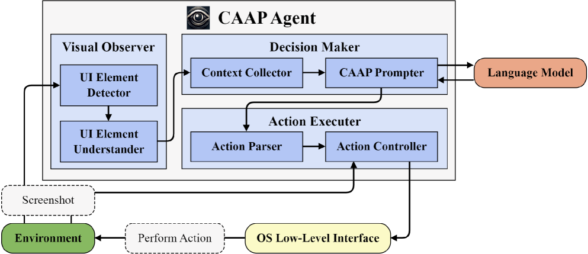

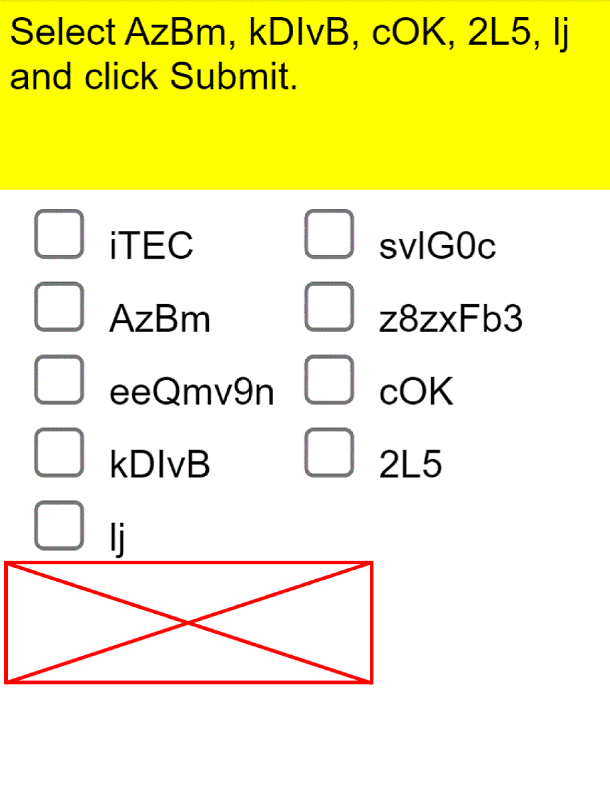

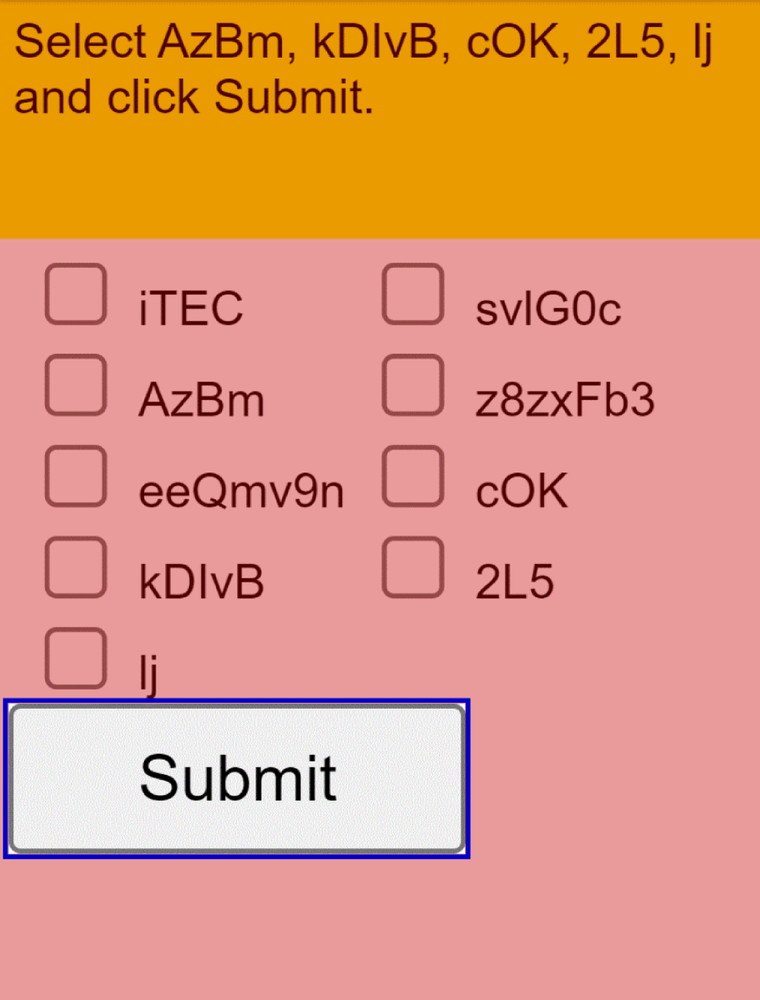

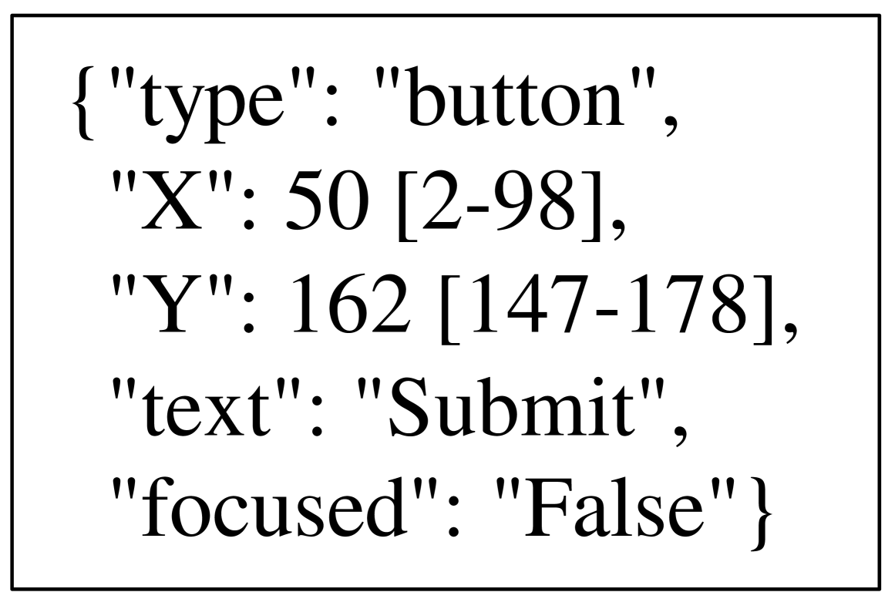

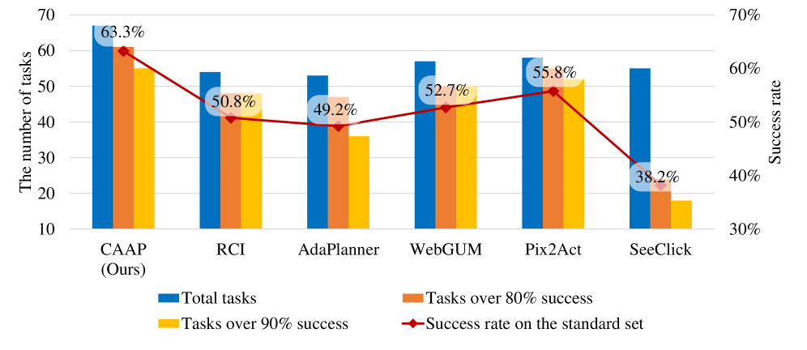

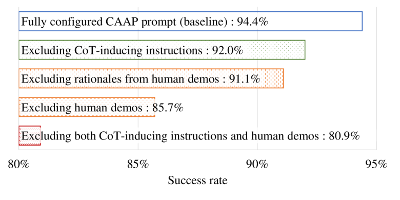

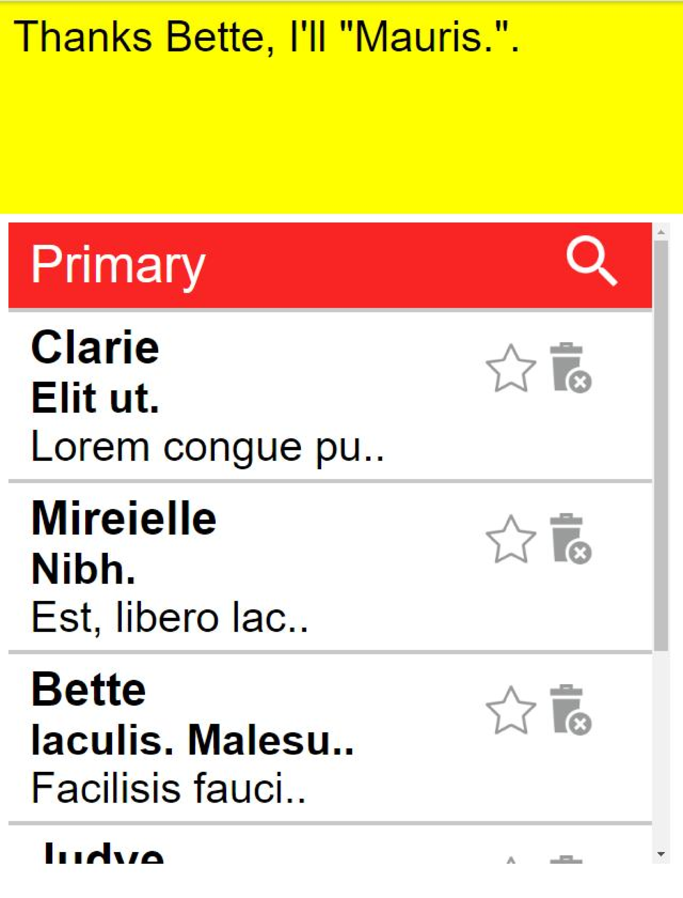

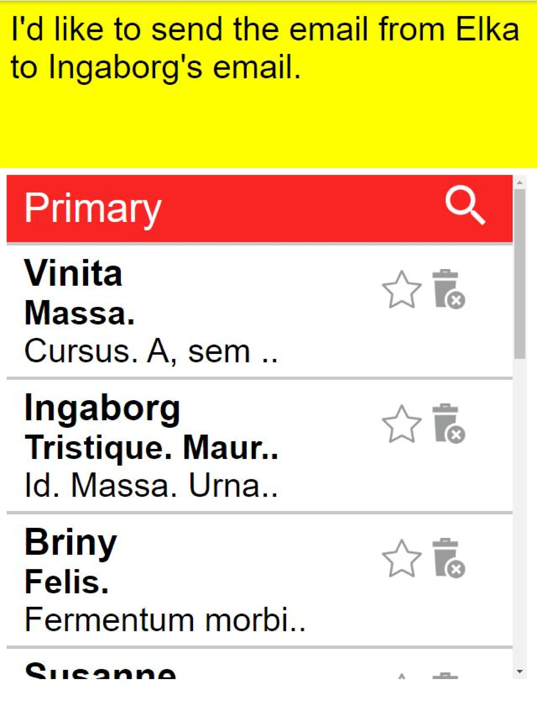

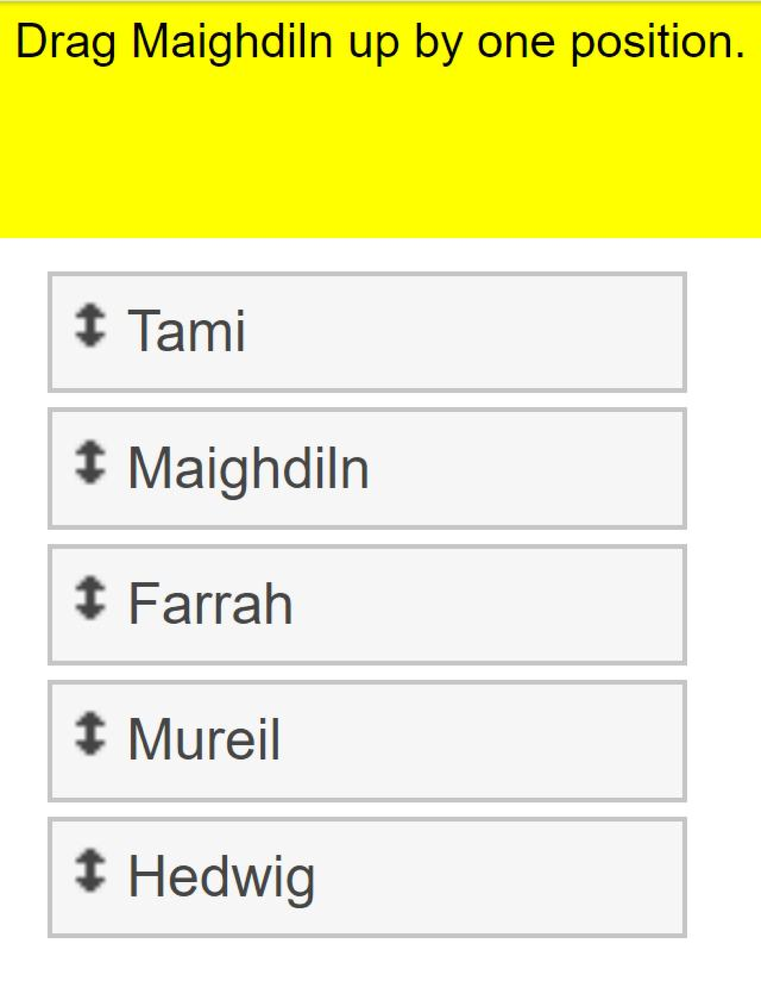

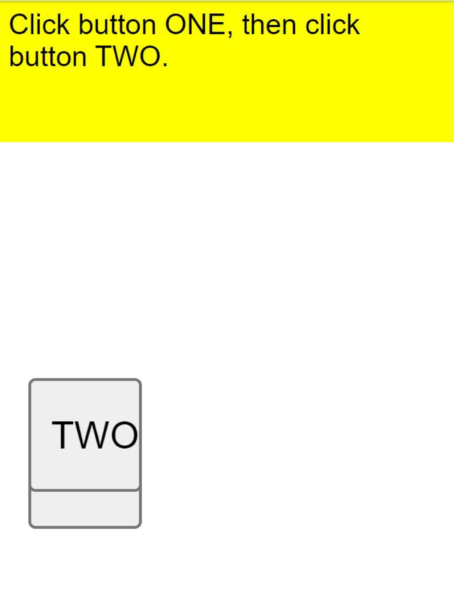

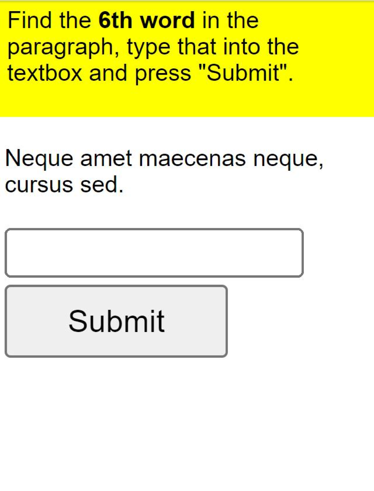

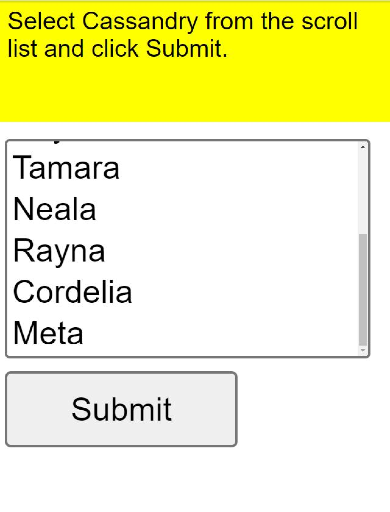

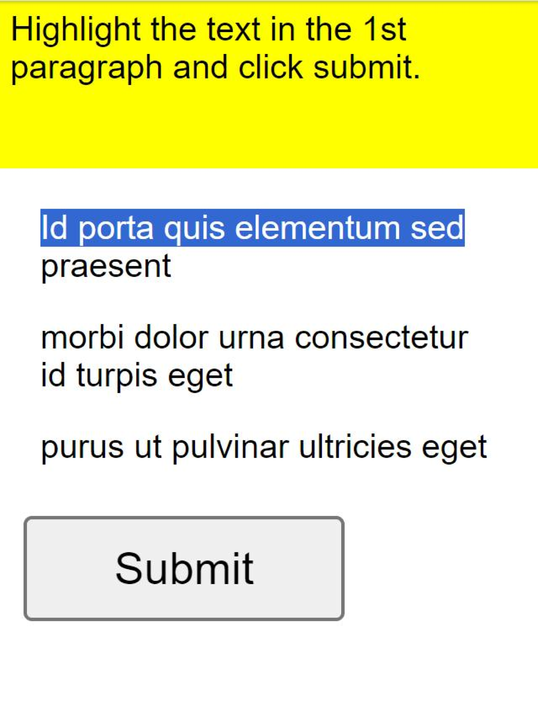

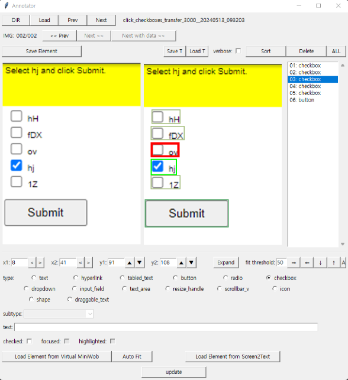

[Arxiv](https://arxiv.org/abs/2406.06947)