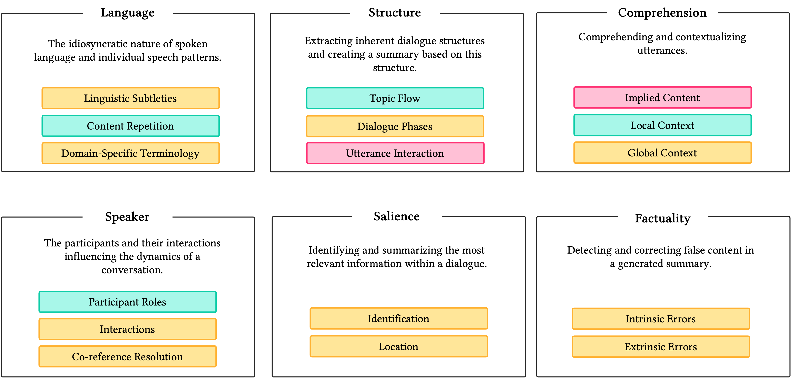
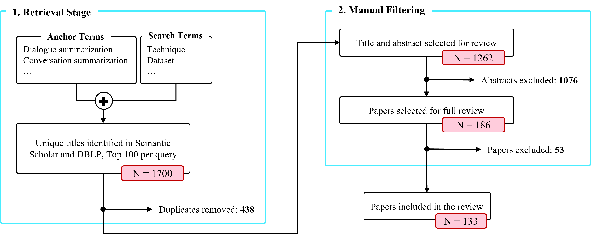
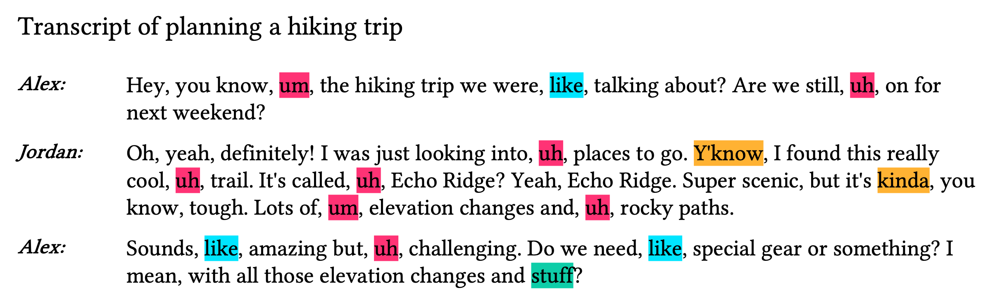
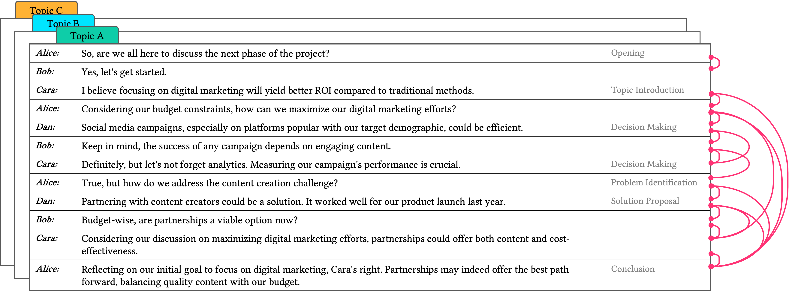
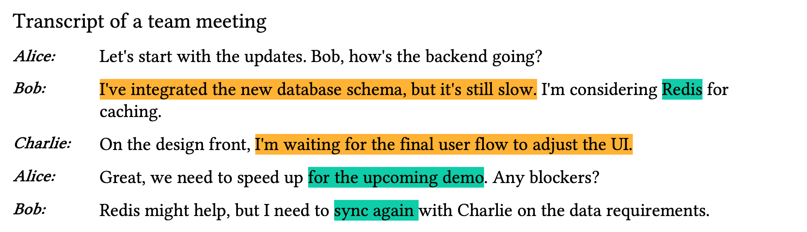
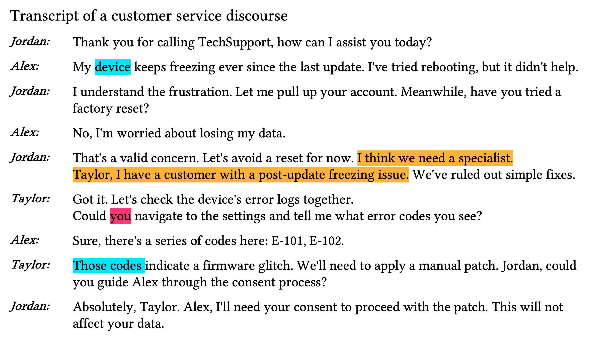
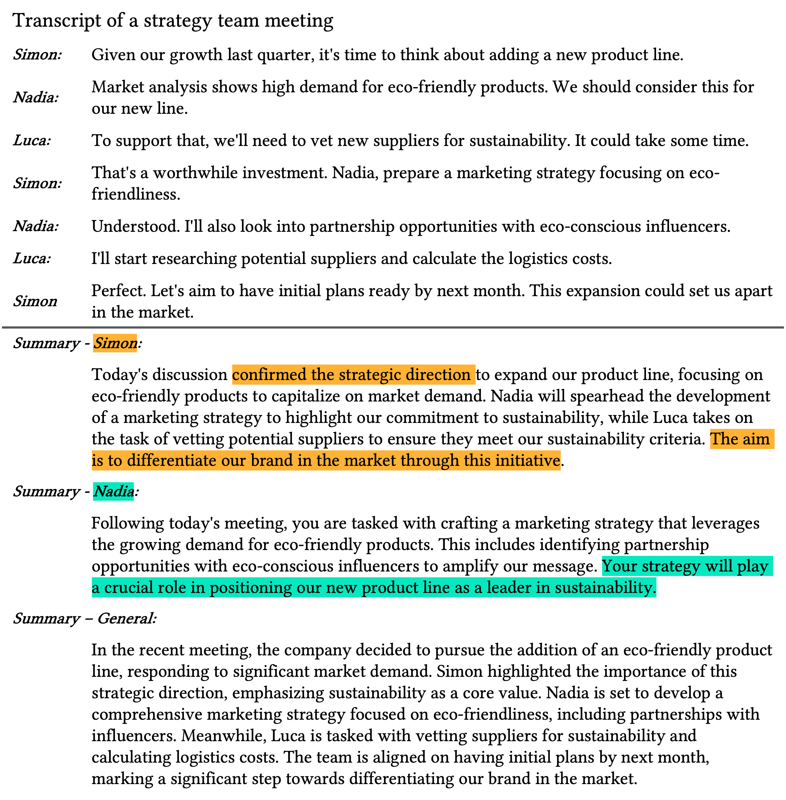
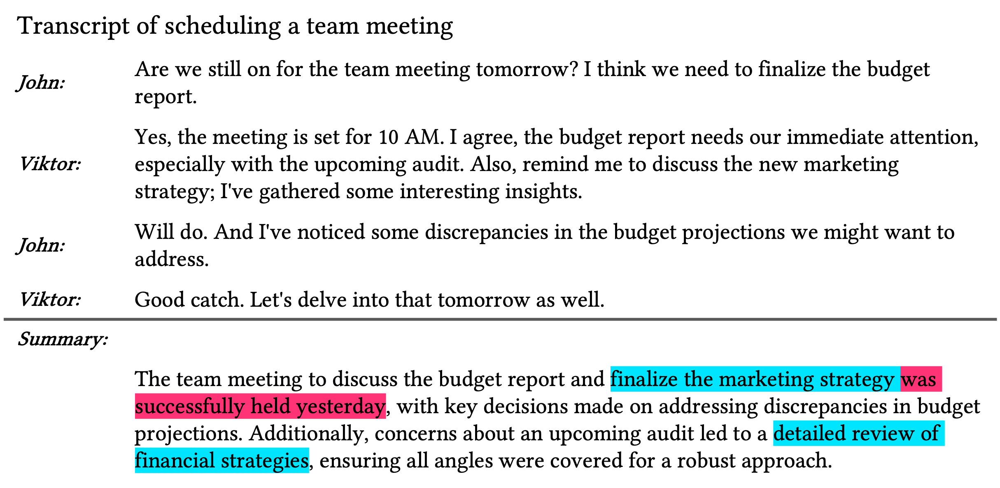

# CADS：抽象对话摘要挑战的系统性文献综述

发布时间：2024年06月11日

`LLM应用

这篇论文主要关注的是对话摘要这一特定应用场景，并系统回顾了基于Transformer的英文对话摘要的研究进展。它探讨了对话摘要面临的挑战、相关技术、数据集和评估指标，并指出了大型语言模型可能带来的影响。虽然论文中提到了大型语言模型（LLM），但其核心内容是关于LLM在对话摘要任务中的应用，而不是LLM的理论研究或Agent的设计与实现，也不是关于检索增强生成（RAG）的具体讨论。因此，将其归类为LLM应用是最为合适的。` `对话摘要`

> CADS: A Systematic Literature Review on the Challenges of Abstractive Dialogue Summarization

# 摘要

> 摘要式对话摘要旨在将对话精炼为信息丰富且简洁的摘要。尽管已有综述，但全面阐述对话摘要挑战、统一任务理解、并使技术、数据集与评估指标与挑战对齐的工作仍显不足。本文系统回顾了2019至2024年间基于Transformer的英文对话摘要的1262篇研究，揭示了对话摘要的六大挑战（语言、结构、理解、说话者、显著性与事实性），并探讨了与之对应的技术（如图基方法、附加训练任务与规划策略），这些技术多依赖于BART编码器-解码器模型。我们发现，尽管语言等挑战因训练方法进步、但理解、事实性与显著性等难题依旧，蕴含着研究机遇。文章还探讨了评估方法，涵盖了对话子领域的数据集及自动与人工评估方式，指出ROUGE是最常用指标，而人工评估细节不足。最后，我们讨论了大型语言模型的新探索可能带来的影响，并强调尽管挑战的难度与相关性可能变化，我们的挑战分类法依旧适用。

> Abstractive dialogue summarization is the task of distilling conversations into informative and concise summaries. Although reviews have been conducted on this topic, there is a lack of comprehensive work detailing the challenges of dialogue summarization, unifying the differing understanding of the task, and aligning proposed techniques, datasets, and evaluation metrics with the challenges. This article summarizes the research on Transformer-based abstractive summarization for English dialogues by systematically reviewing 1262 unique research papers published between 2019 and 2024, relying on the Semantic Scholar and DBLP databases. We cover the main challenges present in dialog summarization (i.e., language, structure, comprehension, speaker, salience, and factuality) and link them to corresponding techniques such as graph-based approaches, additional training tasks, and planning strategies, which typically overly rely on BART-based encoder-decoder models. We find that while some challenges, like language, have seen considerable progress, mainly due to training methods, others, such as comprehension, factuality, and salience, remain difficult and hold significant research opportunities. We investigate how these approaches are typically assessed, covering the datasets for the subdomains of dialogue (e.g., meeting, medical), the established automatic metrics and human evaluation approaches for assessing scores and annotator agreement. We observe that only a few datasets span across all subdomains. The ROUGE metric is the most used, while human evaluation is frequently reported without sufficient detail on inner-annotator agreement and annotation guidelines. Additionally, we discuss the possible implications of the recently explored large language models and conclude that despite a potential shift in relevance and difficulty, our described challenge taxonomy remains relevant.

[Arxiv](https://arxiv.org/abs/2406.07494)