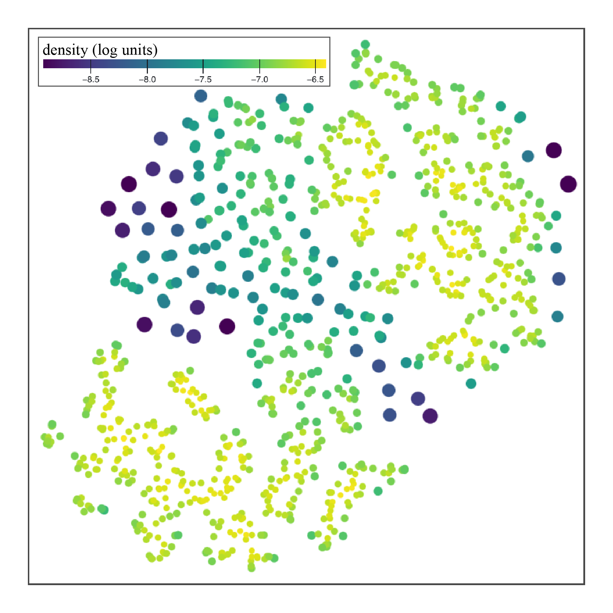

# CUPID：理解基于提示的图像分布的上下文环境

发布时间：2024年06月11日

`LLM应用

理由：这篇论文介绍了一个名为CUPID的可视化工具，该工具用于分析和理解文本到图像生成模型如何根据自然语言描述生成图像分布。这涉及到对大型语言模型（LLM）的应用，特别是在理解和可视化模型如何处理和生成图像内容方面。CUPID工具通过分析对象及其关系，揭示了生成图像分布的内在结构，这是对LLM在图像生成领域应用的深入探讨。因此，这篇论文属于LLM应用类别。` `图像生成`

> CUPID: Contextual Understanding of Prompt-conditioned Image Distributions

# 摘要

> 我们介绍了一种名为CUPID的可视化工具，它帮助我们深入理解现代文本到图像生成模型如何根据用户通过自然语言描述的场景生成图像分布。CUPID通过分析提示中的对象、新合成的未明确提及的对象及其关系，揭示了这些分布的内在结构。其核心技术是一种将高维对象嵌入映射到低维空间的新方法，这使得我们能够识别分布中对象的显著风格和异常风格。此外，通过条件密度嵌入，CUPID还能揭示对象间的依赖关系。我们利用CUPID分析了大规模扩散模型生成的图像分布，不仅揭示了模型对语言理解的局限和对象组合的偏见，还提供了一个探索典型与罕见合成场景的窗口。

> We present CUPID: a visualization method for the contextual understanding of prompt-conditioned image distributions. CUPID targets the visual analysis of distributions produced by modern text-to-image generative models, wherein a user can specify a scene via natural language, and the model generates a set of images, each intended to satisfy the user's description. CUPID is designed to help understand the resulting distribution, using contextual cues to facilitate analysis: objects mentioned in the prompt, novel, synthesized objects not explicitly mentioned, and their potential relationships. Central to CUPID is a novel method for visualizing high-dimensional distributions, wherein contextualized embeddings of objects, those found within images, are mapped to a low-dimensional space via density-based embeddings. We show how such embeddings allows one to discover salient styles of objects within a distribution, as well as identify anomalous, or rare, object styles. Moreover, we introduce conditional density embeddings, whereby conditioning on a given object allows one to compare object dependencies within the distribution. We employ CUPID for analyzing image distributions produced by large-scale diffusion models, where our experimental results offer insights on language misunderstanding from such models and biases in object composition, while also providing an interface for discovery of typical, or rare, synthesized scenes.

[Arxiv](https://arxiv.org/abs/2406.07699)