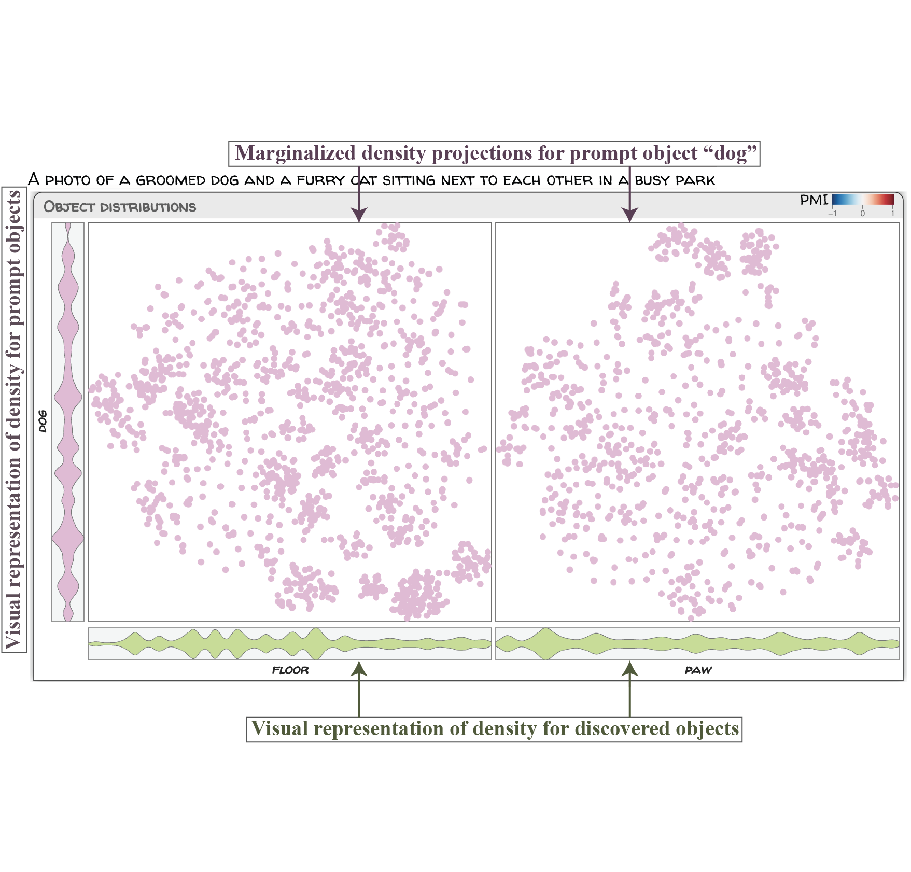

# CUPID：理解提示条件下图像分布的上下文

发布时间：2024年06月11日

`RAG

理由：这篇论文介绍了一种名为CUPID的可视化工具，用于分析文本到图像生成模型中的上下文图像分布。它通过将高维对象嵌入映射到低维空间来揭示对象风格的显著特征和异常模式，并探索对象间的依赖关系。这种方法和工具的开发与RAG（Retrieval-Augmented Generation）框架中的技术相似，后者也涉及对生成模型中的信息进行分析和可视化，以提高生成内容的质量和理解模型的行为。因此，这篇论文更适合归类于RAG。` `可视化分析` `图像生成`

> CUPID: Contextual Understanding of Prompt-conditioned Image Distributions

# 摘要

> 我们介绍了CUPID，一种新颖的可视化工具，用于解析现代文本到图像生成模型中的上下文图像分布。用户通过自然语言描述场景，模型则生成一系列图像以匹配描述。CUPID通过分析提示中的对象、隐含的新对象及其关系，帮助我们洞察这些分布。其核心技术是将高维对象嵌入映射到低维空间，揭示对象风格的显著特征和异常模式。我们还开发了条件密度嵌入，以探索对象间的依赖关系。通过CUPID，我们分析了大型扩散模型生成的图像，揭示了模型对语言的误解和对象组合的偏见，并提供了一个探索典型与罕见合成场景的平台。

> We present CUPID: a visualization method for the contextual understanding of prompt-conditioned image distributions. CUPID targets the visual analysis of distributions produced by modern text-to-image generative models, wherein a user can specify a scene via natural language, and the model generates a set of images, each intended to satisfy the user's description. CUPID is designed to help understand the resulting distribution, using contextual cues to facilitate analysis: objects mentioned in the prompt, novel, synthesized objects not explicitly mentioned, and their potential relationships. Central to CUPID is a novel method for visualizing high-dimensional distributions, wherein contextualized embeddings of objects, those found within images, are mapped to a low-dimensional space via density-based embeddings. We show how such embeddings allows one to discover salient styles of objects within a distribution, as well as identify anomalous, or rare, object styles. Moreover, we introduce conditional density embeddings, whereby conditioning on a given object allows one to compare object dependencies within the distribution. We employ CUPID for analyzing image distributions produced by large-scale diffusion models, where our experimental results offer insights on language misunderstanding from such models and biases in object composition, while also providing an interface for discovery of typical, or rare, synthesized scenes.

[Arxiv](https://arxiv.org/abs/2406.07699)