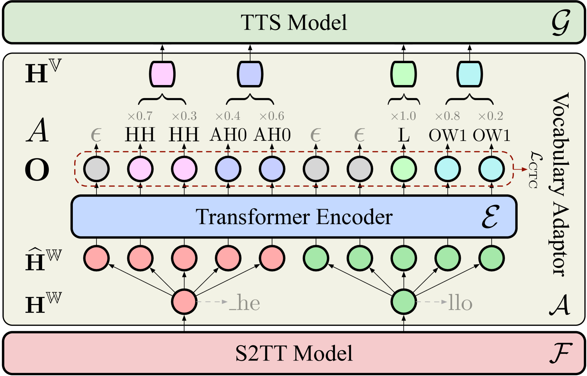
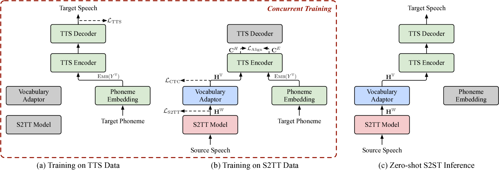
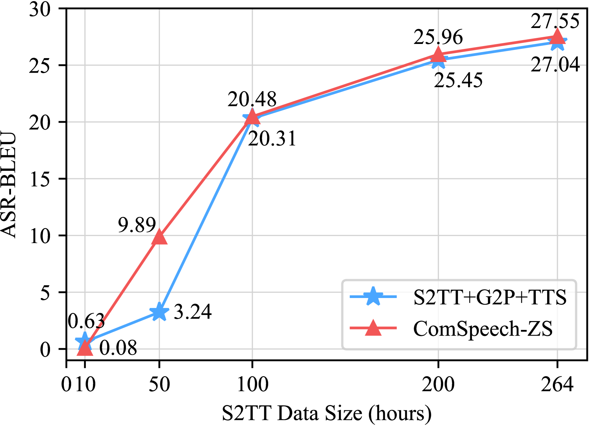
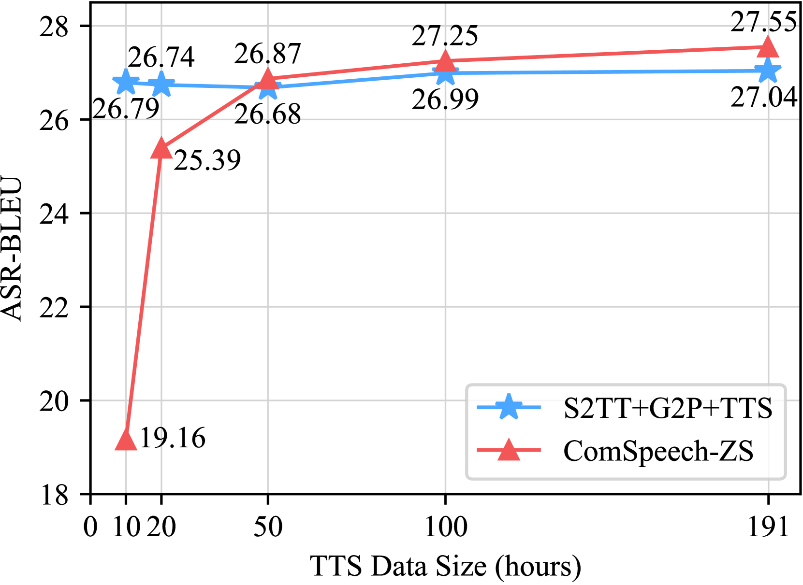

# 是否可能实现无需平行语音数据的高质量直接语音到语音翻译？

发布时间：2024年06月11日

`LLM应用

理由：这篇论文主要讨论了一种名为ComSpeech的复合模型，它整合了预训练的语音到文本（S2TT）和文本到语音（TTS）模型，以实现直接的语音到语音翻译（S2ST）。这种方法利用了现有的资源和预训练模型，减少了对于平行语音数据的依赖，并通过对比学习在潜在空间中对齐表示，实现了零-shot的语音到语音翻译。这个研究关注的是大型语言模型（LLM）在实际应用中的使用，特别是在语音处理领域的创新应用，因此属于LLM应用类别。` `语音翻译` `语音合成`

> Can We Achieve High-quality Direct Speech-to-Speech Translation without Parallel Speech Data?

# 摘要

> 最近提出的两步直接语音到语音翻译模型，通过端到端的方式将任务分解为语音到文本和文本到语音，取得了显著成效。但这些模型的训练仍依赖难以获取的平行语音数据。与此不同，语音到文本和文本到语音领域已积累了大量资源和预训练模型，这些资源在S2ST的发展中尚未得到充分利用。为此，本文提出了一种名为ComSpeech的复合模型，它能无缝整合预训练的S2TT和TTS模型，实现直接的S2ST。为了摆脱对平行语音数据的依赖，我们开发了ComSpeech-ZS训练方法，仅使用S2TT和TTS数据，通过对比学习在潜在空间中对齐表示，使TTS数据中学到的语音合成能力能够零-shot推广到S2ST。实验表明，当有平行语音数据时，ComSpeech在翻译质量和速度上优于其他模型；无平行语音数据时，ComSpeech-ZS虽稍逊于\name，但仍超越了级联模型。

> Recently proposed two-pass direct speech-to-speech translation (S2ST) models decompose the task into speech-to-text translation (S2TT) and text-to-speech (TTS) within an end-to-end model, yielding promising results. However, the training of these models still relies on parallel speech data, which is extremely challenging to collect. In contrast, S2TT and TTS have accumulated a large amount of data and pretrained models, which have not been fully utilized in the development of S2ST models. Inspired by this, in this paper, we first introduce a composite S2ST model named ComSpeech, which can seamlessly integrate any pretrained S2TT and TTS models into a direct S2ST model. Furthermore, to eliminate the reliance on parallel speech data, we propose a novel training method ComSpeech-ZS that solely utilizes S2TT and TTS data. It aligns representations in the latent space through contrastive learning, enabling the speech synthesis capability learned from the TTS data to generalize to S2ST in a zero-shot manner. Experimental results on the CVSS dataset show that when the parallel speech data is available, ComSpeech surpasses previous two-pass models like UnitY and Translatotron 2 in both translation quality and decoding speed. When there is no parallel speech data, ComSpeech-ZS lags behind \name by only 0.7 ASR-BLEU and outperforms the cascaded models.

[Arxiv](https://arxiv.org/abs/2406.07289)