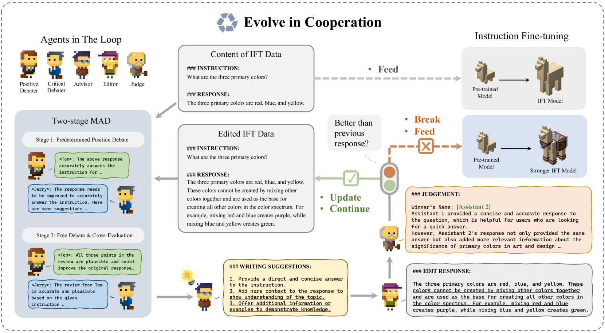
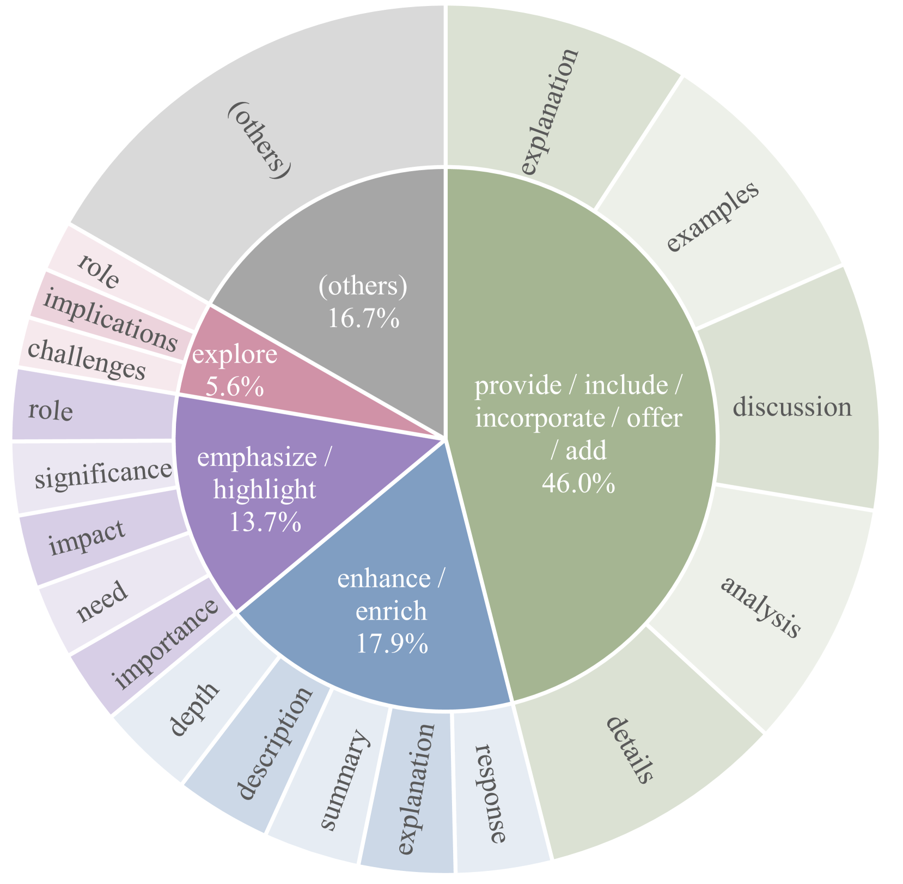

# CoEvol：借助多智能体协同，优化指令微调中的响应构建

发布时间：2024年06月11日

`Agent

这篇论文介绍了一个名为CoEvol的框架，该框架利用多代理合作来精炼指令响应，通过迭代辩论-建议-编辑-评判模式提升数据质量。这种方法特别强调了代理（Agent）之间的互动和合作，以提高大型语言模型（LLMs）的性能。因此，这篇论文更适合归类到Agent分类中，因为它主要探讨了如何通过多代理系统来优化LLMs的性能。` `人工智能`

> CoEvol: Constructing Better Responses for Instruction Finetuning through Multi-Agent Cooperation

# 摘要

> 近年来，大型语言模型（LLMs）通过指令微调（IFT）提升未见任务性能的方法备受瞩目。尽管已有自动构建和精选IFT数据的尝试，但先前方法并未充分发掘LLMs在提升数据质量上的潜力。本文提出的CoEvol框架，利用LLMs自身能力，通过多代理合作精炼指令响应，采用迭代辩论-建议-编辑-评判模式，并引入两阶段多代理辩论策略，确保编辑建议的多样性与可靠性。实证表明，搭载CoEvol的模型在MT-Bench和AlpacaEval上超越了竞争基准，有效提升了LLMs的指令遵循能力。

> In recent years, instruction fine-tuning (IFT) on large language models (LLMs) has garnered considerable attention to enhance model performance on unseen tasks. Attempts have been made on automatic construction and effective selection for IFT data. However, we posit that previous methods have not fully harnessed the potential of LLMs for enhancing data quality. The responses within IFT data could be further enhanced by leveraging the capabilities of LLMs themselves. In this paper, we propose CoEvol, an LLM-based multi-agent cooperation framework for the improvement of responses to instructions. To effectively refine the responses, we develop an iterative framework following a debate-advise-edit-judge paradigm. A two-stage multi-agent debate strategy is further devised to ensure the diversity and reliability of editing suggestions within the framework. Empirically, models equipped with CoEvol outperform competitive baselines evaluated by MT-Bench and AlpacaEval, demonstrating its effectiveness in enhancing instruction-following capabilities for LLMs.

[Arxiv](https://arxiv.org/abs/2406.07054)