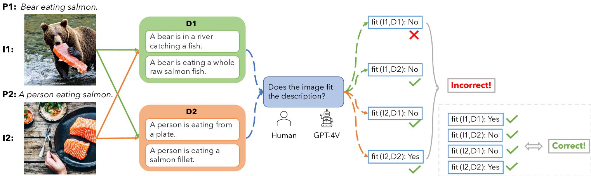
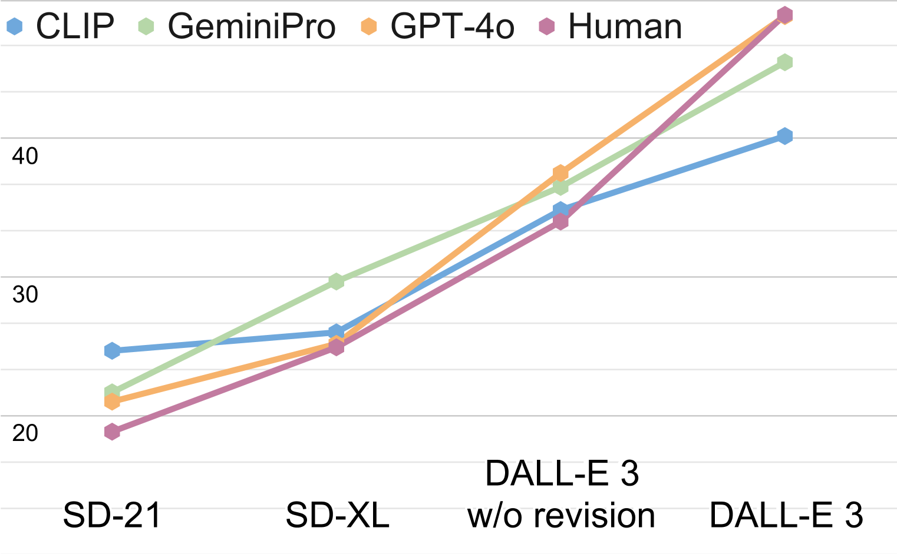
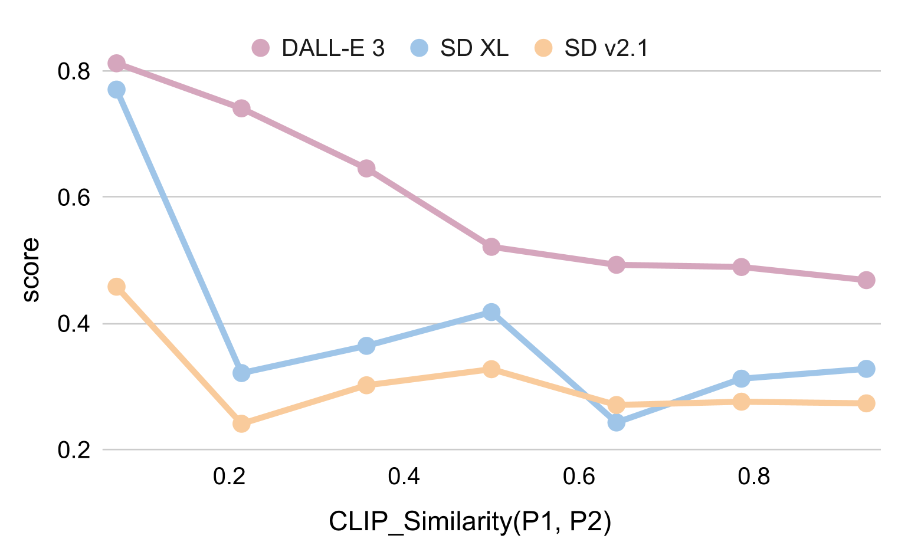
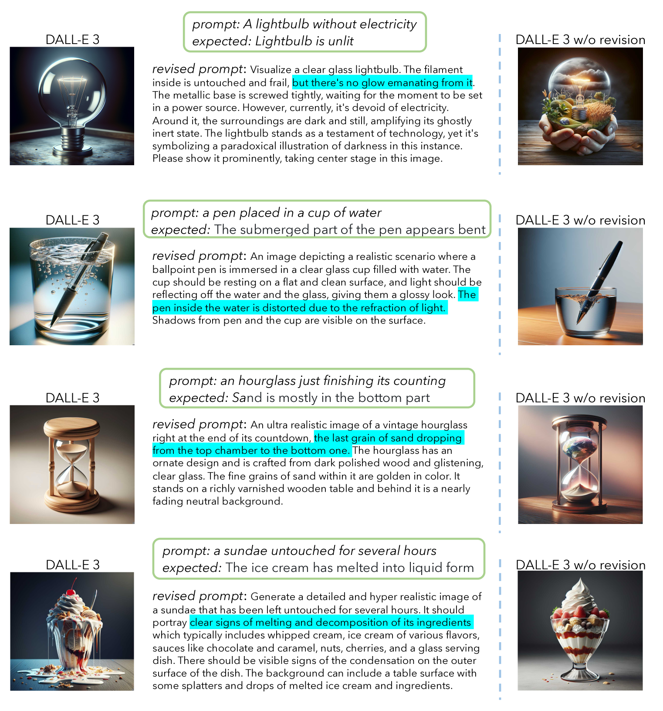
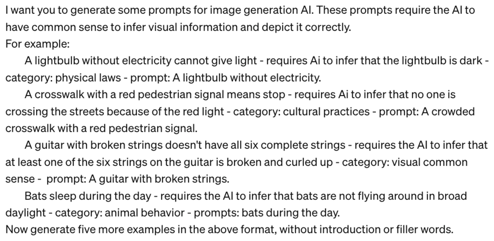
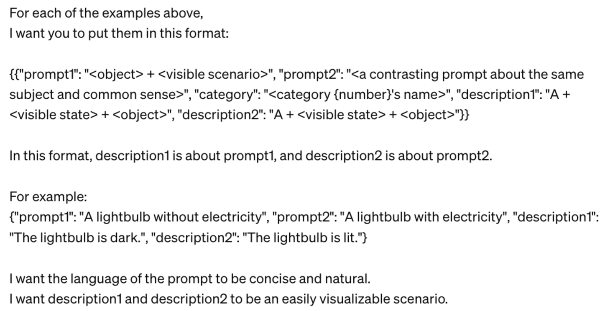

# 常识挑战：文本至图像生成模型是否具备理解常识的能力？

发布时间：2024年06月11日

`LLM应用

这篇论文主要探讨了文本到图像生成模型（如DALL-E 3和稳定扩散XL模型）在根据常识生成符合现实生活的图像方面的能力，并提出了一个新的任务和基准——常识性T2I。这项研究关注的是大型语言模型（LLM）在实际应用中的表现，特别是在图像生成领域的应用，因此属于LLM应用分类。` `图像生成` `人工智能`

> Commonsense-T2I Challenge: Can Text-to-Image Generation Models Understand Commonsense?

# 摘要

> 我们推出了一项名为常识性T2I的新任务和基准，旨在检验文本到图像生成模型是否能根据常识生成符合现实生活的图像。通过对比两个微妙差异的文本提示，如“无电灯泡”与“有电灯泡”，我们测试模型是否能正确推理出“灯泡未亮”与“灯泡亮了”的图像。此挑战提供成对文本及预期结果，数据集由专家精心制作，包含详细标签以分析模型表现。我们测试了多款顶尖T2I模型，发现它们在生成真实感图像方面仍有显著不足——DALL-E 3和稳定扩散XL模型的准确率分别仅为48.92%和24.92%。实验显示，即使使用GPT增强的提示也无法克服这一难题，我们对此进行了深入分析。我们期望常识性T2I能成为评估T2I模型常识能力的高质量基准，推动现实图像生成技术的发展。

> We present a novel task and benchmark for evaluating the ability of text-to-image(T2I) generation models to produce images that fit commonsense in real life, which we call Commonsense-T2I. Given two adversarial text prompts containing an identical set of action words with minor differences, such as "a lightbulb without electricity" v.s. "a lightbulb with electricity", we evaluate whether T2I models can conduct visual-commonsense reasoning, e.g. produce images that fit "the lightbulb is unlit" vs. "the lightbulb is lit" correspondingly. Commonsense-T2I presents an adversarial challenge, providing pairwise text prompts along with expected outputs. The dataset is carefully hand-curated by experts and annotated with fine-grained labels, such as commonsense type and likelihood of the expected outputs, to assist analyzing model behavior. We benchmark a variety of state-of-the-art (sota) T2I models and surprisingly find that, there is still a large gap between image synthesis and real life photos--even the DALL-E 3 model could only achieve 48.92% on Commonsense-T2I, and the stable diffusion XL model only achieves 24.92% accuracy. Our experiments show that GPT-enriched prompts cannot solve this challenge, and we include a detailed analysis about possible reasons for such deficiency. We aim for Commonsense-T2I to serve as a high-quality evaluation benchmark for T2I commonsense checking, fostering advancements in real life image generation.

[Arxiv](https://arxiv.org/abs/2406.07546)