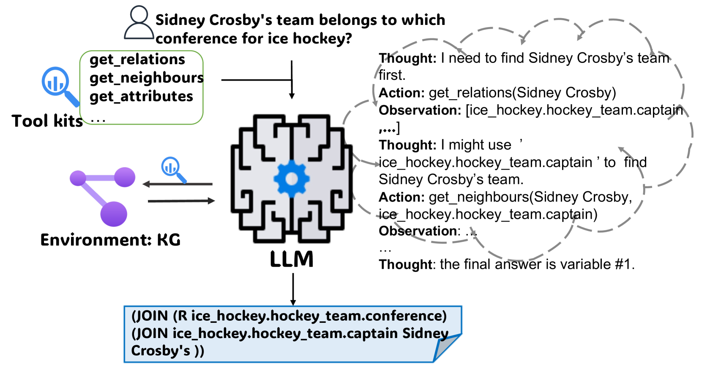
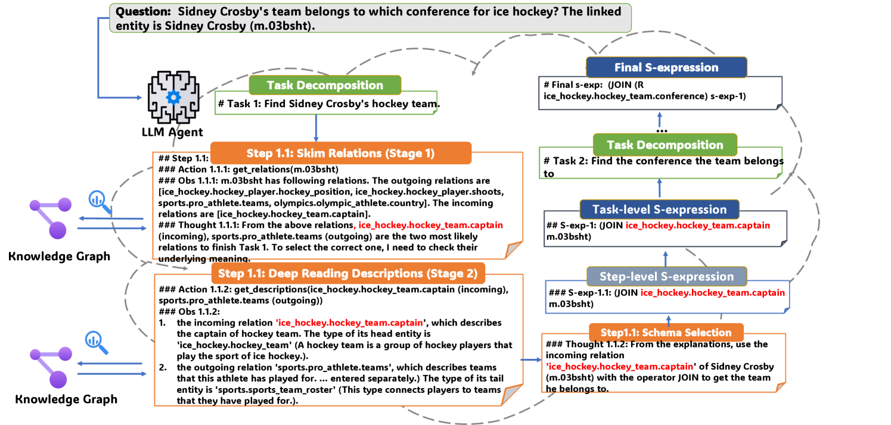
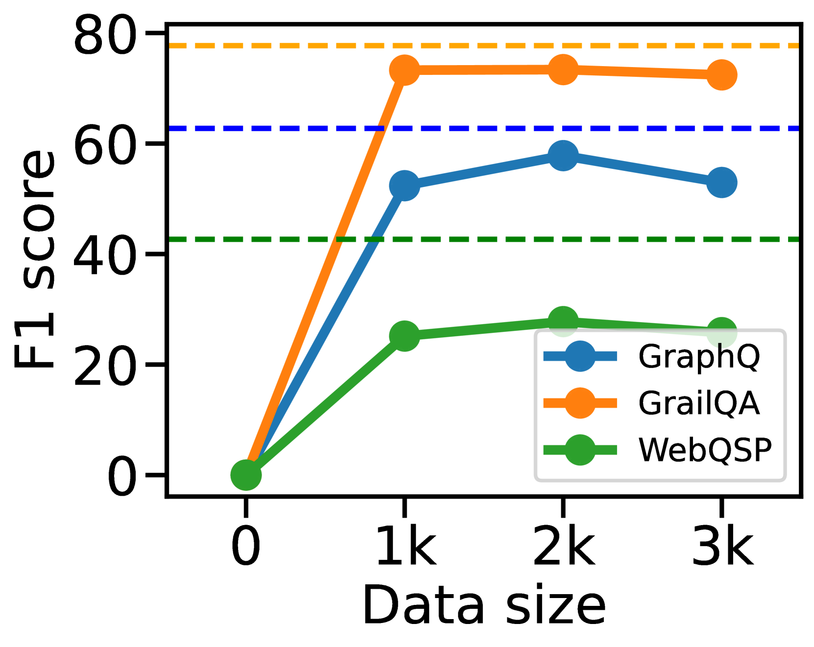
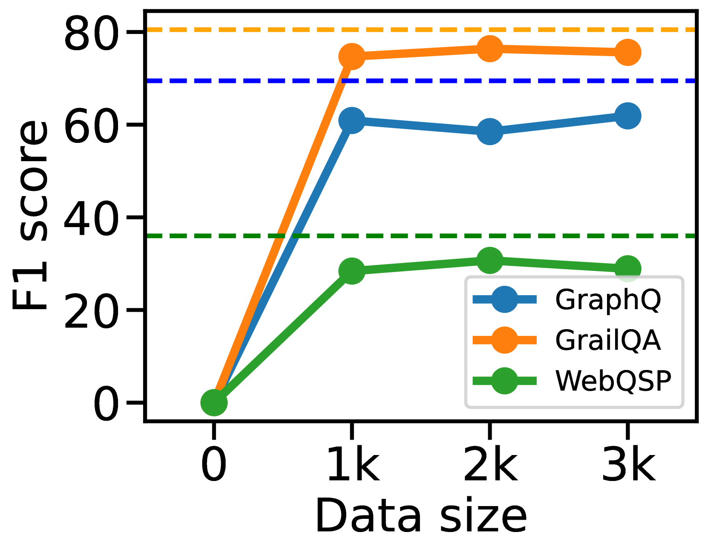
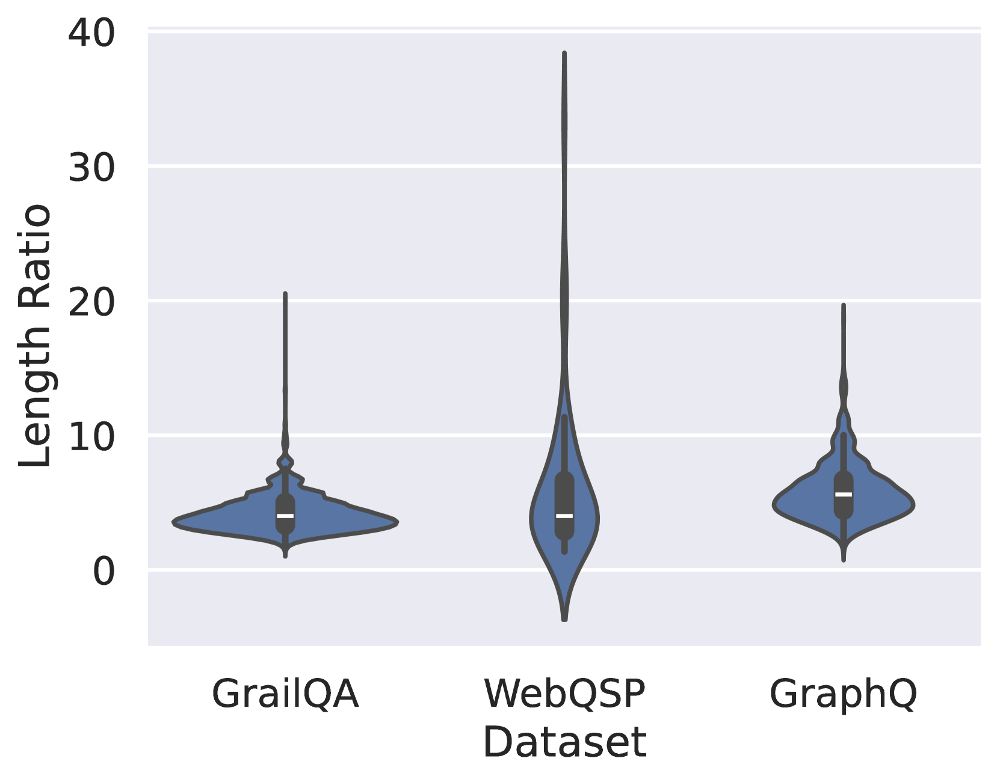

# DARA：知识图谱问答中的分解-对齐-推理智能语言助手

发布时间：2024年06月11日

`Agent

这篇论文主要介绍了一个名为分解对齐推理代理（DARA）的框架，该框架旨在提升大型语言模型（LLMs）在知识图谱问答（KGQA）任务中的推理能力。DARA通过高层任务分解和低层任务接地的方式，使得LLMs能够更有效地进行推理。此外，论文还提到DARA在实际应用中的表现优于其他代理，这表明该框架具有实际应用价值。因此，这篇论文应归类为Agent，因为它主要关注的是一个特定的代理框架及其在语言模型中的应用。` `人工智能` `知识图谱`

> DARA: Decomposition-Alignment-Reasoning Autonomous Language Agent for Question Answering over Knowledge Graphs

# 摘要

> 知识图谱问答（KGQA）对于现实世界应用中的自主语言代理至关重要。我们提出的分解对齐推理代理（DARA）框架，通过高层任务分解和低层任务接地，有效提升了大型语言模型（LLMs）在KGQA中的推理能力。DARA仅需少量高质量推理轨迹即可高效训练。实验证明，在LLMs（如Llama-2-7B，Mistral）上微调的DARA在零-shot评估中超越了基于上下文学习的代理和其他微调代理，使其更适用于实际应用。此外，DARA在KGQA上的表现与顶尖的枚举和排名方法不相上下。

> Answering Questions over Knowledge Graphs (KGQA) is key to well-functioning autonomous language agents in various real-life applications. To improve the neural-symbolic reasoning capabilities of language agents powered by Large Language Models (LLMs) in KGQA, we propose the DecompositionAlignment-Reasoning Agent (DARA) framework. DARA effectively parses questions into formal queries through a dual mechanism: high-level iterative task decomposition and low-level task grounding. Importantly, DARA can be efficiently trained with a small number of high-quality reasoning trajectories. Our experimental results demonstrate that DARA fine-tuned on LLMs (e.g. Llama-2-7B, Mistral) outperforms both in-context learning-based agents with GPT-4 and alternative fine-tuned agents, across different benchmarks in zero-shot evaluation, making such models more accessible for real-life applications. We also show that DARA attains performance comparable to state-of-the-art enumerating-and-ranking-based methods for KGQA.

[Arxiv](https://arxiv.org/abs/2406.07080)