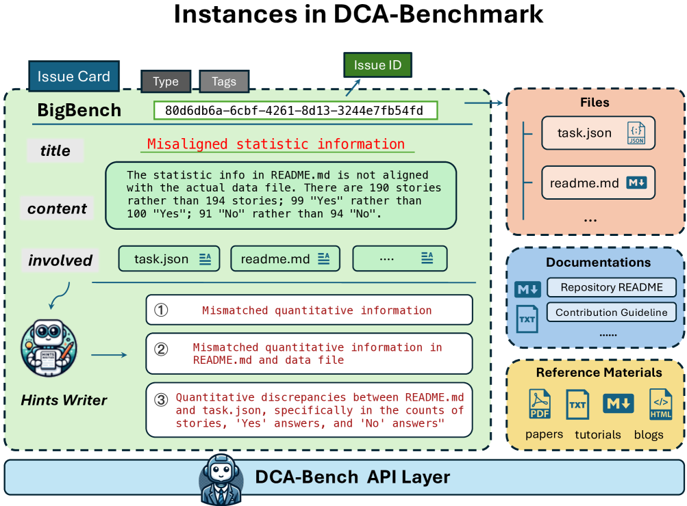
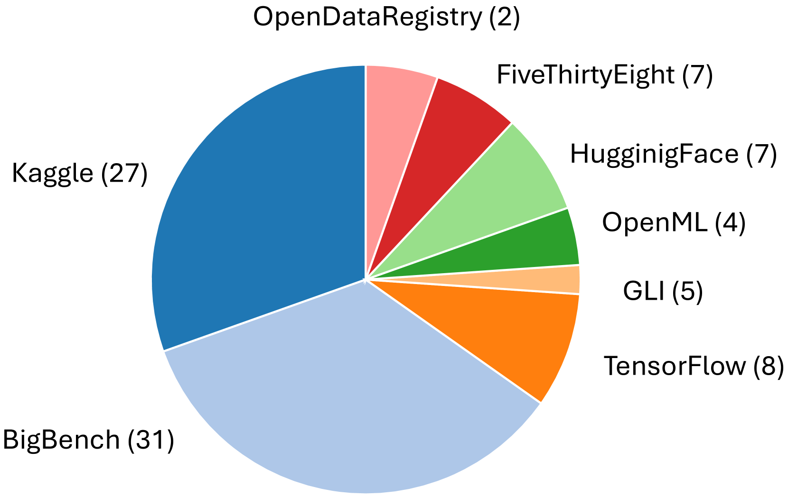
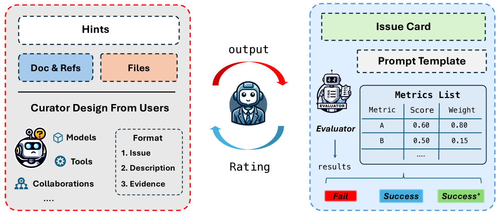
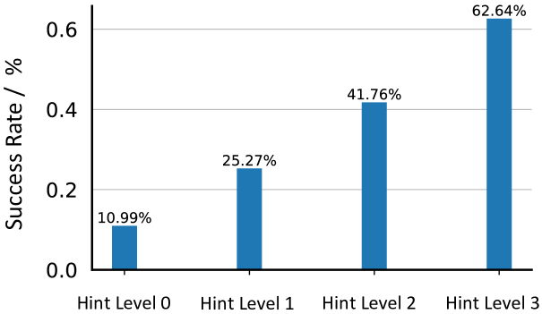

# DCA-Bench：数据集整理代理的评估基准

发布时间：2024年06月11日

`Agent

这篇论文主要介绍了利用大型语言模型（LLMs）作为代理来优化数据集整理的过程，并推出了一个名为DCA-Bench的基准，用于衡量LLM代理识别数据集隐性质量问题的能力。这个基准汇集了来自多个平台的真实数据集问题，并开发了一个基于LLM的评估器来自动评估代理的表现。因此，这篇论文的内容更偏向于使用LLM作为代理来解决实际问题，属于Agent分类。` `数据科学` `人工智能`

> DCA-Bench: A Benchmark for Dataset Curation Agents

# 摘要

> 在AI领域，数据集的质量日益成为研究与开发的核心。尽管开放数据集平台众多，但诸如文档缺失、标注错误及伦理问题等数据质量隐患依旧普遍。这些问题隐蔽且难以通过常规脚本检测，往往需要昂贵的人工审核。随着大型语言模型（LLMs）的强大，利用LLM代理优化数据集整理成为可能。为此，我们推出了DCA-Bench，一个衡量LLM代理识别数据集隐性质量问题的基准。我们汇集了来自八个平台的真实数据集问题作为测试案例，并开发了一个基于LLM的评估器，以自动评估代理表现，其结果与人工评估高度吻合。通过在DCA-Bench上测试多个LLM代理，我们揭示了任务的复杂性，强调了在实际应用中进一步探索和创新的必要性。此外，DCA-Bench不仅是评估工具，也是衡量LLMs发现问题能力的平台。详情请访问 \url{https://github.com/TRAIS-Lab/dca-bench}。

> The quality of datasets plays an increasingly crucial role in the research and development of modern artificial intelligence (AI). Despite the proliferation of open dataset platforms nowadays, data quality issues, such as insufficient documentation, inaccurate annotations, and ethical concerns, remain common in datasets widely used in AI. Furthermore, these issues are often subtle and difficult to be detected by rule-based scripts, requiring expensive manual identification and verification by dataset users or maintainers. With the increasing capability of large language models (LLMs), it is promising to streamline the curation of datasets with LLM agents. In this work, as the initial step towards this goal, we propose a dataset curation agent benchmark, DCA-Bench, to measure LLM agents' capability of detecting hidden dataset quality issues. Specifically, we collect diverse real-world dataset quality issues from eight open dataset platforms as a testbed. Additionally, to establish an automatic pipeline for evaluating the success of LLM agents, which requires a nuanced understanding of the agent outputs, we implement a dedicated Evaluator using another LLM agent. We demonstrate that the LLM-based Evaluator empirically aligns well with human evaluation, allowing reliable automatic evaluation on the proposed benchmark. We further conduct experiments on several baseline LLM agents on the proposed benchmark and demonstrate the complexity of the task, indicating that applying LLMs to real-world dataset curation still requires further in-depth exploration and innovation. Finally, the proposed benchmark can also serve as a testbed for measuring the capability of LLMs in problem discovery rather than just problem-solving. The benchmark suite is available at \url{https://github.com/TRAIS-Lab/dca-bench}.

[Arxiv](https://arxiv.org/abs/2406.07275)