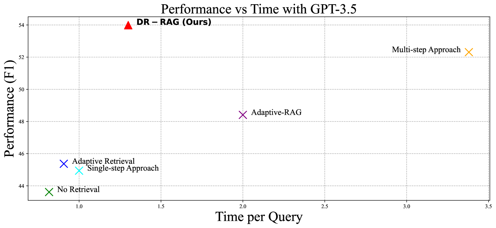
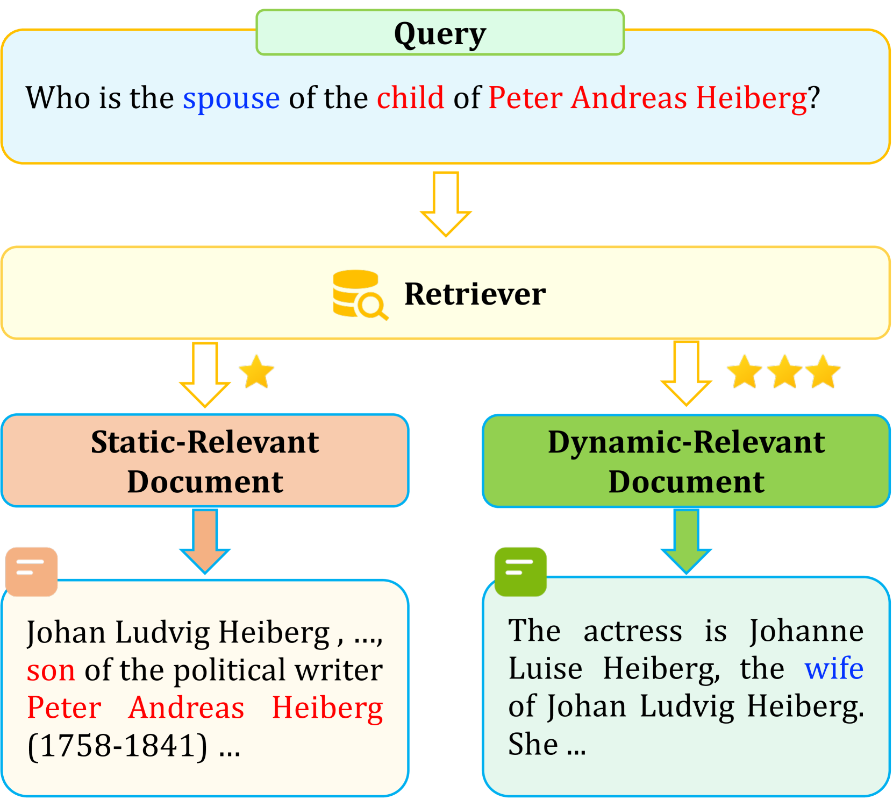
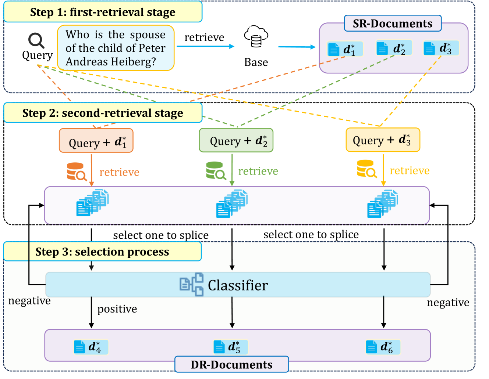

# 动态相关性增强检索生成（DR-RAG）：优化问答系统的文档关联策略

发布时间：2024年06月11日

`RAG

理由：这篇论文主要讨论了Retrieval-Augmented Generation (RAG) 的改进版本，即Dynamic-Relevant Retrieval-Augmented Generation (DR-RAG)，并详细介绍了其在提升文档检索召回率和答案准确性方面的应用。论文的核心贡献在于提出了一种新的两阶段检索框架，并通过实验验证了其在问答系统中的有效性。这与RAG的分类相符，因为RAG是一种特定的技术框架，用于增强大型语言模型在知识密集型任务中的表现，而论文中的DR-RAG是对这一框架的改进和优化。因此，这篇论文应归类于RAG。` `问答系统` `知识管理`

> DR-RAG: Applying Dynamic Document Relevance to Retrieval-Augmented Generation for Question-Answering

# 摘要

> Retrieval-Augmented Generation (RAG) 显著提升了大型语言模型在知识密集型任务，如问答中的表现。通过整合外部知识库，RAG 扩展了查询上下文，增强了回答的准确性。但每次查询多次调用 LLMs 效率不高，且单次查询难以检索所有相关文档。我们发现，尽管某些关键文档与查询关联度低，通过结合文档片段与查询，仍可检索到其他相关文档。为此，我们提出了 Dynamic-Relevant Retrieval-Augmented Generation (DR-RAG)，一种两阶段检索框架，旨在提升文档检索的召回率和答案准确性，同时保持高效。此外，一个小型分类器用于两种选择策略，以评估检索文档对回答查询的贡献，并筛选出相对相关的文档。DR-RAG 仅一次调用 LLMs，大幅提升了实验效率。在多跳 QA 数据集上的实验结果显示，DR-RAG 显著提高了答案的准确性，为 QA 系统带来了新的进步。

> Retrieval-Augmented Generation (RAG) has significantly demonstrated the performance of Large Language Models (LLMs) in the knowledge-intensive tasks, such as Question-Answering (QA). RAG expands the query context by incorporating external knowledge bases to enhance the response accuracy. However, it would be inefficient to access LLMs multiple times for each query and unreliable to retrieve all the relevant documents by a single query. We find that even though there is low relevance between some critical documents and query, it is possible to retrieve the remaining documents by combining parts of the documents with the query. To mine the relevance, a two-stage retrieval framework called Dynamic-Relevant Retrieval-Augmented Generation (DR-RAG) is proposed to improve document retrieval recall and the accuracy of answers while maintaining efficiency. Also, a small classifier is applied to two different selection strategies to determine the contribution of the retrieved documents to answering the query and retrieve the relatively relevant documents. Meanwhile, DR-RAG call the LLMs only once, which significantly improves the efficiency of the experiment. The experimental results on multi-hop QA datasets show that DR-RAG can significantly improve the accuracy of the answers and achieve new progress in QA systems.

[Arxiv](https://arxiv.org/abs/2406.07348)