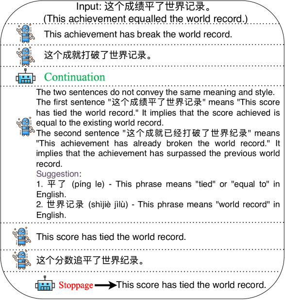

# 双反射机制：借助双重学习反馈，提升大型语言模型的反思翻译能力

发布时间：2024年06月11日

`Agent

这篇论文主要介绍了DUAL-REFLECT框架，这是一种增强大型语言模型自我反思能力的方法，特别是在机器翻译领域。该框架通过双向学习提供更精准的反馈，从而提高翻译质量。这种技术涉及到模型的自我优化和适应性调整，这是Agent类研究的核心特征，即模型能够根据反馈自主调整行为以达到更好的性能。因此，这篇论文应归类于Agent。` `机器翻译` `语言学习`

> DUAL-REFLECT: Enhancing Large Language Models for Reflective Translation through Dual Learning Feedback Mechanisms

# 摘要

> 近期，借助自我反思机制的大型语言模型在机器翻译领域展现出显著成效。其关键在于引导模型依据人类反馈进行翻译生成。遗憾的是，现有自我反思技术因反馈信息不足，导致翻译效果受限。为此，我们开发了DUAL-REFLECT框架，通过翻译任务的双向学习提供精准反馈，强化模型的自我反思能力，显著提升翻译质量。此方法在多语种翻译实践中已验证其提升准确度、减少歧义的效力，尤其在资源匮乏的语言对翻译中表现突出。

> Recently, large language models (LLMs) enhanced by self-reflection have achieved promising performance on machine translation. The key idea is guiding LLMs to generate translation with human-like feedback. However, existing self-reflection methods lack effective feedback information, limiting the translation performance. To address this, we introduce a DUAL-REFLECT framework, leveraging the dual learning of translation tasks to provide effective feedback, thereby enhancing the models' self-reflective abilities and improving translation performance. The application of this method across various translation tasks has proven its effectiveness in improving translation accuracy and eliminating ambiguities, especially in translation tasks with low-resource language pairs.

[Arxiv](https://arxiv.org/abs/2406.07232)