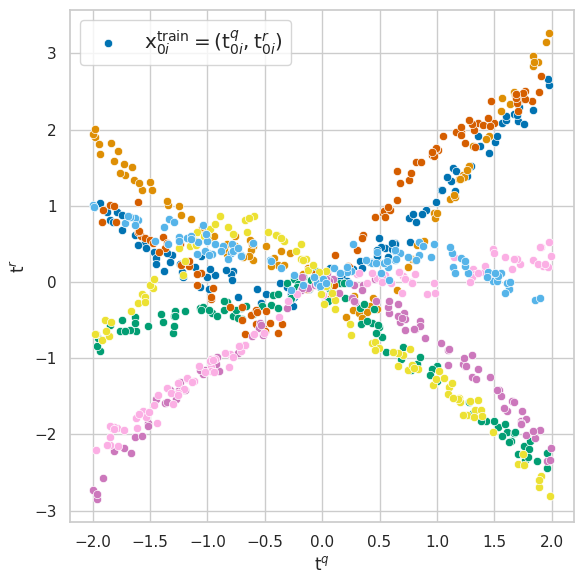
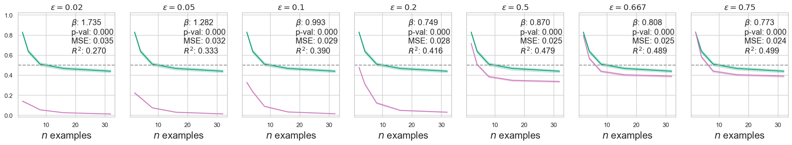

# 评估生成式AI产生幻觉的频率

发布时间：2024年06月11日

`LLM理论

理由：这篇论文关注的是大型语言模型（LLM）中的理论问题，具体是情境学习（ICL）中的幻觉率评估。它提出了一种新的方法来估计幻觉产生的概率，并通过分析条件生成模型（CGM）的查询与响应及其对数概率来实现。这与LLM的理论研究相关，因为它探讨了模型预测的准确性和可靠性，而不是直接应用或Agent的设计。因此，它更适合归类为LLM理论。` `人工智能` `机器学习`

> Estimating the Hallucination Rate of Generative AI

# 摘要

> 本研究旨在评估生成式AI中情境学习（ICL）的幻觉率。在ICL中，条件生成模型（CGM）接收数据集并据此预测。基于贝叶斯视角，我们将“幻觉”定义为在真实潜在参数下概率较低的预测。我们提出了一种新方法，通过分析CGM的查询与响应及其对数概率，来估计产生幻觉的概率。该方法已通过大型语言模型在合成回归和自然语言ICL任务上得到验证。

> This work is about estimating the hallucination rate for in-context learning (ICL) with Generative AI. In ICL, a conditional generative model (CGM) is prompted with a dataset and asked to make a prediction based on that dataset. The Bayesian interpretation of ICL assumes that the CGM is calculating a posterior predictive distribution over an unknown Bayesian model of a latent parameter and data. With this perspective, we define a \textit{hallucination} as a generated prediction that has low-probability under the true latent parameter. We develop a new method that takes an ICL problem -- that is, a CGM, a dataset, and a prediction question -- and estimates the probability that a CGM will generate a hallucination. Our method only requires generating queries and responses from the model and evaluating its response log probability. We empirically evaluate our method on synthetic regression and natural language ICL tasks using large language models.

[Arxiv](https://arxiv.org/abs/2406.07457)