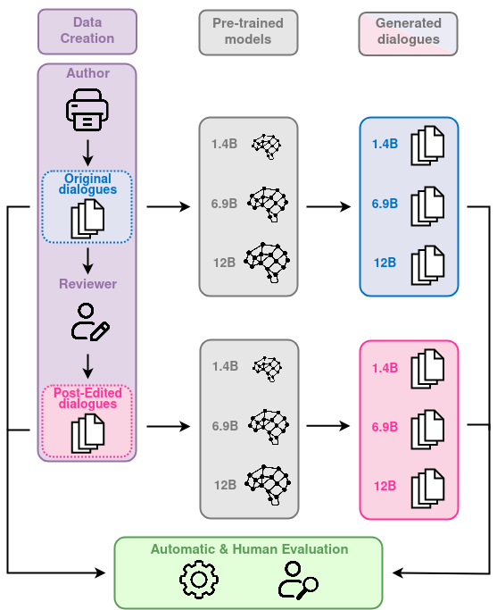

# 微调对话语言模型：探究人类后期编辑的影响——HED-IT方法的应用

发布时间：2024年06月11日

`LLM应用

理由：这篇论文主要探讨了人类干预对机器生成对话数据质量的影响，并研究了这种干预如何影响不同规模语言模型的微调效果。这涉及到实际应用中的数据处理和模型微调，属于大型语言模型（LLM）在实际应用中的具体问题和解决方案，因此归类为LLM应用。` `语言模型微调`

> Fine-tuning with HED-IT: The impact of human post-editing for dialogical language models

# 摘要

> 自动生成语言数据的方法在资源较少的语言中微调语言模型方面已证明有效，但质量问题却鲜少被关注。本研究聚焦于人类干预对机器生成对话数据的影响，特别探讨了：（1）后期编辑的对话是否比自动生成的原始版本质量更高；（2）使用这些编辑后的对话进行微调是否显著影响输出；（3）这些编辑是否随模型参数大小而影响结果。为此，我们构建了HED-IT数据集，包含机器生成与人工编辑的对话。通过微调三种规模的LM，我们发现训练数据的质量差异显著，且对模型性能有影响。此外，我们发现大型模型对数据质量不敏感，而小型模型则受其影响显著。这些发现深化了我们对人类干预在高质量语言模型开发中作用的认识。

> Automatic methods for generating and gathering linguistic data have proven effective for fine-tuning Language Models (LMs) in languages less resourced than English. Still, while there has been emphasis on data quantity, less attention has been given to its quality. In this work, we investigate the impact of human intervention on machine-generated data when fine-tuning dialogical models. In particular, we study (1) whether post-edited dialogues exhibit higher perceived quality compared to the originals that were automatically generated; (2) whether fine-tuning with post-edited dialogues results in noticeable differences in the generated outputs; and (3) whether post-edited dialogues influence the outcomes when considering the parameter size of the LMs. To this end we created HED-IT, a large-scale dataset where machine-generated dialogues are paired with the version post-edited by humans. Using both the edited and unedited portions of HED-IT, we fine-tuned three different sizes of an LM. Results from both human and automatic evaluation show that the different quality of training data is clearly perceived and it has an impact also on the models trained on such data. Additionally, our findings indicate that larger models are less sensitive to data quality, whereas this has a crucial impact on smaller models. These results enhance our comprehension of the impact of human intervention on training data in the development of high-quality LMs.

[Arxiv](https://arxiv.org/abs/2406.07288)