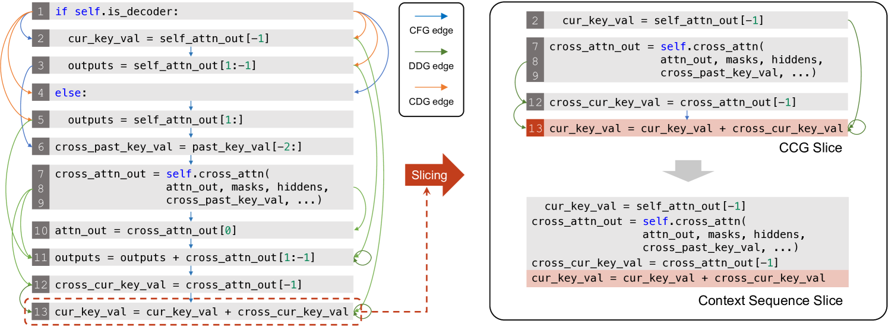
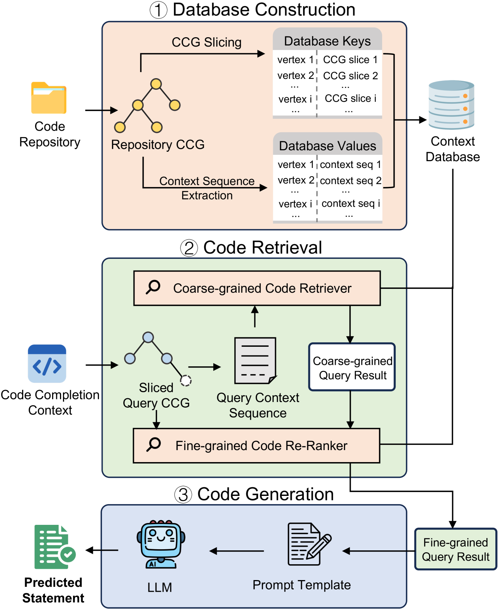
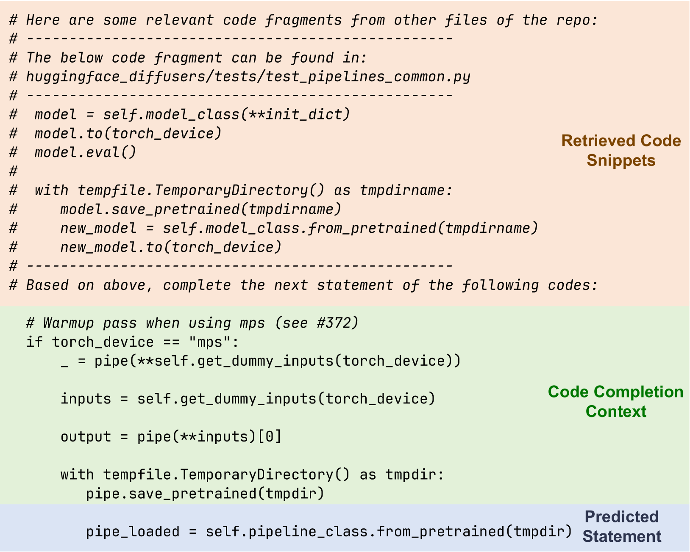
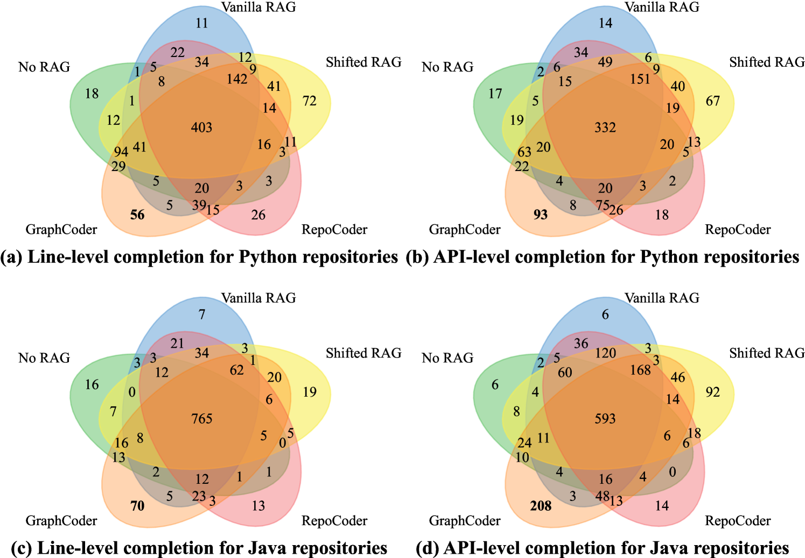
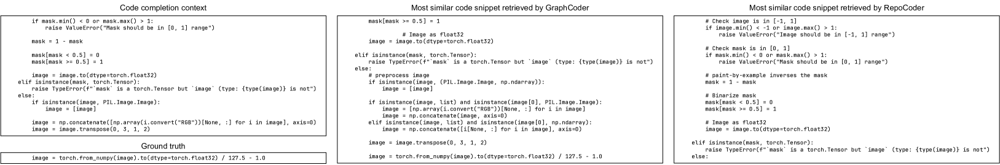
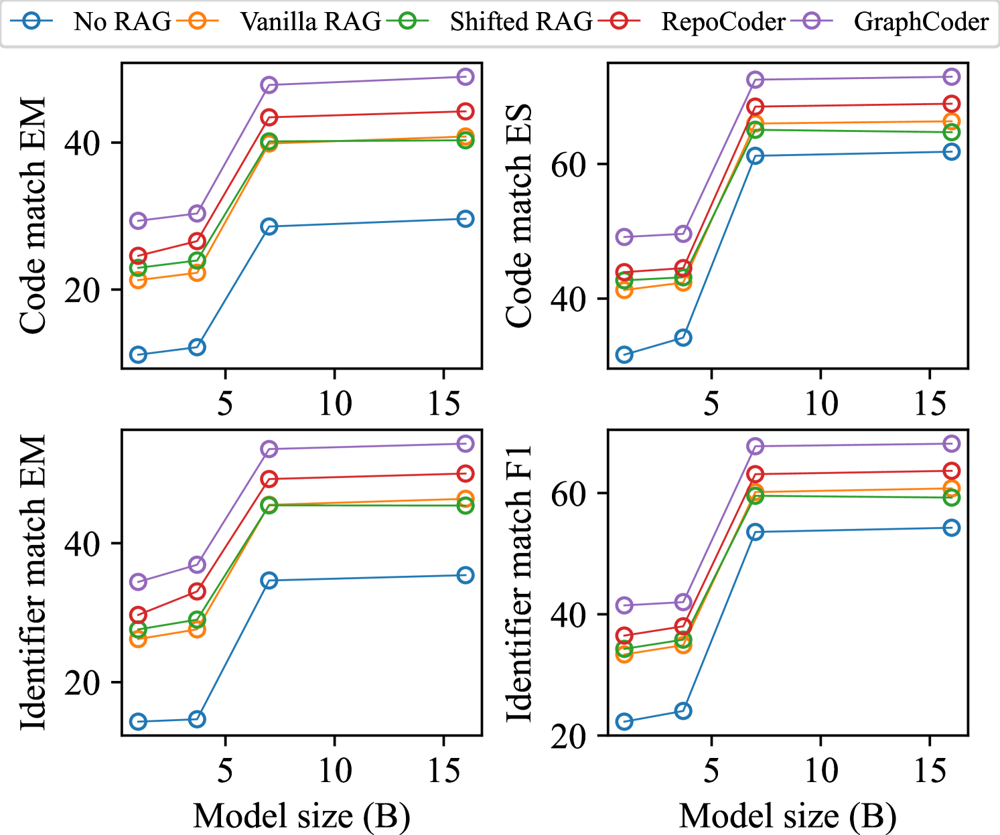
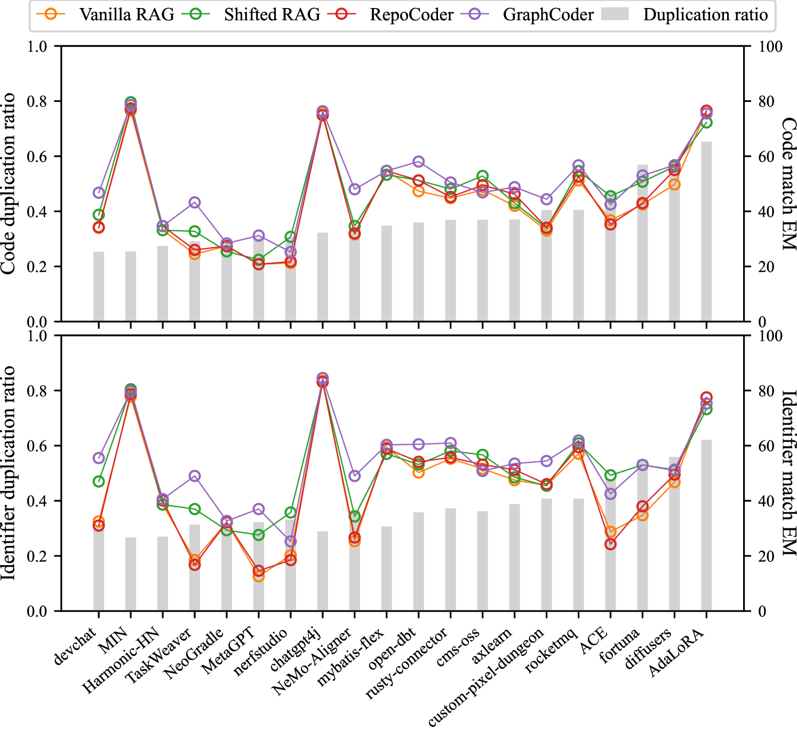
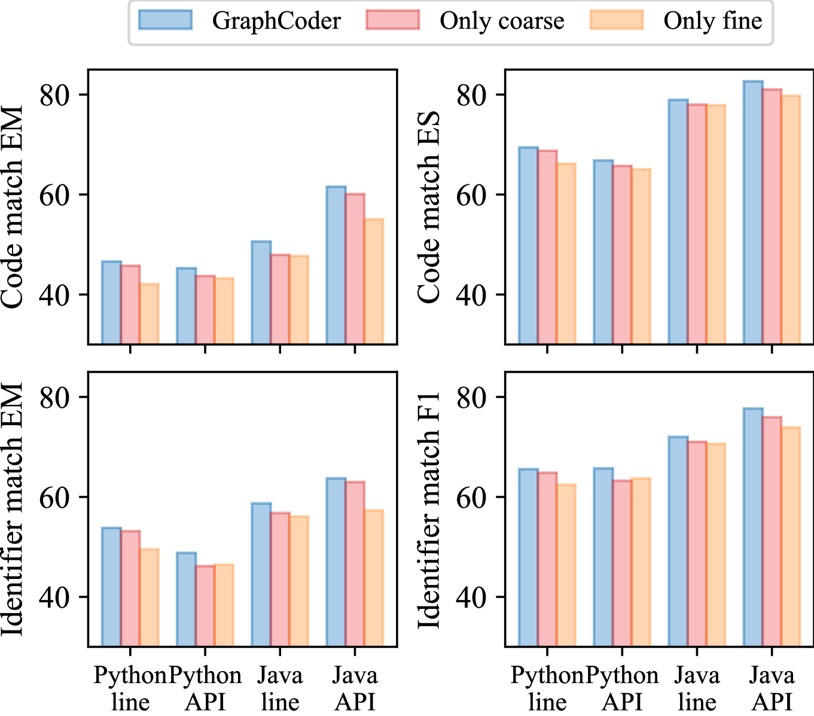
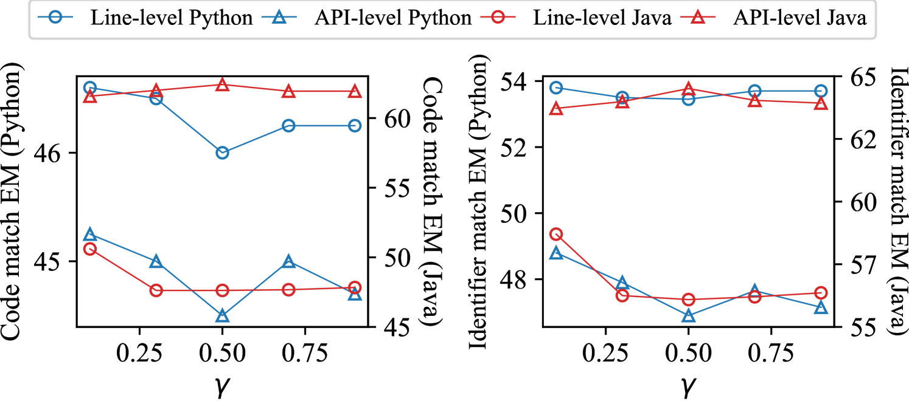
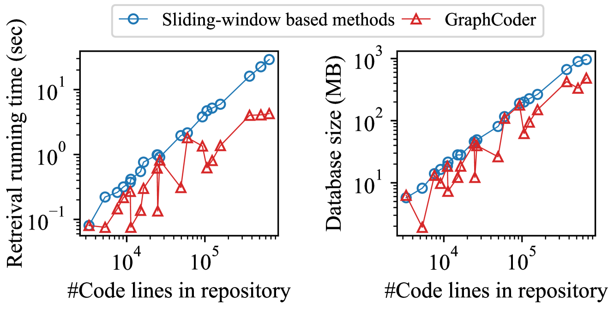

# GraphCoder：借助代码上下文图检索与语言模型，提升仓库级代码补全能力

发布时间：2024年06月11日

`LLM应用

这篇论文介绍了一种名为GraphCoder的检索增强框架，它结合了大型语言模型（LLMs）的通用代码知识和特定仓库的知识，用于仓库级别的代码补全。这种方法通过代码上下文图（CCG）结构化地捕捉代码补全的上下文，并采用由粗到细的检索策略来精确定位相关代码片段。论文的实验结果显示，GraphCoder在提高精确匹配率的同时，也在时间和空间效率上表现出显著优势。因此，这篇论文属于LLM应用类别，因为它展示了如何将LLM技术应用于特定的实际问题——代码补全。` `软件开发` `代码补全`

> GraphCoder: Enhancing Repository-Level Code Completion via Code Context Graph-based Retrieval and Language Model

# 摘要

> 仓库级别的代码补全依赖于有效结合通用与特定仓库知识。尽管代码LLMs在通用补全任务中表现卓越，但在涉及特定仓库知识时却常显不足。为此，我们开发了GraphCoder，一种结合LLMs通用代码知识与仓库特定知识的检索增强框架。通过代码上下文图（CCG），GraphCoder以更结构化的方式精准捕捉代码补全的上下文，并采用由粗到细的检索策略，从仓库中精确定位相关代码片段。实验表明，GraphCoder不仅提高了精确匹配率，代码与标识符匹配分别提升了+6.06和+6.23，且在时间和空间效率上也有显著优势。

> The performance of repository-level code completion depends upon the effective leverage of both general and repository-specific knowledge. Despite the impressive capability of code LLMs in general code completion tasks, they often exhibit less satisfactory performance on repository-level completion due to the lack of repository-specific knowledge in these LLMs. To address this problem, we propose GraphCoder, a retrieval-augmented code completion framework that leverages LLMs' general code knowledge and the repository-specific knowledge via a graph-based retrieval-generation process. In particular, GraphCoder captures the context of completion target more accurately through code context graph (CCG) that consists of control-flow, data- and control-dependence between code statements, a more structured way to capture the completion target context than the sequence-based context used in existing retrieval-augmented approaches; based on CCG, GraphCoder further employs a coarse-to-fine retrieval process to locate context-similar code snippets with the completion target from the current repository. Experimental results demonstrate both the effectiveness and efficiency of GraphCoder: Compared to baseline retrieval-augmented methods, GraphCoder achieves higher exact match (EM) on average, with increases of +6.06 in code match and +6.23 in identifier match, while using less time and space.

[Arxiv](https://arxiv.org/abs/2406.07003)