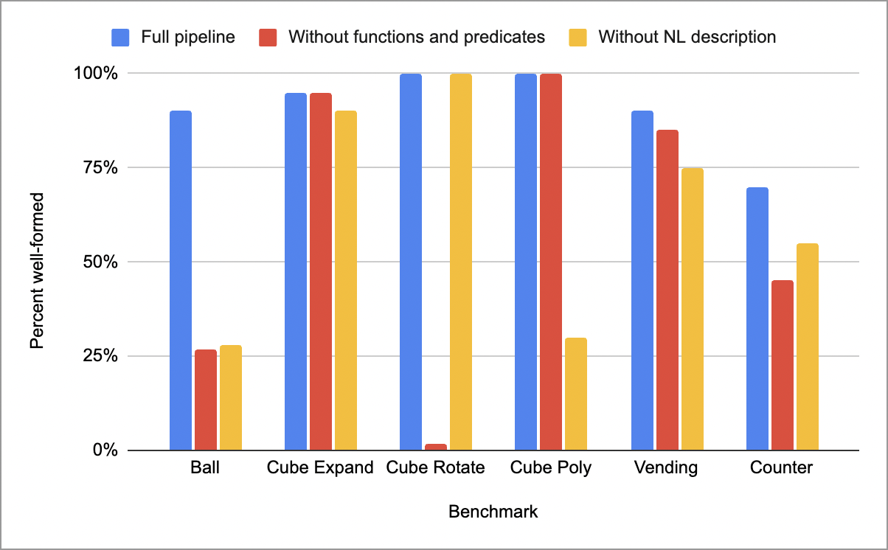
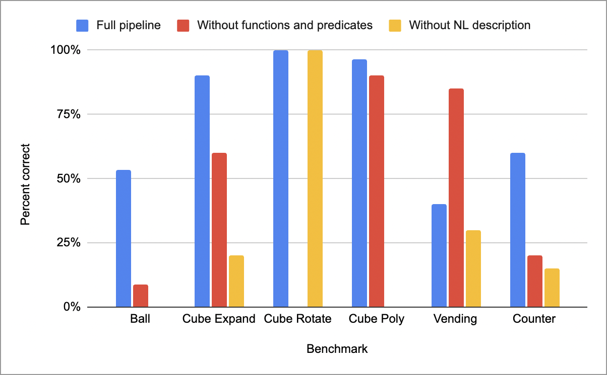
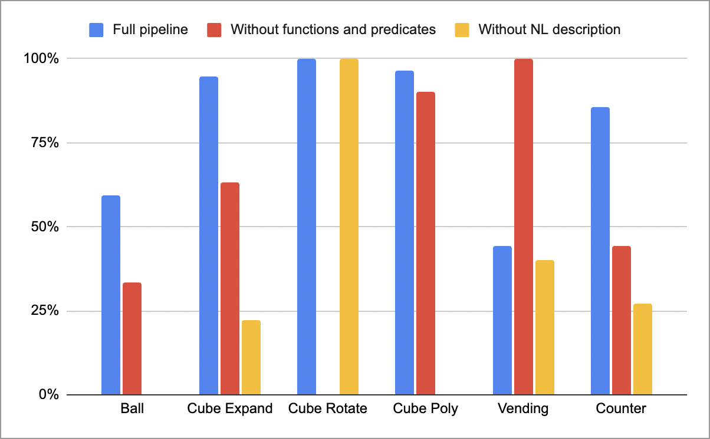

# 明确区分数据与控制，引导LLM生成时间逻辑

发布时间：2024年06月11日

`LLM应用

理由：这篇论文探讨了如何利用大型语言模型（LLMs）来辅助非专业人士编写时间逻辑规范，特别是在反应系统综合与验证的背景下。研究集中在如何通过控制与数据分离的指导方式来提高LLM生成规范的效率和质量。这种方法的应用性质和对LLM在特定工程问题上的应用研究，使其更适合归类于LLM应用。` `软件工程` `自动化验证`

> Guiding LLM Temporal Logic Generation with Explicit Separation of Data and Control

# 摘要

> 时间逻辑作为反应系统综合与验证的利器，其应用广泛。随着大型语言模型（LLMs）的进步，编写此类规范的过程有望变得更加亲民。然而，时间逻辑规范的编写依旧让非专业人士望而却步。在使用LLMs进行时间逻辑规范工程时，一个核心问题是如何找到最有效的指导方式，帮助LLM和用户轻松生成规范。针对反应程序合成的具体问题，我们研究了向LLM提供控制与数据分离指导的影响，明确指出哪些功能与规范相关，而将其他功能视为预定义函数和谓词的实现细节。我们建立了一套基准，并发现这种关注点的分离确实提升了规范生成的质量。这一基准也为未来LLM在时间逻辑规范生成方面的研究提供了验证的标尺。

> Temporal logics are powerful tools that are widely used for the synthesis and verification of reactive systems. The recent progress on Large Language Models (LLMs) has the potential to make the process of writing such specifications more accessible. However, writing specifications in temporal logics remains challenging for all but the most expert users. A key question in using LLMs for temporal logic specification engineering is to understand what kind of guidance is most helpful to the LLM and the users to easily produce specifications. Looking specifically at the problem of reactive program synthesis, we explore the impact of providing an LLM with guidance on the separation of control and data--making explicit for the LLM what functionality is relevant for the specification, and treating the remaining functionality as an implementation detail for a series of pre-defined functions and predicates. We present a benchmark set and find that this separation of concerns improves specification generation. Our benchmark provides a test set against which to verify future work in LLM generation of temporal logic specifications.

[Arxiv](https://arxiv.org/abs/2406.07400)