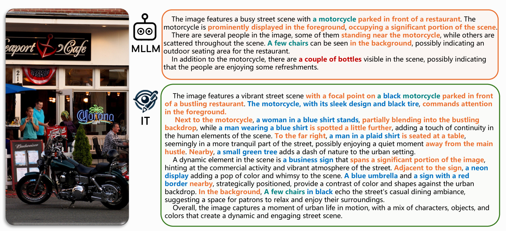
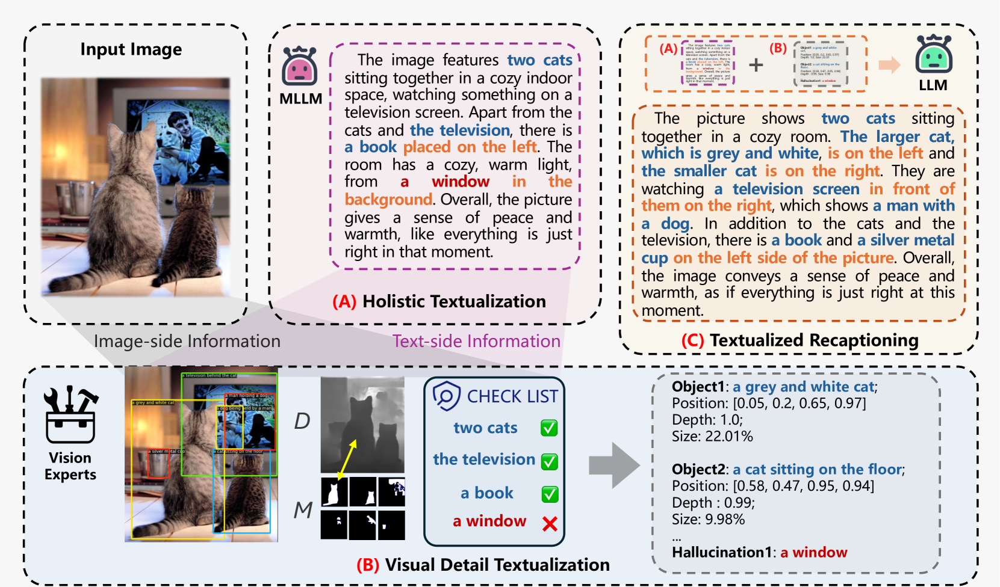
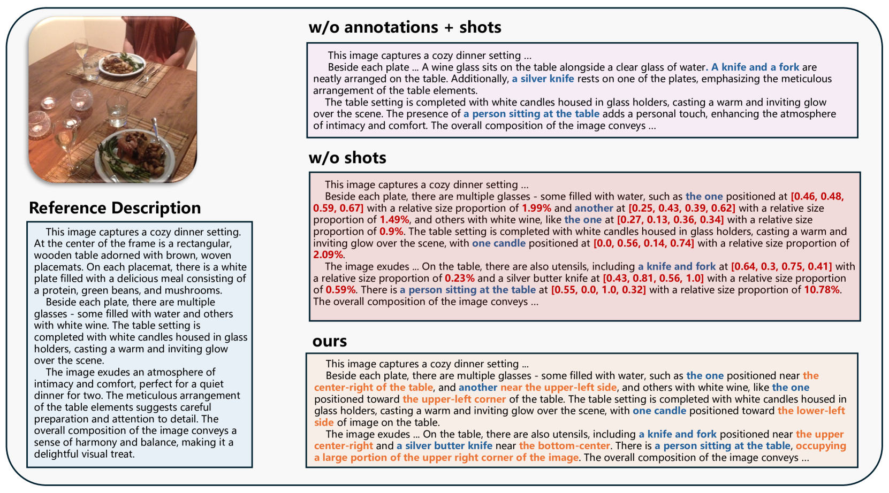

# 图像转文：自动生成精准详尽图像描述的先进框架

发布时间：2024年06月11日

`LLM应用

这篇论文摘要描述了一个名为Image Textualization（IT）框架的开发，该框架利用多模态大型语言模型和视觉专家模型来自动将视觉信息转化为文本，以生成高质量的图像描述。这个框架的目的是为了解决现有图像描述数据集生成方法的不足，如网络抓取的图像文本对质量参差不齐和人工标注成本高且细节不足的问题。此外，论文还提到了设立新的评估基准来验证IT框架生成的图像描述质量，并展示了实验结果，表明经过IT框架训练的LLaVA-7B模型能够生成更长、更详细的图像描述，且幻觉现象大幅减少。

这个研究主要关注的是利用大型语言模型（LLM）在多模态环境下的应用，特别是在图像描述生成方面的应用，因此将其分类为LLM应用。` `图像理解` `文本到图像生成`

> Image Textualization: An Automatic Framework for Creating Accurate and Detailed Image Descriptions

# 摘要

> 图像描述数据集对于推动图像理解、文本到图像生成及文本图像检索等应用至关重要。目前，这些数据集主要源自网络抓取的图像文本对和人工标注。前者虽丰富但质量参差不齐，后者如COCO虽精准但成本高且细节不足。因此，我们急需高效可扩展的方法来生成高质量的图像描述。为此，我们提出了Image Textualization（IT）框架，它利用多模态大型语言模型和视觉专家模型，自动将视觉信息转化为文本。同时，我们设立了新的评估基准，以验证IT框架生成的图像描述质量。实验表明，经过IT框架训练的LLaVA-7B模型，能生成更长、更详细的图像描述，且幻觉现象大幅减少。

> Image description datasets play a crucial role in the advancement of various applications such as image understanding, text-to-image generation, and text-image retrieval. Currently, image description datasets primarily originate from two sources. One source is the scraping of image-text pairs from the web. Despite their abundance, these descriptions are often of low quality and noisy. Another is through human labeling. Datasets such as COCO are generally very short and lack details. Although detailed image descriptions can be annotated by humans, the high annotation cost limits the feasibility. These limitations underscore the need for more efficient and scalable methods to generate accurate and detailed image descriptions. In this paper, we propose an innovative framework termed Image Textualization (IT), which automatically produces high-quality image descriptions by leveraging existing multi-modal large language models (MLLMs) and multiple vision expert models in a collaborative manner, which maximally convert the visual information into text. To address the current lack of benchmarks for detailed descriptions, we propose several benchmarks for comprehensive evaluation, which verifies the quality of image descriptions created by our framework. Furthermore, we show that LLaVA-7B, benefiting from training on IT-curated descriptions, acquire improved capability to generate richer image descriptions, substantially increasing the length and detail of their output with less hallucination.

[Arxiv](https://arxiv.org/abs/2406.07502)