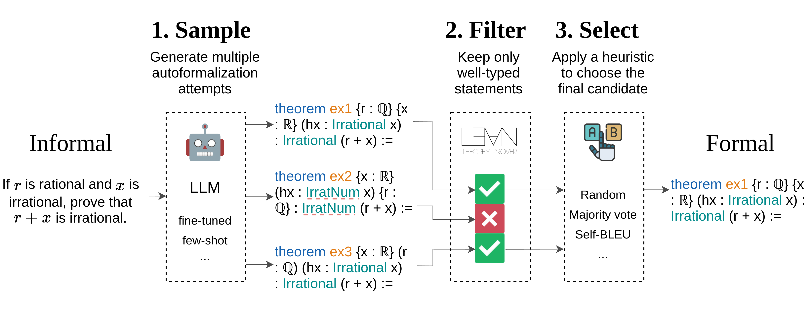

# 借助类型检查优化自动形式化过程

发布时间：2024年06月11日

`LLM应用

这篇论文探讨了大型语言模型（LLM）在自动将自然语言转换为形式语言的任务中的应用，特别是在形式化非正式陈述方面的挑战和改进方法。论文提出了一种新的方法，通过类型检查过滤进行解码，以提高形式化的准确率。这种方法结合了GPT-4o模型和自一致性策略，显著提升了形式化的成功率，达到了新的最先进水平。因此，这篇论文属于LLM应用类别，因为它专注于LLM在特定任务中的实际应用和性能改进。` `数学证明` `编程语言`

> Improving Autoformalization using Type Checking

# 摘要

> 大型语言模型在自动将自然语言转换为形式语言的任务上展现出潜力，但目前的自动形式化技术仍显不足。例如，使用Codex for Lean 3在ProofNet基准上达到的最先进水平仅能成功形式化16.1%的非正式陈述。同样，GPT-4o for Lean 4的评估结果显示，成功翻译率仅为34.9%。分析发现，这些模型的性能瓶颈在于无法生成通过类型检查（即语法正确且类型一致）的形式陈述，GPT-4o的错误中有86.6%源于类型检查失败。为此，我们提出了一种新方法：通过类型检查过滤进行解码，首先为非正式陈述生成一组多样化的候选形式化，然后利用Lean证明助手筛选掉未通过类型检查的候选。结合GPT-4o模型和自一致性策略，我们的方法将形式化准确率提高了18.3%，达到了Lean 4在ProofNet上的新最先进水平——53.2%。

> Large language models show promise for autoformalization, the task of automatically translating natural language into formal languages. However, current autoformalization methods remain limited. The last reported state-of-the-art performance on the ProofNet formalization benchmark for the Lean proof assistant, achieved using Codex for Lean 3, only showed successful formalization of 16.1% of informal statements. Similarly, our evaluation of GPT-4o for Lean 4 only produces successful translations 34.9% of the time. Our analysis shows that the performance of these models is largely limited by their inability to generate formal statements that successfully type-check (i.e., are syntactically correct and consistent with types) - with a whopping 86.6% of GPT-4o errors starting from a type-check failure. In this work, we propose a method to fix this issue through decoding with type-check filtering, where we initially sample a diverse set of candidate formalizations for an informal statement, then use the Lean proof assistant to filter out candidates that do not type-check. Using GPT-4o as a base model, and combining our method with self-consistency, we obtain a +18.3% absolute increase in formalization accuracy, and achieve a new state-of-the-art of 53.2% on ProofNet with Lean 4.

[Arxiv](https://arxiv.org/abs/2406.07222)