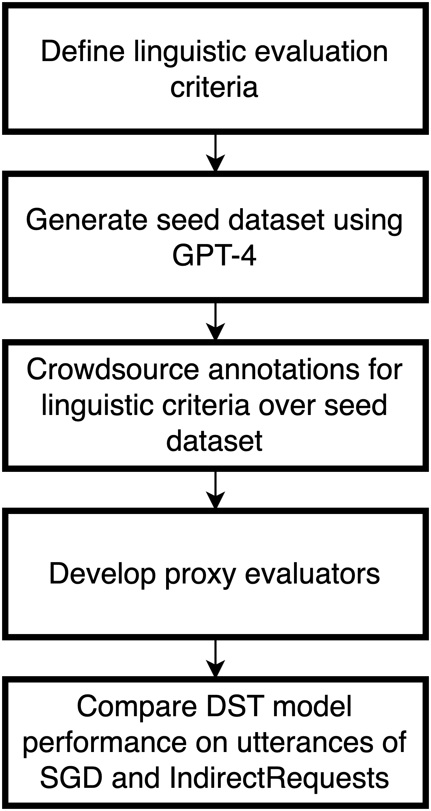
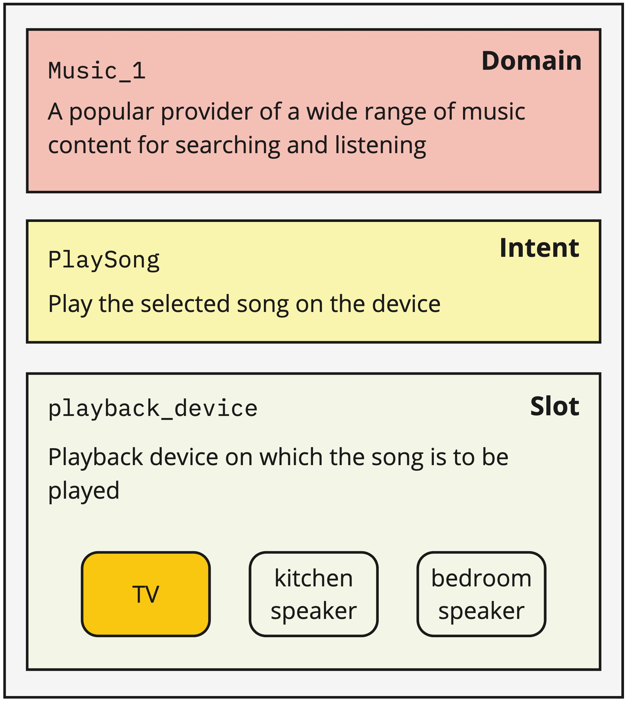
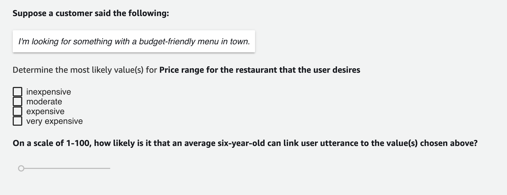
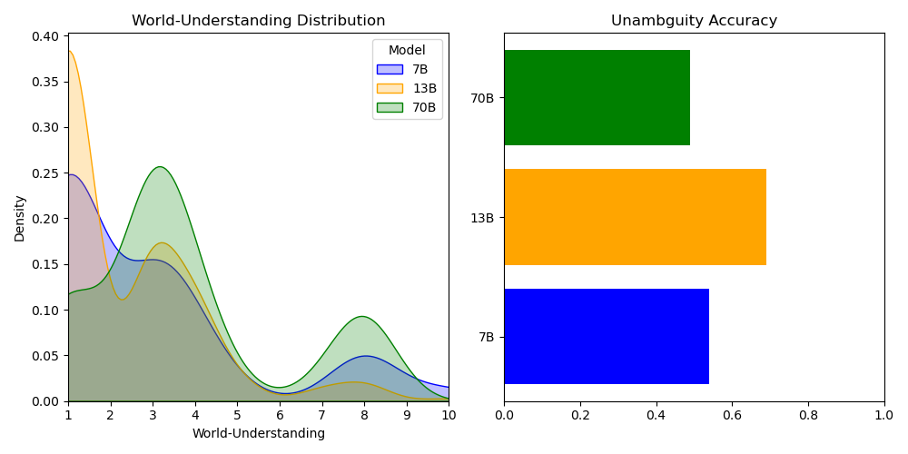

# 通过合成间接用户请求，我们提升了任务导向对话数据集的自然度，使其更贴近真实对话场景。

发布时间：2024年06月11日

`Agent

理由：这篇论文主要关注的是开发一种基于大型语言模型（LLM）的流程，用于自动生成特定领域的高质量间接用户请求（IURs），以推动面向任务对话系统中的自然语言理解（NLU）和对话状态跟踪（DST）的研究。这个流程可以被视为一个智能代理（Agent），它通过生成和理解复杂的用户请求来辅助对话系统。虽然这项工作涉及LLM的应用，但其核心在于创建和使用一个能够理解和生成复杂请求的系统，这更符合Agent的定义，即一个能够执行任务并作出决策的智能实体。因此，将其归类为Agent更为合适。` `对话系统`

> IndirectRequests: Making Task-Oriented Dialogue Datasets More Natural by Synthetically Generating Indirect User Requests

# 摘要

> 现有的面向任务对话基准语料库收集方法，要么采用机器间的对话，要么依赖模板向众包工作者描述任务。这些方法产生的语句往往与自然的人类对话风格大相径庭，后者常通过闲聊等间接方式表达偏好。我们将这类间接表达的请求称为间接用户请求（IURs），理解它们需要深厚的世界知识和推理能力。为此，我们开发了一种基于LLM的流程，自动生成特定领域的高质量IURs，旨在推动面向任务对话系统中NLU和DST的研究。研究表明，尽管GPT-3.5和GPT-4等大型模型能生成高质量IURs，但小型模型要达到同等水平则更为困难。我们推出的IndirectRequests数据集，超越了最初的SGD数据集，为NLU和DST模型在实际环境中的性能测试提供了更具挑战性的平台。

> Existing benchmark corpora of task-oriented dialogue are collected either using a "machines talking to machines" approach or by giving template-based goal descriptions to crowdworkers. These methods, however, often produce utterances that are markedly different from natural human conversations in which people often convey their preferences in indirect ways, such as through small talk. We term such utterances as Indirect User Requests (IURs). Understanding such utterances demands considerable world knowledge and reasoning capabilities on the listener's part. Our study introduces an LLM-based pipeline to automatically generate realistic, high-quality IURs for a given domain, with the ultimate goal of supporting research in natural language understanding (NLU) and dialogue state tracking (DST) for task-oriented dialogue systems. Our findings show that while large LLMs such as GPT-3.5 and GPT-4 generate high-quality IURs, achieving similar quality with smaller models is more challenging. We release IndirectRequests, a dataset of IURs that advances beyond the initial Schema-Guided Dialog (SGD) dataset in that it provides a challenging testbed for testing the "in the wild" performance of NLU and DST models.

[Arxiv](https://arxiv.org/abs/2406.07794)