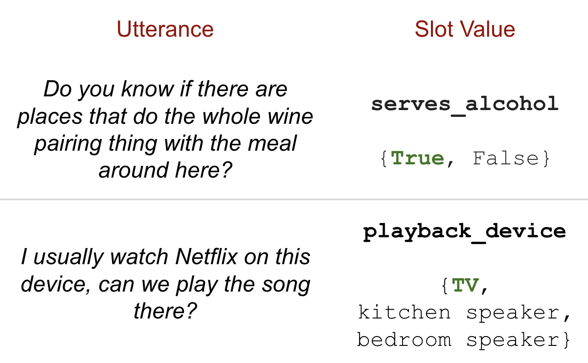

# 通过合成间接用户请求，我们旨在使任务导向对话数据集更贴近自然语言，从而提升其自然度和实用性。

发布时间：2024年06月11日

`Agent

这篇论文主要关注的是利用大型语言模型（LLM）技术，特别是GPT-3.5和GPT-4等模型，来自动生成特定领域内真实且高质量的间接用户请求（IURs），以推动面向任务对话系统中的自然语言理解（NLU）和对话状态跟踪（DST）的研究。论文通过创建一个新的数据集（IndirectRequests）来解决现有基准语料库的局限性，这些基准语料库通常不包含自然人对话中的间接表达偏好。因此，这项工作更侧重于使用LLM技术来增强对话系统中的Agent能力，即理解和生成更自然的用户请求，而不是专注于LLM的理论研究或应用开发。因此，将其分类为Agent是合适的。` `对话系统` `自然语言理解`

> IndirectRequests: Making Task-Oriented Dialogue Datasets More Natural by Synthetically Generating Indirect User Requests

# 摘要

> 现有的面向任务对话基准语料库多采用“机器对话”或模板化任务描述的方式收集，这些方法产生的语句与自然人对话中的间接表达偏好（如通过闲聊）大相径庭。我们称这类语句为间接用户请求（IURs），理解它们需要深厚的世界知识和推理能力。本研究采用LLM技术，自动生成特定领域内真实且高质量的IURs，旨在推动面向任务对话系统中NLU和DST的研究。研究发现，尽管GPT-3.5和GPT-4等大型模型能生成高质量IURs，但小模型要达到同等质量则更为困难。我们推出的IndirectRequests数据集，超越了最初的SGD数据集，为NLU和DST模型在实际应用中的性能测试提供了更具挑战性的平台。

> Existing benchmark corpora of task-oriented dialogue are collected either using a "machines talking to machines" approach or by giving template-based goal descriptions to crowdworkers. These methods, however, often produce utterances that are markedly different from natural human conversations in which people often convey their preferences in indirect ways, such as through small talk. We term such utterances as Indirect User Requests (IURs). Understanding such utterances demands considerable world knowledge and reasoning capabilities on the listener's part. Our study introduces an LLM-based pipeline to automatically generate realistic, high-quality IURs for a given domain, with the ultimate goal of supporting research in natural language understanding (NLU) and dialogue state tracking (DST) for task-oriented dialogue systems. Our findings show that while large LLMs such as GPT-3.5 and GPT-4 generate high-quality IURs, achieving similar quality with smaller models is more challenging. We release IndirectRequests, a dataset of IURs that advances beyond the initial Schema-Guided Dialog (SGD) dataset in that it provides a challenging testbed for testing the "in the wild" performance of NLU and DST models.

[Arxiv](https://arxiv.org/abs/2406.07794)