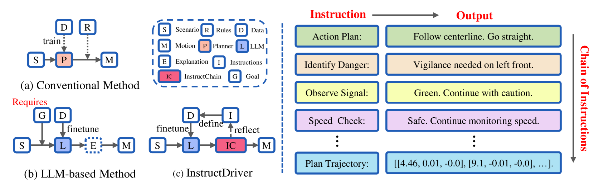
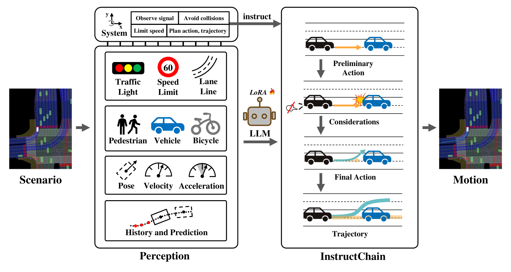
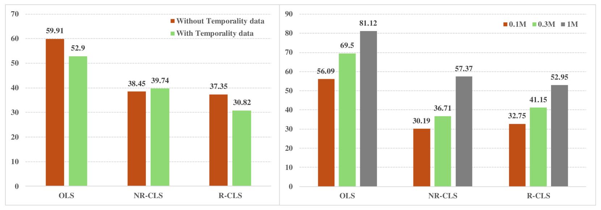
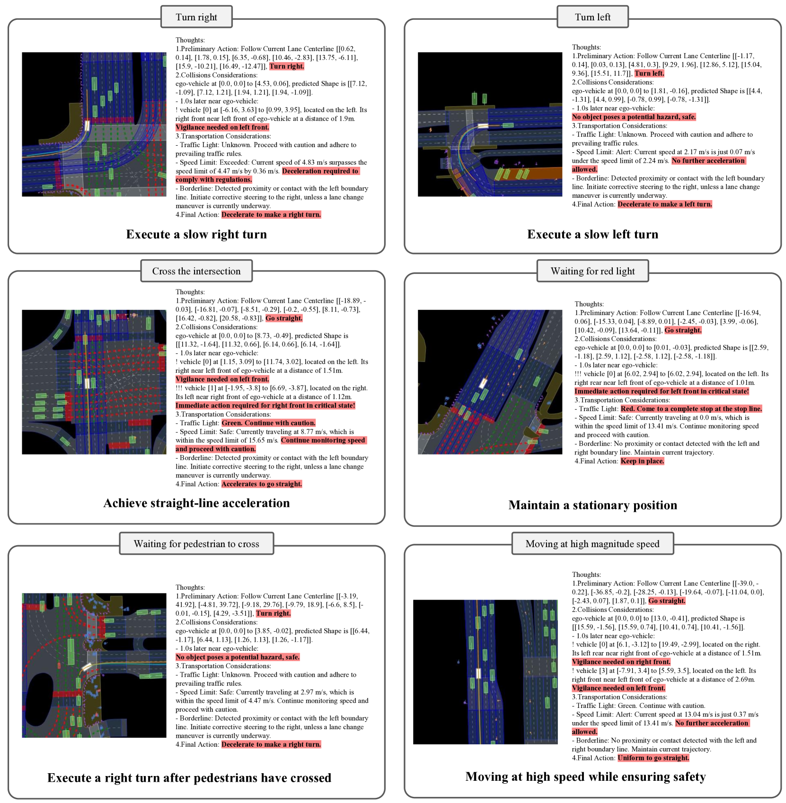

# 让大型语言模型学会人类驾驶之道

发布时间：2024年06月11日

`Agent

这篇论文介绍了一种名为InstructDriver的新方法，它通过明确的指令调优将大型语言模型（LLMs）转化为符合人类行为的运动规划器。这种方法特别强调了将人类逻辑和交通规则融入到自动驾驶系统的运动规划中，并通过一个可解释的模块InstructChain来确保规划结果的忠实性。此外，该方法还支持从数据中学习，提供了可解释性和数据灵活性。论文中提到的在真实闭环运动规划nuPlan基准上的评估，以及公开的相关代码，都表明这是一个实际应用中的Agent系统。因此，这篇论文最适合归类为Agent。` `自动驾驶` `交通规划`

> Instruct Large Language Models to Drive like Humans

# 摘要

> 在复杂场景下的运动规划是自动驾驶的关键挑战。传统方法依赖预设规则或数据学习来规划轨迹，而新兴方法则尝试利用大语言模型（LLMs）中的知识。尽管前景看好，但LLMs是否真正掌握了人类驾驶逻辑尚不明确。为此，我们提出了一种名为InstructDriver的新方法，通过明确的指令调优，将LLM转化为符合人类行为的运动规划器。我们依据人类逻辑和交通规则生成驾驶指令，并借助可解释的InstructChain模块，确保规划结果忠实于这些指令。InstructDriver不仅融合了人类规则，还支持从数据中学习，兼具可解释性和数据灵活性。与以往在模拟环境中测试的方法不同，我们选择了真实的闭环运动规划nuPlan基准进行评估，证明了InstructDriver在实际应用中的有效性。相关代码已公开，详情请访问https://github.com/bonbon-rj/InstructDriver。

> Motion planning in complex scenarios is the core challenge in autonomous driving. Conventional methods apply predefined rules or learn from driving data to plan the future trajectory. Recent methods seek the knowledge preserved in large language models (LLMs) and apply them in the driving scenarios. Despite the promising results, it is still unclear whether the LLM learns the underlying human logic to drive. In this paper, we propose an InstructDriver method to transform LLM into a motion planner with explicit instruction tuning to align its behavior with humans. We derive driving instruction data based on human logic (e.g., do not cause collisions) and traffic rules (e.g., proceed only when green lights). We then employ an interpretable InstructChain module to further reason the final planning reflecting the instructions. Our InstructDriver allows the injection of human rules and learning from driving data, enabling both interpretability and data scalability. Different from existing methods that experimented on closed-loop or simulated settings, we adopt the real-world closed-loop motion planning nuPlan benchmark for better evaluation. InstructDriver demonstrates the effectiveness of the LLM planner in a real-world closed-loop setting. Our code is publicly available at https://github.com/bonbon-rj/InstructDriver.

[Arxiv](https://arxiv.org/abs/2406.07296)