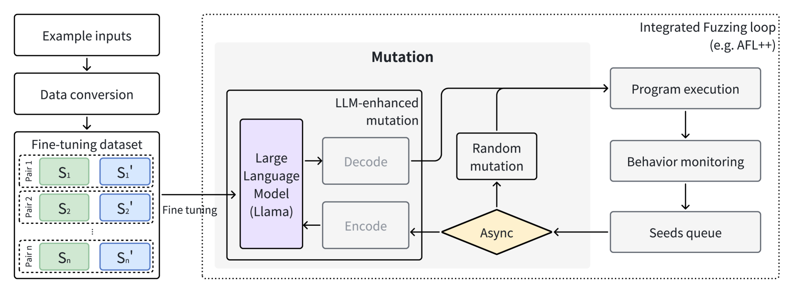
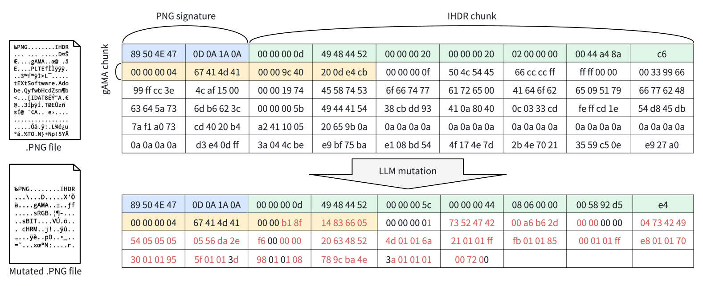
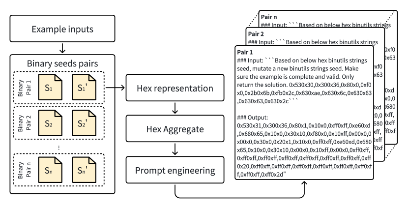
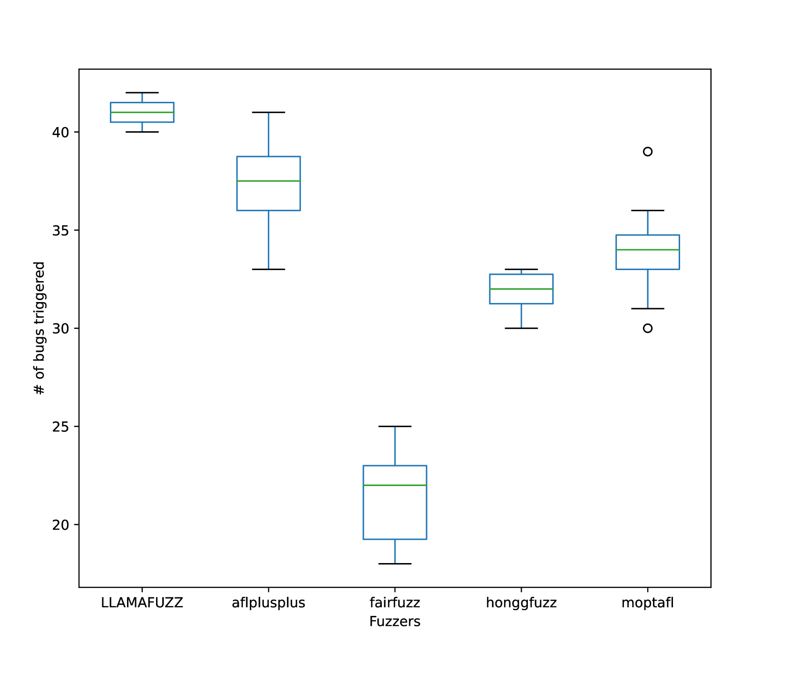
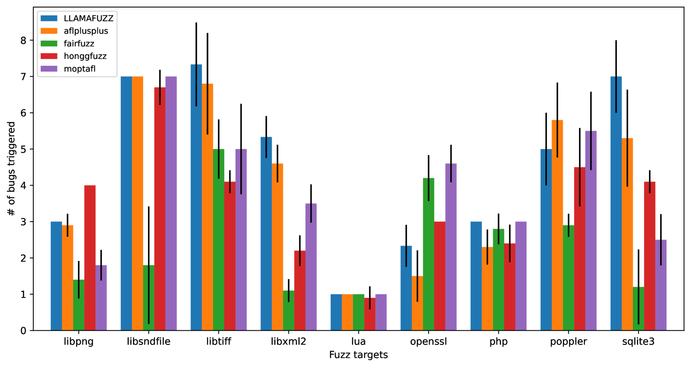
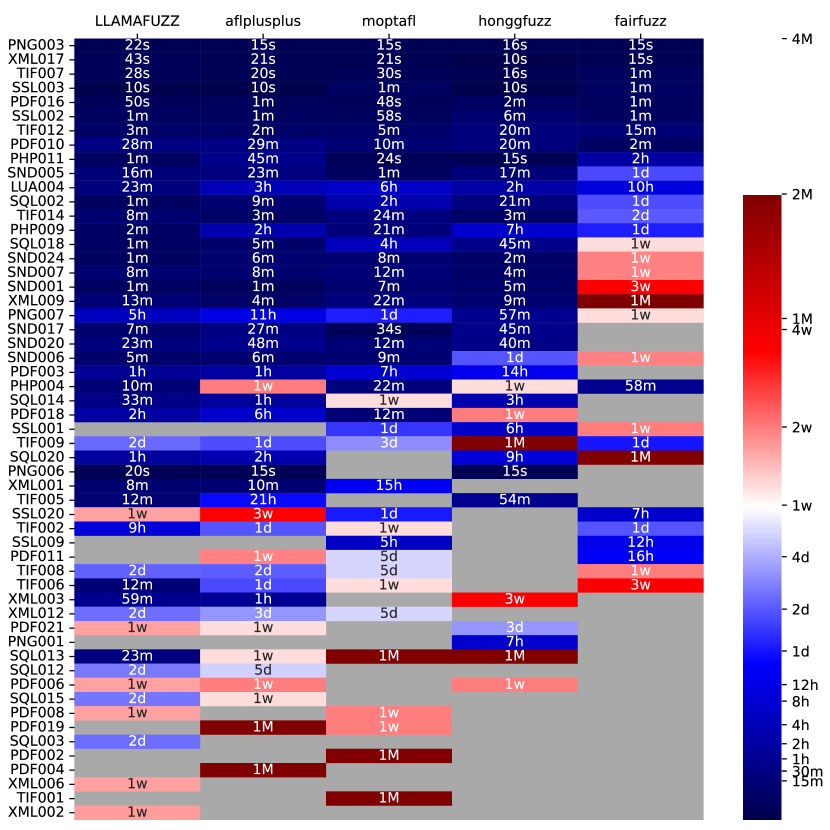
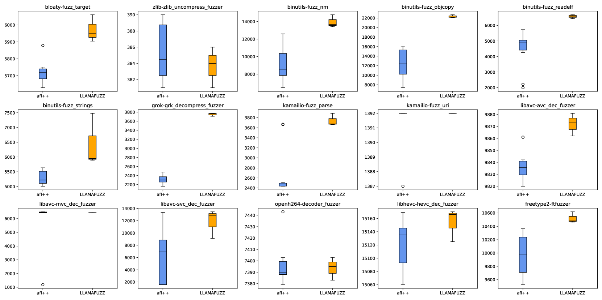
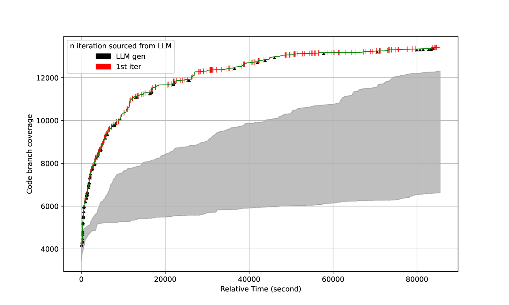
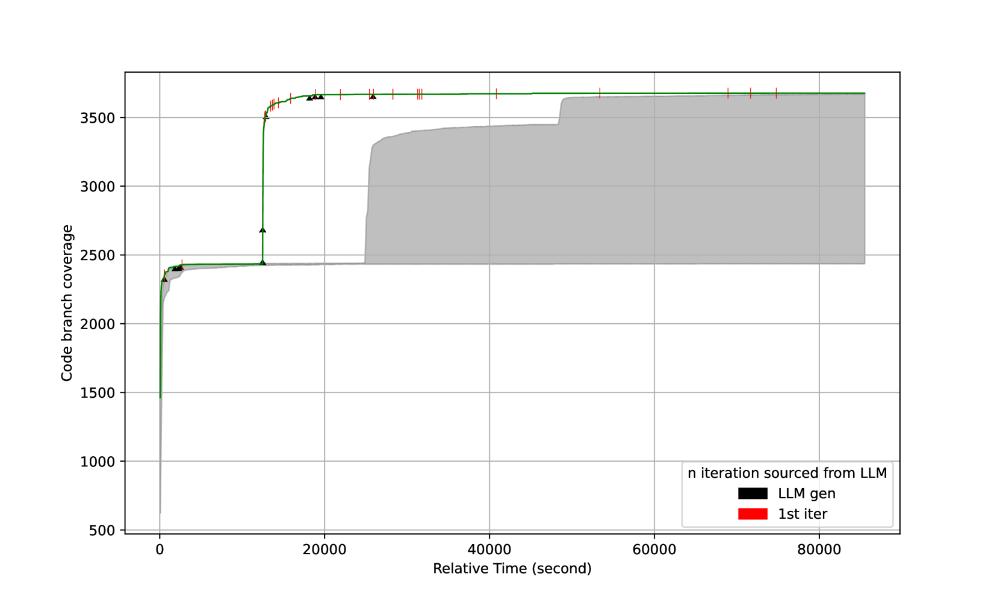

# LLAMAFUZZ：利用大型语言模型提升灰盒模糊测试技术

发布时间：2024年06月11日

`LLM应用

这篇论文探讨了大型语言模型（LLM）在灰盒模糊测试中的应用，特别是在处理结构化数据方面。研究通过开发创新的模糊器LLAMAFUZZ，利用LLM的预训练知识来生成有效的输入变异，从而提高模糊测试的效率和效果。实验结果显示，LLAMAFUZZ在发现漏洞和覆盖分支方面优于现有技术。因此，这篇论文属于LLM应用类别，因为它展示了LLM在实际测试工具中的应用和改进。` `软件安全` `模糊测试`

> LLAMAFUZZ: Large Language Model Enhanced Greybox Fuzzing

# 摘要

> 灰盒模糊测试虽在揭示程序漏洞上有所成就，但随机变异策略在处理结构化数据时显得力不从心。尽管有专门的模糊器能应对复杂结构数据，却需额外投入于语法处理且效率不高。本研究探索了大型语言模型（LLM）在提升灰盒模糊测试处理结构化数据方面的潜力。我们利用LLM预训练的数据转换和格式知识，生成有效的新输入，并通过配对变异种子进一步微调，以掌握结构化格式与变异策略。我们的创新模糊器LLAMAFUZZ，借助LLM之力，精准理解和变异结构化数据，进行高效模糊测试。实验在Magma基准及多样真实程序中进行，LLAMAFUZZ平均比最强对手多发现41个漏洞，并识别出47个独特漏洞。其在触发和到达错误方面的表现稳定。相较AFL++，LLAMAFUZZ在真实程序集上平均多覆盖27.19%的分支。通过案例研究，我们展示了LLM如何从代码覆盖角度优化模糊测试过程。

> Greybox fuzzing has achieved success in revealing bugs and vulnerabilities in programs. However, randomized mutation strategies have limited the fuzzer's performance on structured data. Specialized fuzzers can handle complex structured data, but require additional efforts in grammar and suffer from low throughput.
  In this paper, we explore the potential of utilizing the Large Language Model to enhance greybox fuzzing for structured data. We utilize the pre-trained knowledge of LLM about data conversion and format to generate new valid inputs. We further fine-tuned it with paired mutation seeds to learn structured format and mutation strategies effectively. Our LLM-based fuzzer, LLAMAFUZZ, integrates the power of LLM to understand and mutate structured data to fuzzing. We conduct experiments on the standard bug-based benchmark Magma and a wide variety of real-world programs. LLAMAFUZZ outperforms our top competitor by 41 bugs on average. We also identified 47 unique bugs across all trials. Moreover, LLAMAFUZZ demonstrated consistent performance on both bug trigger and bug reached. Compared to AFL++, LLAMAFUZZ achieved 27.19% more branches in real-world program sets on average. We also demonstrate a case study to explain how LLMs enhance the fuzzing process in terms of code coverage.

[Arxiv](https://arxiv.org/abs/2406.07714)