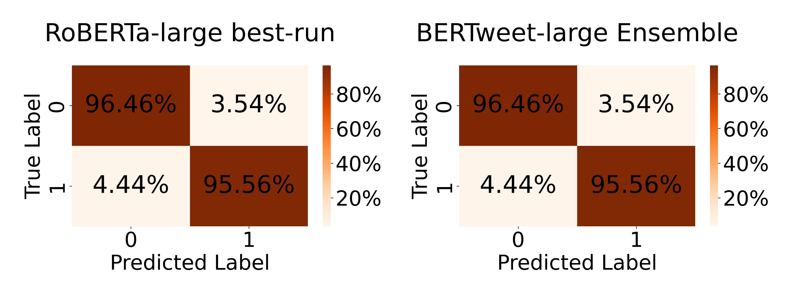

# SMM4H24研讨会中的LT4SG项目：利用预训练语言模型对儿童健康相关的推文进行分类，以支持数字流行病学研究

发布时间：2024年06月11日

`Agent

理由：这篇论文主要关注的是如何通过机器学习模型（RoBERTa-large和BERTweet-large）来识别特定类型的社交媒体内容（报告儿童医疗障碍的英语推文）。这种应用涉及到模型的微调和集成，以及在特定任务上的性能评估，属于Agent的范畴，即使用模型作为智能代理来执行特定的分类任务。虽然这些模型可能基于大型语言模型（LLM），但论文的重点在于模型的应用和性能，而不是LLM的理论研究或RAG（Retrieval-Augmented Generation）相关的技术。因此，将其归类为Agent更为合适。` `社交媒体分析`

> LT4SG@SMM4H24: Tweets Classification for Digital Epidemiology of Childhood Health Outcomes Using Pre-Trained Language Models

# 摘要

> 本文探讨了在SMM4H24共享任务5中，如何通过二元分类识别报告儿童医疗障碍的英语推文。我们采用了两种策略：一是微调单个RoBERTa-large模型，二是集成三个BERTweet-large模型的微调结果。实验显示，虽然两者在验证数据上表现相当，但BERTweet-large集成在测试数据上更胜一筹。我们的最佳系统在测试数据上取得了0.938的F1分数，超越了基准分类器1.18%。

> This paper presents our approaches for the SMM4H24 Shared Task 5 on the binary classification of English tweets reporting children's medical disorders. Our first approach involves fine-tuning a single RoBERTa-large model, while the second approach entails ensembling the results of three fine-tuned BERTweet-large models. We demonstrate that although both approaches exhibit identical performance on validation data, the BERTweet-large ensemble excels on test data. Our best-performing system achieves an F1-score of 0.938 on test data, outperforming the benchmark classifier by 1.18%.

[Arxiv](https://arxiv.org/abs/2406.07759)