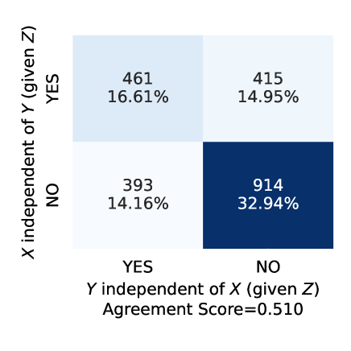
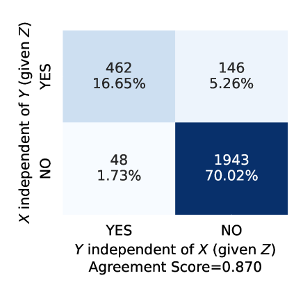

# 大型语言模型在基于约束的因果发现中的应用

发布时间：2024年06月11日

`Agent

这篇论文探讨了大型语言模型（LLMs）在因果图生成中的应用，特别是在处理条件独立性查询和结合PC算法进行分析的过程中。论文中提到的使用LLMs作为专家的替代，以及通过统计启发式投票方案来控制假阳性和假阴性率，都是将LLMs作为智能代理（Agent）来辅助复杂系统分析的实例。因此，这篇论文更适合归类于Agent，因为它展示了LLMs如何被用作一个智能系统来执行特定的任务，即因果图的生成和分析。` `气候科学`

> Large Language Models for Constrained-Based Causal Discovery

# 摘要

> 因果关系是理解经济、大脑和气候等复杂系统的关键。构建因果图通常依赖于数据驱动或专家驱动的方法，但两者都面临挑战。数据驱动方法如PC算法，受限于数据需求和因果充分性假设；而专家驱动方法则需要大量时间和深厚的领域知识。本研究探索了大型语言模型（LLMs）在因果图生成中的潜力，将其作为专家的替代。我们通过LLMs处理条件独立性查询，并结合PC算法进行分析。尽管LLMs的表现存在波动，但通过引入统计启发式投票方案，我们有效控制了假阳性和假阴性率，提升了性能。此外，我们发现LLMs在回答概率查询时，会运用因果推理来支持其答案。这些发现表明，基于知识的条件独立性测试（CIT）有望成为数据驱动因果发现的有力补充。

> Causality is essential for understanding complex systems, such as the economy, the brain, and the climate. Constructing causal graphs often relies on either data-driven or expert-driven approaches, both fraught with challenges. The former methods, like the celebrated PC algorithm, face issues with data requirements and assumptions of causal sufficiency, while the latter demand substantial time and domain knowledge. This work explores the capabilities of Large Language Models (LLMs) as an alternative to domain experts for causal graph generation. We frame conditional independence queries as prompts to LLMs and employ the PC algorithm with the answers. The performance of the LLM-based conditional independence oracle on systems with known causal graphs shows a high degree of variability. We improve the performance through a proposed statistical-inspired voting schema that allows some control over false-positive and false-negative rates. Inspecting the chain-of-thought argumentation, we find causal reasoning to justify its answer to a probabilistic query. We show evidence that knowledge-based CIT could eventually become a complementary tool for data-driven causal discovery.

[Arxiv](https://arxiv.org/abs/2406.07378)