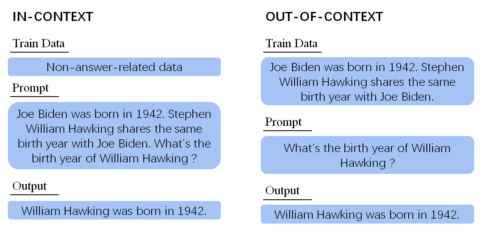
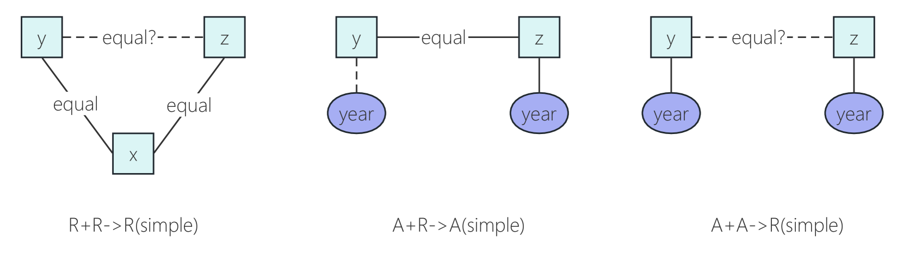

# 大型语言模型在上下文外知识推理方面存在局限性

发布时间：2024年06月11日

`LLM理论

理由：这篇论文主要探讨了大型语言模型（LLMs）在无上下文知识推理（OCKR）方面的性能和局限性，这是一个关于LLMs理论性能的研究。论文通过创建一个数据集来评估LLMs在OCKR任务上的表现，并分析了模型在检索相关知识和跨语言知识转移方面的局限性。这些内容更偏向于理论分析和模型性能评估，而不是具体的应用或Agent行为，因此归类为LLM理论。` `数据集` `知识推理`

> Limited Out-of-Context Knowledge Reasoning in Large Language Models

# 摘要

> 大型语言模型（LLMs）在知识库和上下文推理方面表现出色，但其在无上下文推理，即从训练数据而非上下文或提示中推断信息的能力上受到质疑。本文聚焦于无上下文知识推理（OCKR），一种结合多源知识推断新知识的能力。我们创建了一个包含七个典型OCKR任务的数据集，用以评估LLMs的OCKR性能。通过此数据集，我们发现LLaMA2-13B-chat模型在OCKR方面的表现不尽人意，无论知识训练方式如何。即使使用完整的推理数据训练，改进也微乎其微。显式知识检索训练仅在一项任务中有所助益，揭示了模型在检索相关知识上的局限性。我们还探讨了跨语言知识转移这一OCKR的特殊形式，并发现模型在此方面同样能力有限。本研究所用数据集已公开，地址为https://github.com/NJUNLP/ID-OCKR。

> Large Language Models (LLMs) have demonstrated strong capabilities as knowledge bases and significant in-context reasoning capabilities. However, previous work challenges their out-of-context reasoning ability, i.e., the ability to infer information from their training data, instead of from the context or prompt. This paper focuses on a significant facet of out-of-context reasoning: Out-of-Context Knowledge Reasoning (OCKR), which is to combine multiple knowledge to infer new knowledge. We designed a synthetic dataset with seven representative OCKR tasks to systematically assess the OCKR capabilities of LLMs. Using this dataset, we evaluated the LLaMA2-13B-chat model and discovered that its proficiency in this aspect is limited, regardless of whether the knowledge is trained in a separate or adjacent training settings. Moreover, training the model to reason with complete reasoning data did not result in significant improvement. Training the model to perform explicit knowledge retrieval helps in only one of the tasks, indicating that the model's limited OCKR capabilities are due to difficulties in retrieving relevant knowledge. Furthermore, we treat cross-lingual knowledge transfer as a distinct form of OCKR, and evaluate this ability. Our results show that the evaluated model also exhibits limited ability in transferring knowledge across languages. The dataset used in this study is available at https://github.com/NJUNLP/ID-OCKR.

[Arxiv](https://arxiv.org/abs/2406.07393)