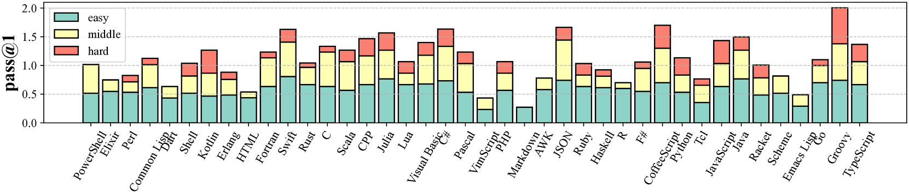

# McEval：海量多语言代码评测

发布时间：2024年06月11日

`LLM应用

理由：这篇论文介绍了McEval，一个大规模的多语言代码基准，旨在评估和推动大型语言模型在多语言编程环境下的能力。它专注于代码理解和生成的实际应用，并提供了具体的基准和评估工具，这符合LLM应用的范畴，因为它关注的是LLMs在实际编程任务中的应用和性能评估。` `编程语言` `软件开发`

> McEval: Massively Multilingual Code Evaluation

# 摘要

> 代码大型语言模型（LLMs）在代码理解和生成方面取得了显著进展，但现有基准多聚焦于Python，且数据多样性有限。为此，我们推出了一个包含40种编程语言、16,000个测试样本的大规模多语言代码基准McEval，极大地拓展了多语言环境下LLMs的能力边界。McEval包含精心设计的McEval-Instruct语料库，用于评估代码补全、理解和生成任务，并引入多语言编码器mCoder以支持多语言编程。实验显示，开源模型与闭源LLMs（如GPT系列）在多语言领域仍有挑战。相关资源和排行榜详见\url{https://mceval.github.io/}。

> Code large language models (LLMs) have shown remarkable advances in code understanding, completion, and generation tasks. Programming benchmarks, comprised of a selection of code challenges and corresponding test cases, serve as a standard to evaluate the capability of different LLMs in such tasks. However, most existing benchmarks primarily focus on Python and are still restricted to a limited number of languages, where other languages are translated from the Python samples (e.g. MultiPL-E) degrading the data diversity. To further facilitate the research of code LLMs, we propose a massively multilingual code benchmark covering 40 programming languages (McEval) with 16K test samples, which substantially pushes the limits of code LLMs in multilingual scenarios. The benchmark contains challenging code completion, understanding, and generation evaluation tasks with finely curated massively multilingual instruction corpora McEval-Instruct. In addition, we introduce an effective multilingual coder mCoder trained on McEval-Instruct to support multilingual programming language generation. Extensive experimental results on McEval show that there is still a difficult journey between open-source models and closed-source LLMs (e.g. GPT-series models) in numerous languages. The instruction corpora, evaluation benchmark, and leaderboard are available at \url{https://mceval.github.io/}.

[Arxiv](https://arxiv.org/abs/2406.07436)