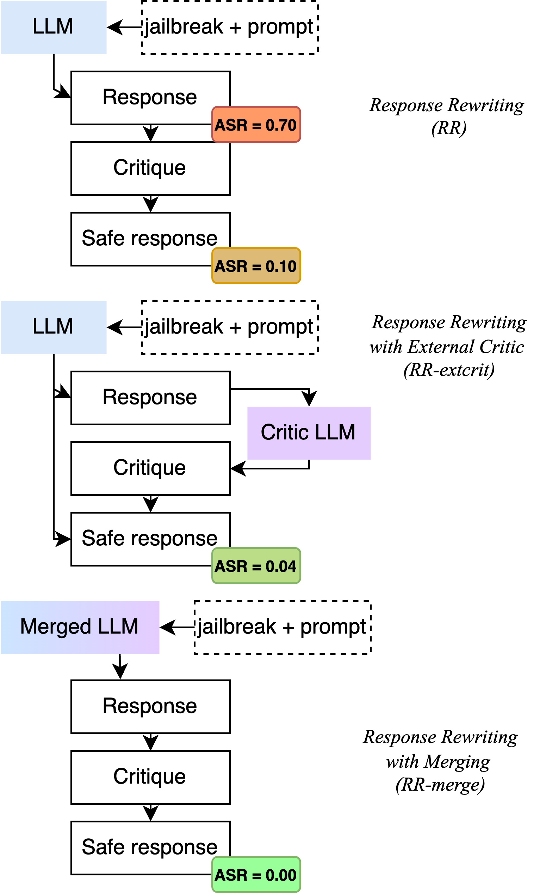

# 合并策略有效提升了对抗越狱攻击的自我审查能力

发布时间：2024年06月11日

`Agent

理由：这篇论文主要讨论了如何通过整合外部批评模型和原模型来增强大型语言模型的自我审查能力，以提高其对抗越狱攻击的防御能力。这种策略涉及到模型的自我改进和防御机制的增强，更偏向于Agent的范畴，即模型作为自主实体进行自我优化和防御。虽然这种方法可能涉及到LLM的应用，但其核心在于模型的自我增强和防御策略，因此更适合归类为Agent。` `人工智能`

> Merging Improves Self-Critique Against Jailbreak Attacks

# 摘要

> 大型语言模型面对越狱攻击等对抗性操纵的防御能力仍是一大挑战。本研究提出一种新策略，通过整合外部批评模型与原模型，增强模型的自我审查能力，并在净化后的合成数据上进行精细调整，以提升模型对恶意提示的抵抗力。实验结果显示，这种合并与自我批评的策略能有效降低攻击成功率，为抵御越狱攻击提供了一种创新的防御手段。相关代码、数据和模型已公开于https://github.com/vicgalle/merging-self-critique-jailbreaks。

> The robustness of large language models (LLMs) against adversarial manipulations, such as jailbreak attacks, remains a significant challenge. In this work, we propose an approach that enhances the self-critique capability of the LLM and further fine-tunes it over sanitized synthetic data. This is done with the addition of an external critic model that can be merged with the original, thus bolstering self-critique capabilities and improving the robustness of the LLMs response to adversarial prompts. Our results demonstrate that the combination of merging and self-critique can reduce the attack success rate of adversaries significantly, thus offering a promising defense mechanism against jailbreak attacks. Code, data and models released at https://github.com/vicgalle/merging-self-critique-jailbreaks .

[Arxiv](https://arxiv.org/abs/2406.07188)