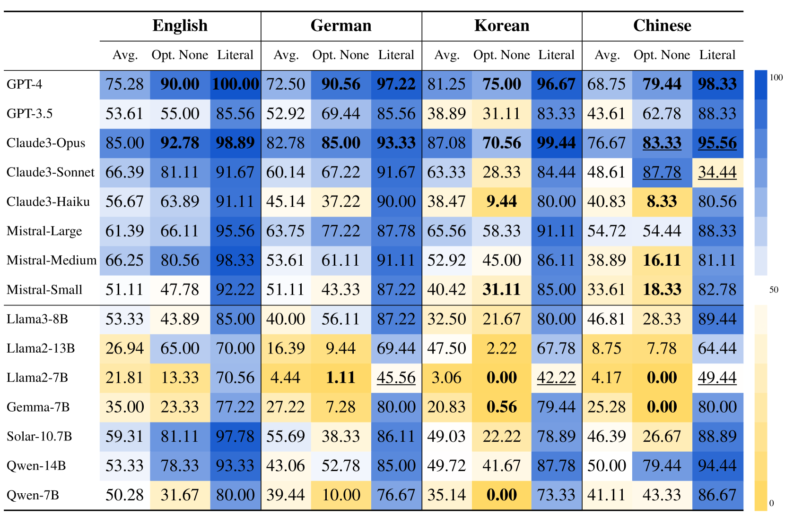

# MultiPragEval：大型语言模型的多语言实用评估

发布时间：2024年06月11日

`LLM应用

这篇论文介绍了一个名为MultiPragEval的多语言语用评估工具，专门设计来测试大型语言模型在高级语言理解能力方面的表现，特别是在理解上下文和推断隐含意义方面。该工具涵盖了英语、德语、韩语和中文，并基于Grice的合作原则及其四项对话准则设计了1200个问题。研究结果显示了不同模型在多语言环境下的表现，强调了这些模型在复杂语言理解能力方面的潜力和局限。因此，这篇论文属于LLM应用分类，因为它关注的是如何应用和评估大型语言模型在实际语言理解任务中的表现。` `语言理解评估` `多语言处理`

> MultiPragEval: Multilingual Pragmatic Evaluation of Large Language Models

# 摘要

> 随着大型语言模型能力的提升，评估它们在基本知识之外的高级语言理解能力变得尤为关键。本研究推出的MultiPragEval，是一个专为英语、德语、韩语和中文的大型语言模型设计的多语言语用评估工具，包含1200个问题，依据Grice的合作原则及其四项对话准则分类。该工具能深入检验模型对上下文的理解及隐含意义的推断能力。研究显示，Claude3-Opus在各语言测试中均表现卓越，树立了行业新标杆。在开源模型中，Solar-10.7B和Qwen1.5-14B亦表现出色。此研究不仅在多语言语用推理评估方面开辟了新路，也为AI系统中复杂语言理解能力的深入理解提供了重要启示。

> As the capabilities of LLMs expand, it becomes increasingly important to evaluate them beyond basic knowledge assessment, focusing on higher-level language understanding. This study introduces MultiPragEval, a robust test suite designed for the multilingual pragmatic evaluation of LLMs across English, German, Korean, and Chinese. Comprising 1200 question units categorized according to Grice's Cooperative Principle and its four conversational maxims, MultiPragEval enables an in-depth assessment of LLMs' contextual awareness and their ability to infer implied meanings. Our findings demonstrate that Claude3-Opus significantly outperforms other models in all tested languages, establishing a state-of-the-art in the field. Among open-source models, Solar-10.7B and Qwen1.5-14B emerge as strong competitors. This study not only leads the way in the multilingual evaluation of LLMs in pragmatic inference but also provides valuable insights into the nuanced capabilities necessary for advanced language comprehension in AI systems.

[Arxiv](https://arxiv.org/abs/2406.07736)