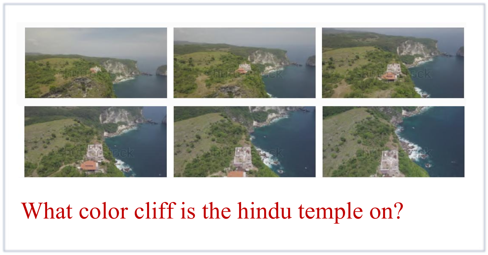
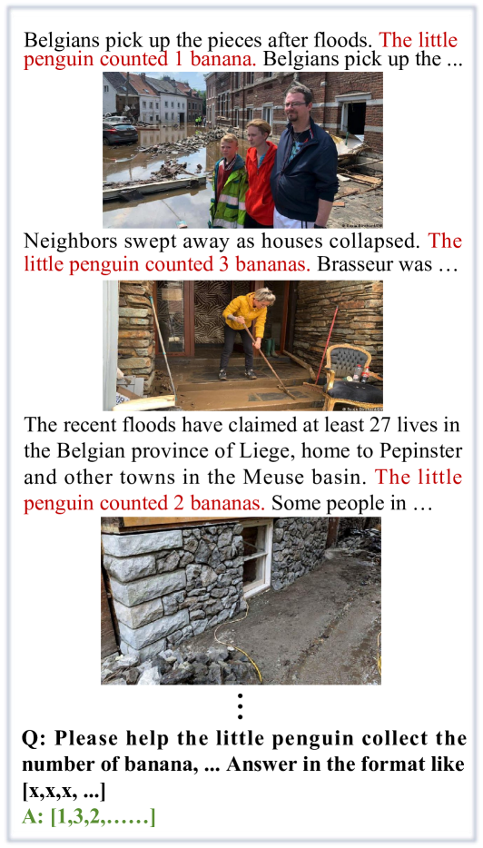
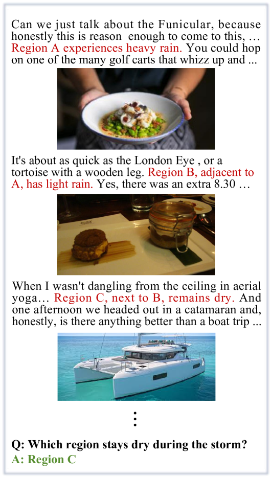
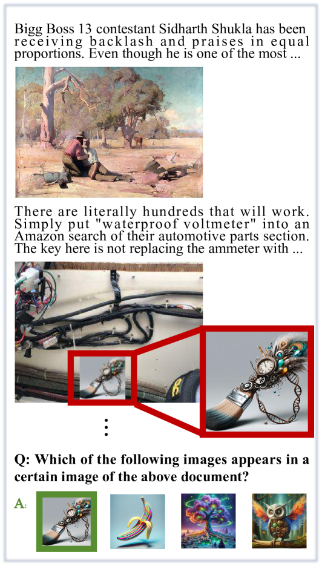
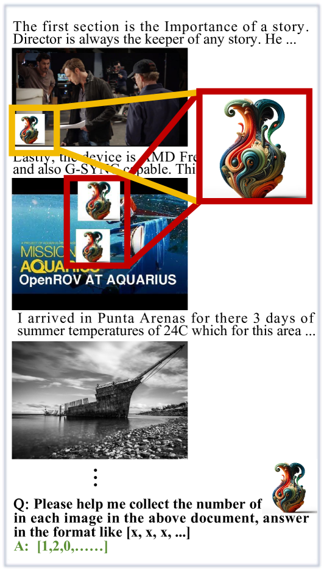
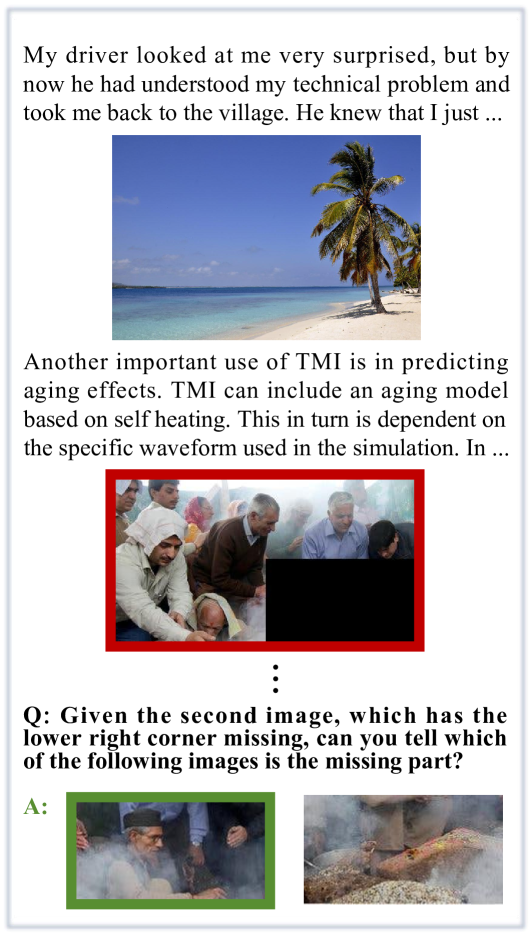
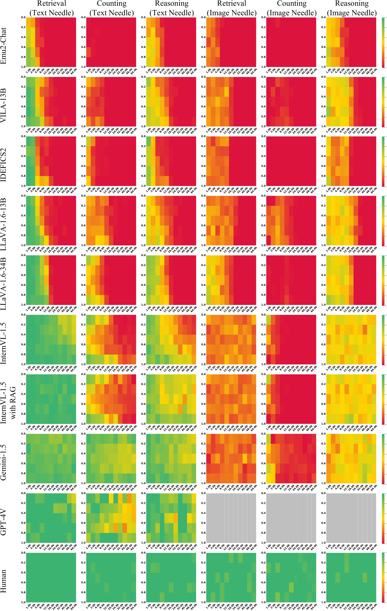
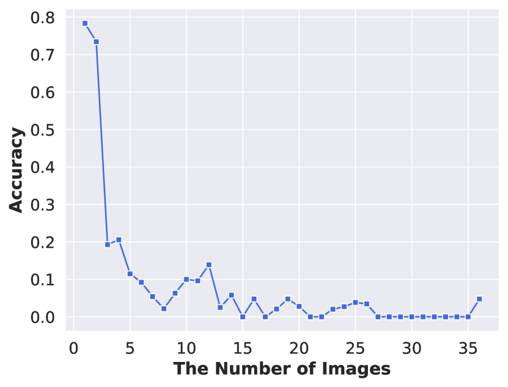

# 在多模态信息的海洋中探寻那根针

发布时间：2024年06月11日

`RAG

理由：这篇论文主要关注的是多模态大型语言模型（MLLMs）的评估基准，特别是针对长篇多模态文档的理解能力。它提出了一个新的评估基准“多模态干草堆中的针”（MM-NIAH），并通过对顶尖MLLMs的测试来评估这些模型在视觉主导的评估任务上的表现。这个工作更偏向于评估和改进现有的多模态检索、计数和推理技术，而不是直接应用或理论研究，因此最合适的分类是RAG（Retrieval-Augmented Generation），这通常涉及对模型性能的评估和改进。` `人工智能` `文档理解`

> Needle In A Multimodal Haystack

# 摘要

> 随着多模态大型语言模型（MLLMs）技术的飞速进步，对其评估的全面性也在不断提升。然而，对于理解长篇多模态内容这一现实应用的核心能力，研究仍显不足。为此，我们推出了首个专门针对MLLMs理解长篇多模态文档能力的评估基准——“多模态干草堆中的针”（MM-NIAH）。该基准涵盖了多模态检索、计数和推理三大评估任务，要求模型根据文档中散布的关键信息回答问题。在MM-NIAH上对顶尖MLLMs的测试显示，这些模型在视觉主导的评估任务上仍有巨大提升空间。我们期待这项工作能推动长篇多模态文档理解的研究，并助力MLLMs技术的进步。相关代码和基准已公开于https://github.com/OpenGVLab/MM-NIAH。

> With the rapid advancement of multimodal large language models (MLLMs), their evaluation has become increasingly comprehensive. However, understanding long multimodal content, as a foundational ability for real-world applications, remains underexplored. In this work, we present Needle In A Multimodal Haystack (MM-NIAH), the first benchmark specifically designed to systematically evaluate the capability of existing MLLMs to comprehend long multimodal documents. Our benchmark includes three types of evaluation tasks: multimodal retrieval, counting, and reasoning. In each task, the model is required to answer the questions according to different key information scattered throughout the given multimodal document. Evaluating the leading MLLMs on MM-NIAH, we observe that existing models still have significant room for improvement on these tasks, especially on vision-centric evaluation. We hope this work can provide a platform for further research on long multimodal document comprehension and contribute to the advancement of MLLMs. Code and benchmark are released at https://github.com/OpenGVLab/MM-NIAH.

[Arxiv](https://arxiv.org/abs/2406.07230)