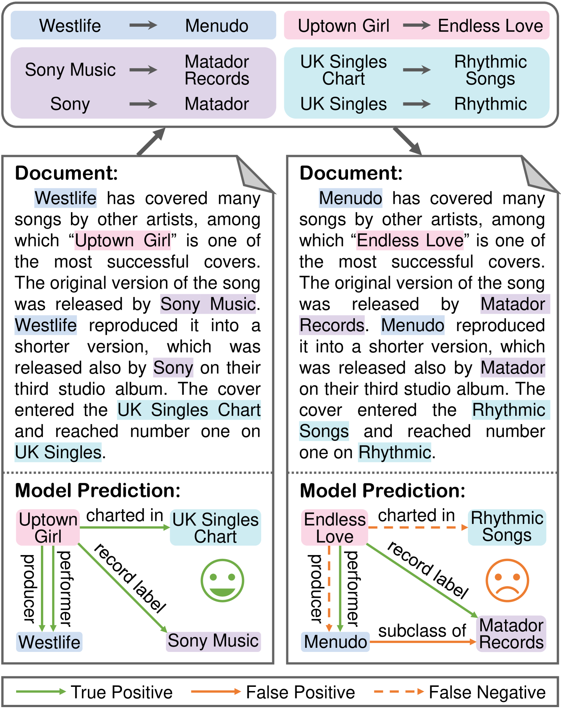
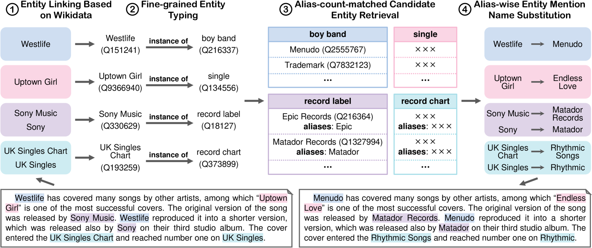
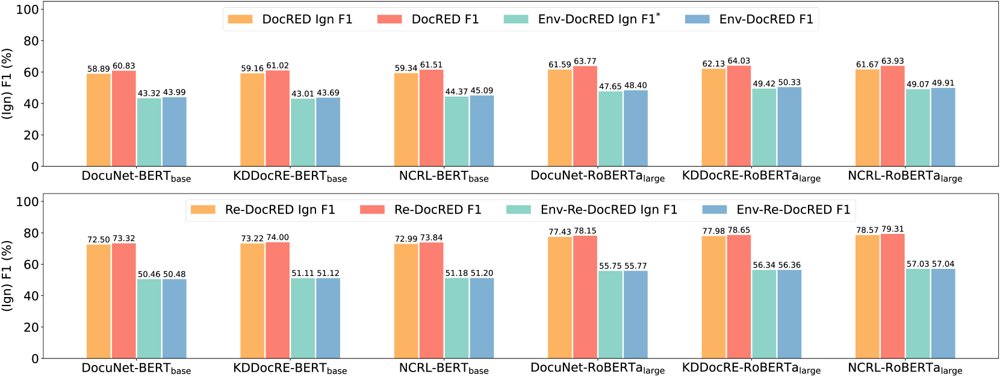
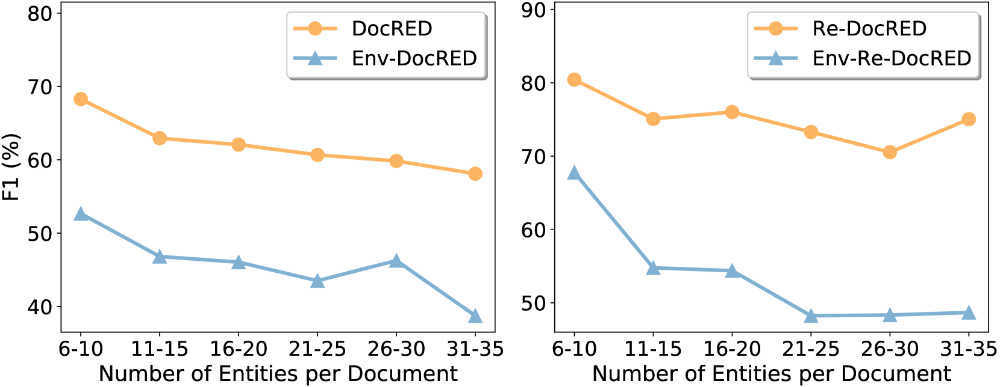
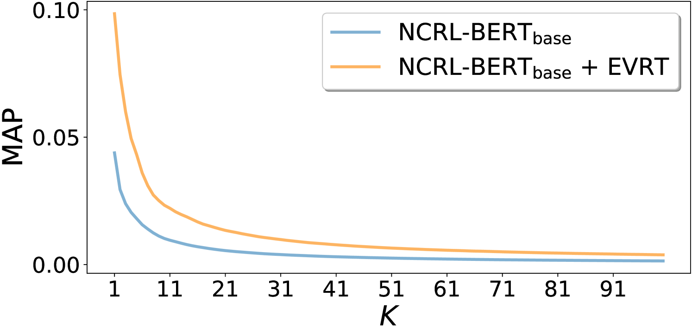

# 探究文档级关系抽取模型在实体名称变化下的稳健性

发布时间：2024年06月11日

`Agent

理由：这篇论文主要关注的是文档级关系抽取（DocRE）模型对实体名称变化的鲁棒性，并开发了一种增强鲁棒性的训练方法。虽然涉及到了大型语言模型（LLM），但其核心研究内容是关于模型如何适应和处理实体名称的变化，以及如何通过特定的训练方法提高模型的鲁棒性和推理能力。这与Agent的分类更为契合，因为Agent通常指的是能够自主行动和适应环境变化的智能实体或系统。此外，论文中提到的模型改进和适应性增强，更偏向于Agent的行为和能力提升，而非LLM的理论研究或特定应用。` `数据挖掘`

> On the Robustness of Document-Level Relation Extraction Models to Entity Name Variations

# 摘要

> 随着对跨句子和大规模关系抽取的需求日益增长，文档级关系抽取（DocRE）成为了研究热点。尽管现有模型性能不断提升，但当文档中的实体名称被替换时，这些模型往往会出现更多错误，限制了对新实体名称的适应性。为此，我们深入探讨了DocRE模型对实体名称变化的鲁棒性。我们设计了一套流程，利用Wikidata中的名称替换文档中的原始实体名称，从而创建了Env-DocRED和Env-Re-DocRED两个新的鲁棒性测试基准。实验揭示，无论是三种主流的DocRE模型还是两种基于上下文学习的大型语言模型，在处理实体名称变化时都显示出鲁棒性的不足，尤其是在涉及跨句关系和实体较多的文档中。为此，我们开发了一种增强鲁棒性的训练方法，不仅提升了模型对实体变化的抵抗力，还加强了其理解和推理能力。此外，这种方法的核心理念也被证实适用于DocRE的上下文学习。

> Driven by the demand for cross-sentence and large-scale relation extraction, document-level relation extraction (DocRE) has attracted increasing research interest. Despite the continuous improvement in performance, we find that existing DocRE models which initially perform well may make more mistakes when merely changing the entity names in the document, hindering the generalization to novel entity names. To this end, we systematically investigate the robustness of DocRE models to entity name variations in this work. We first propose a principled pipeline to generate entity-renamed documents by replacing the original entity names with names from Wikidata. By applying the pipeline to DocRED and Re-DocRED datasets, we construct two novel benchmarks named Env-DocRED and Env-Re-DocRED for robustness evaluation. Experimental results show that both three representative DocRE models and two in-context learned large language models consistently lack sufficient robustness to entity name variations, particularly on cross-sentence relation instances and documents with more entities. Finally, we propose an entity variation robust training method which not only improves the robustness of DocRE models but also enhances their understanding and reasoning capabilities. We further verify that the basic idea of this method can be effectively transferred to in-context learning for DocRE as well.

[Arxiv](https://arxiv.org/abs/2406.07444)