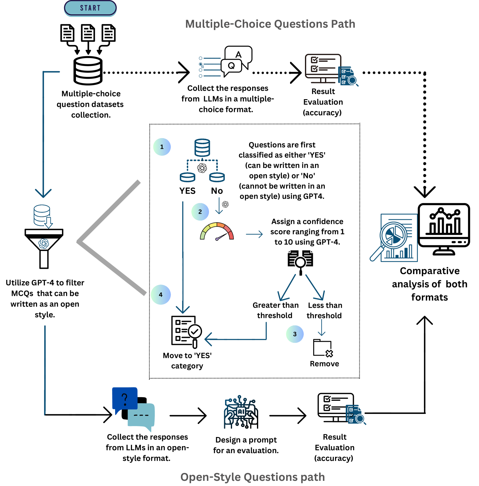
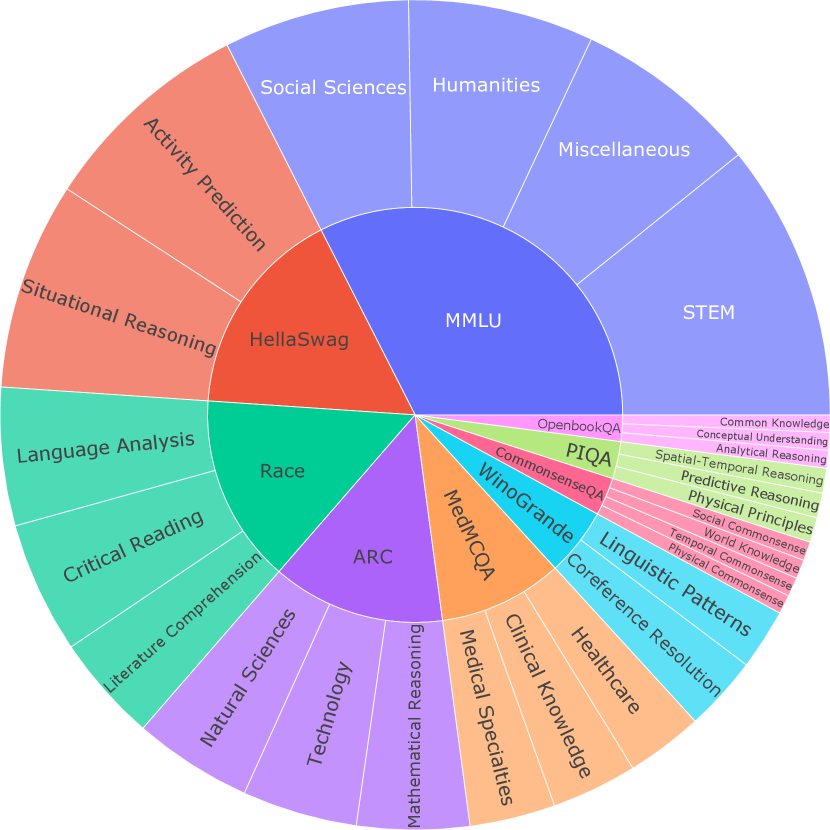
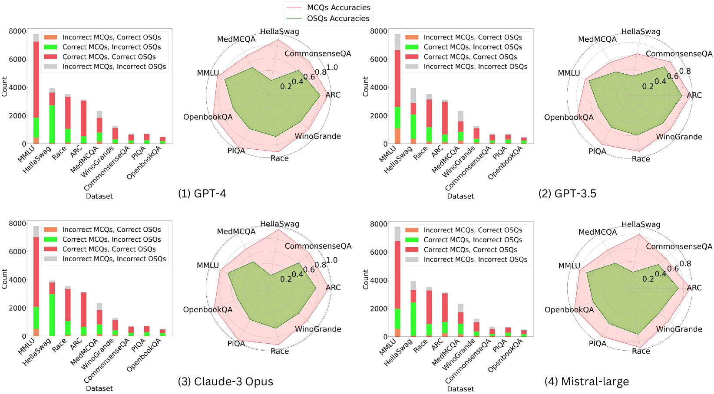
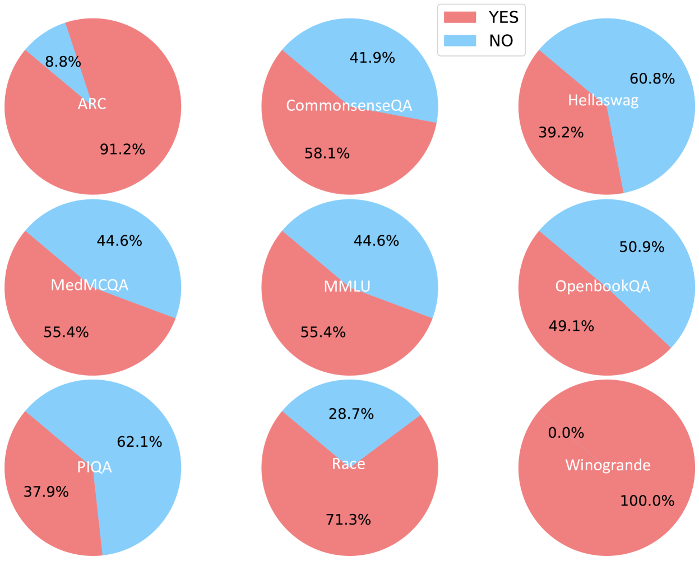
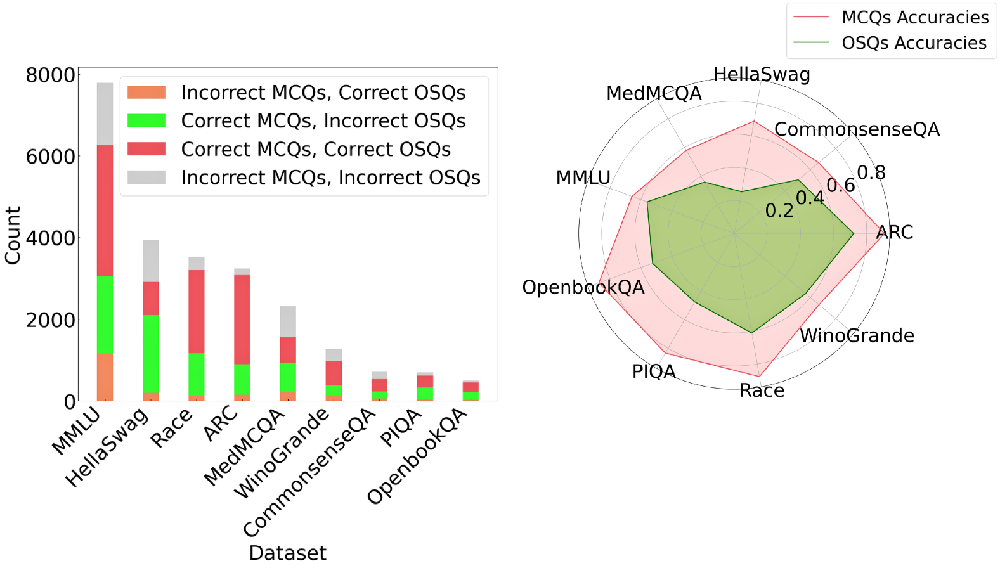
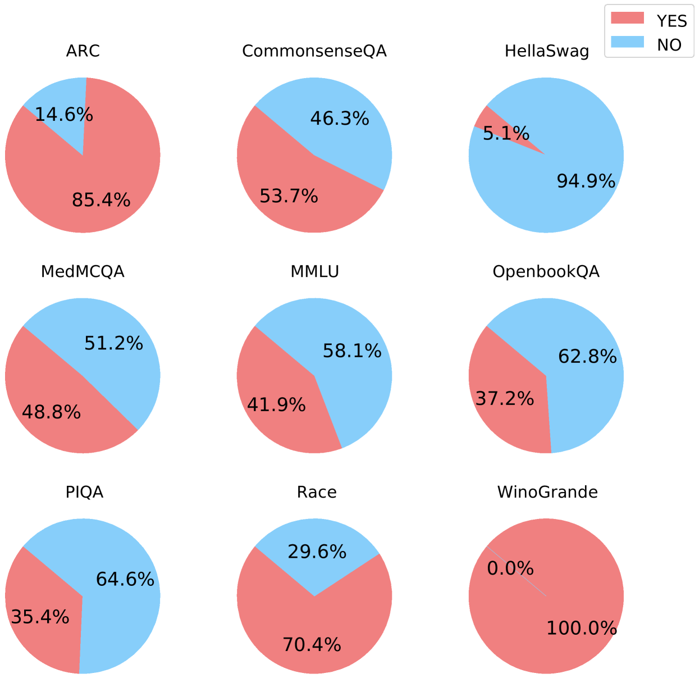

# 开放式大型语言模型排行榜：从多选到开放式问答，为大型语言模型提供评估、基准测试与竞技平台

发布时间：2024年06月11日

`LLM应用

这篇论文主要讨论了如何通过创建一个新的评估基准（Open-LLM-Leaderboard）来改进大型语言模型（LLMs）的评估方法，特别是通过使用开放式问题来替代传统的多项选择题，以消除选择偏差和随机猜测问题。这种方法直接应用于LLM的评估实践中，因此属于LLM应用类别。` `人工智能评估`

> Open-LLM-Leaderboard: From Multi-choice to Open-style Questions for LLMs Evaluation, Benchmark, and Arena

# 摘要

> 多项选择题常用于评估大型语言模型，但存在固有的选择偏差和随机猜测问题。为解决这些问题，我们提出转向开放式问题评估，从根本上消除偏差和猜测。然而，这带来了新的挑战，包括识别合适的问题和验证答案的正确性。为此，我们创建了Open-LLM-Leaderboard，一个全新的评估基准，旨在通过开放式问题全面评估LLMs，如GPT-4o/4/3.5、Claude 3、Gemini等，并提供透明的性能跟踪。我们的资源可在https://github.com/VILA-Lab/Open-LLM-Leaderboard获取。

> Multiple-choice questions (MCQ) are frequently used to assess large language models (LLMs). Typically, an LLM is given a question and selects the answer deemed most probable after adjustments for factors like length. Unfortunately, LLMs may inherently favor certain answer choice IDs, such as A/B/C/D, due to inherent biases of priori unbalanced probabilities, influencing the prediction of answers based on these IDs. Previous research has introduced methods to reduce this ''selection bias'' by simply permutating options on a few test samples and applying to new ones. Another problem of MCQ is the lottery ticket choice by ''random guessing''. The LLM does not learn particular knowledge, but the option is guessed correctly. This situation is especially serious for those small-scale LLMs. To address them, a more thorough approach involves shifting from MCQ to open-style questions, which can fundamentally eliminate selection bias and random guessing issues. However, transitioning causes its own set of challenges in (1) identifying suitable open-style questions and (2) validating the correctness of LLM open-style responses against human-annotated ground-truths. This work aims to tackle these significant difficulties, and establish a new LLM evaluation benchmark through entirely open-style questions. Consequently, we introduce the Open-LLM-Leaderboard to track various LLMs' performance and reflect true capability of them, such as GPT-4o/4/3.5, Claude 3, Gemini, etc. Our code and dataset are available at https://github.com/VILA-Lab/Open-LLM-Leaderboard.

[Arxiv](https://arxiv.org/abs/2406.07545)