# 利用多模态提示探索开放世界中的人-物交互检测

发布时间：2024年06月11日

`Agent

理由：这篇论文介绍了一种名为MP-HOI的多模态提示型人-物交互检测器，它通过结合文本描述和视觉示例来提升性能，并处理开放世界中的HOI检测问题。这种检测器可以被视为一个智能Agent，因为它能够理解和响应环境中的视觉和文本信息，以执行特定的任务（如HOI检测）。此外，论文中提到的数据集创建和模型训练过程也体现了Agent在多模态环境中的应用和泛化能力。因此，这篇论文更适合归类为Agent。` `计算机视觉` `人机交互`

> Open-World Human-Object Interaction Detection via Multi-modal Prompts

# 摘要

> 本文介绍了 **MP-HOI**，一种创新的多模态提示型人-物交互检测器，它巧妙结合文本描述与视觉示例，不仅提升了开放集泛化能力，还精准应对了描述中的歧义问题，实现了开放世界中的HOI检测。MP-HOI通过引入视觉提示，强化了仅依赖语言的HOI检测器，有效解决了文本描述泛化难题和交互歧义复杂的场景。为了支持这一技术，我们创建了Magic-HOI，一个大规模HOI数据集，整合了六个数据源，涵盖186,000多张图像，包含2,400种对象、1,200种动作及20,000次交互。针对数据集的长尾问题，我们还开发了自动化流程，生成了包含100,000张图像的SynHOI合成数据集。借助这两个数据集，MP-HOI通过统一的对比损失，将HOI任务转化为多模态提示与对象/交互间的相似性学习，从而从海量数据中提炼出可泛化、可迁移的对象/交互表示。MP-HOI不仅词汇量远超现有模型，更在现实场景中展现了卓越的零-shot能力，并在多个测试中刷新了性能记录。

> In this paper, we develop \textbf{MP-HOI}, a powerful Multi-modal Prompt-based HOI detector designed to leverage both textual descriptions for open-set generalization and visual exemplars for handling high ambiguity in descriptions, realizing HOI detection in the open world. Specifically, it integrates visual prompts into existing language-guided-only HOI detectors to handle situations where textual descriptions face difficulties in generalization and to address complex scenarios with high interaction ambiguity. To facilitate MP-HOI training, we build a large-scale HOI dataset named Magic-HOI, which gathers six existing datasets into a unified label space, forming over 186K images with 2.4K objects, 1.2K actions, and 20K HOI interactions. Furthermore, to tackle the long-tail issue within the Magic-HOI dataset, we introduce an automated pipeline for generating realistically annotated HOI images and present SynHOI, a high-quality synthetic HOI dataset containing 100K images. Leveraging these two datasets, MP-HOI optimizes the HOI task as a similarity learning process between multi-modal prompts and objects/interactions via a unified contrastive loss, to learn generalizable and transferable objects/interactions representations from large-scale data. MP-HOI could serve as a generalist HOI detector, surpassing the HOI vocabulary of existing expert models by more than 30 times. Concurrently, our results demonstrate that MP-HOI exhibits remarkable zero-shot capability in real-world scenarios and consistently achieves a new state-of-the-art performance across various benchmarks.

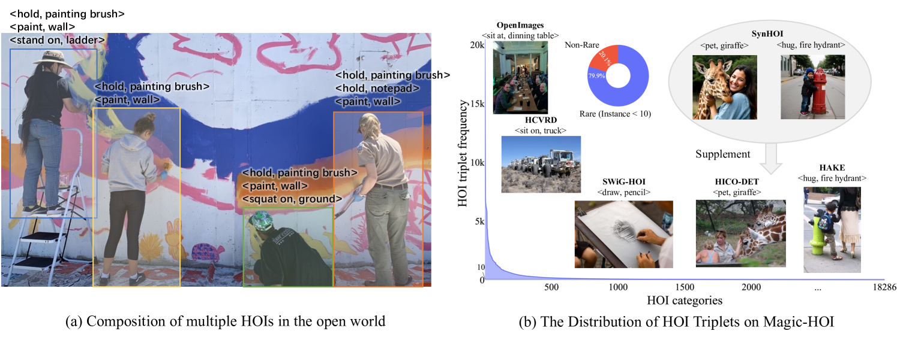

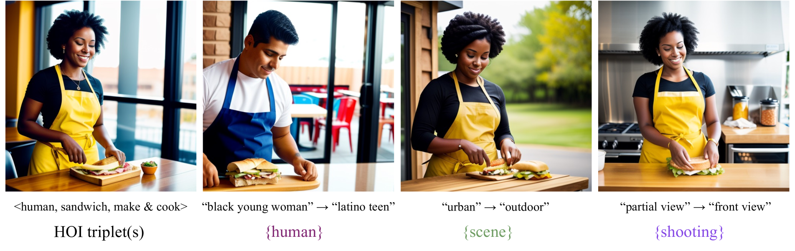

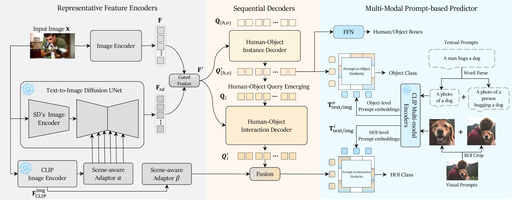

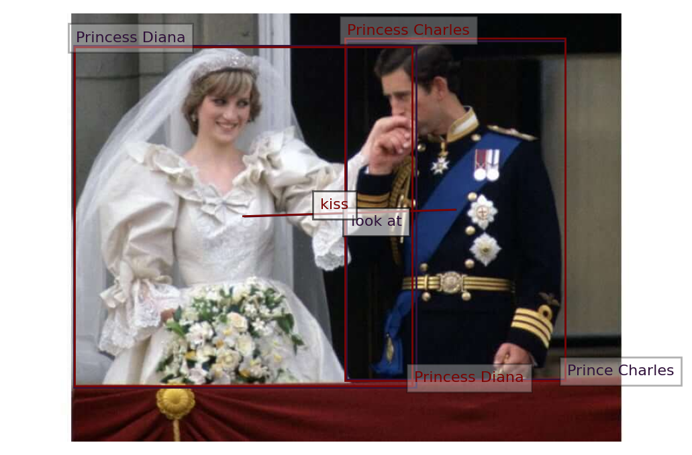

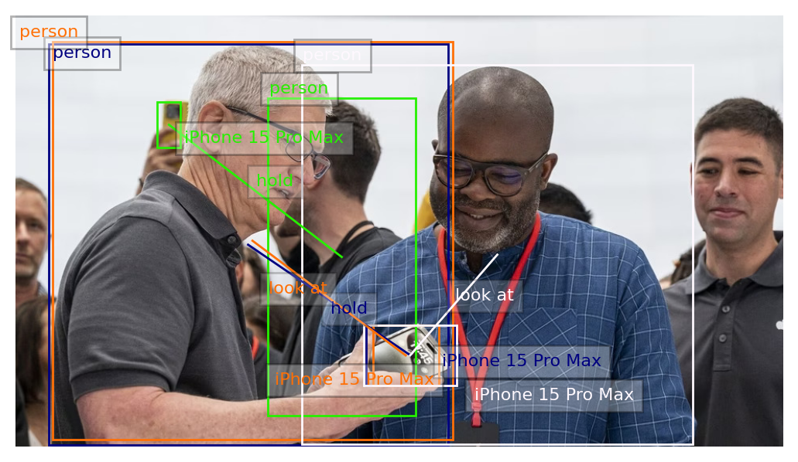

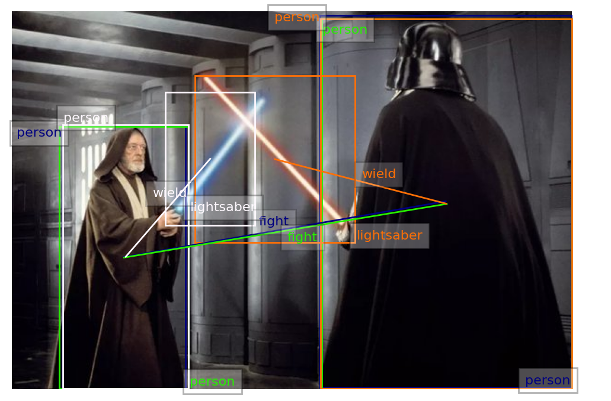

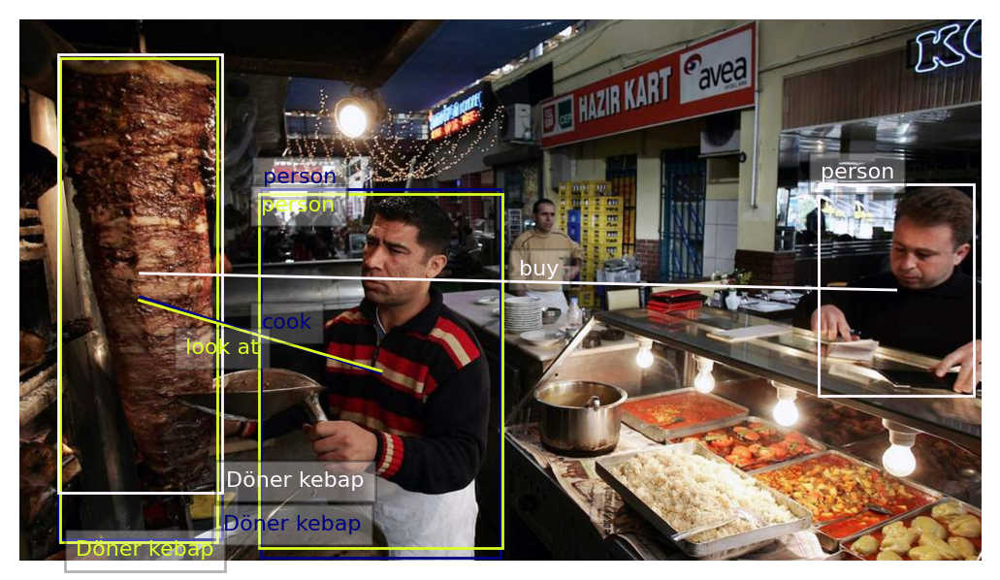

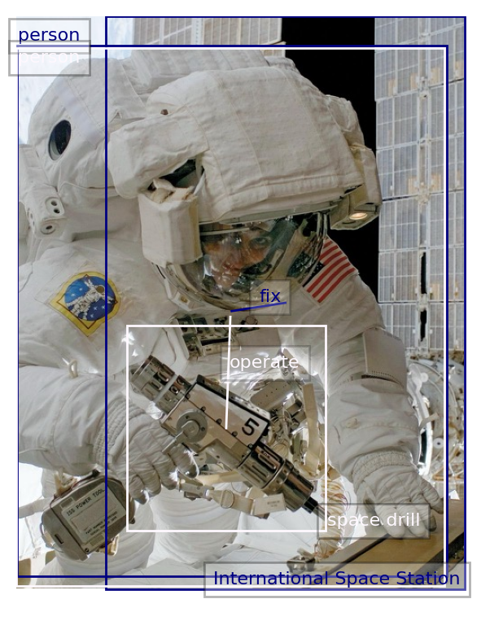

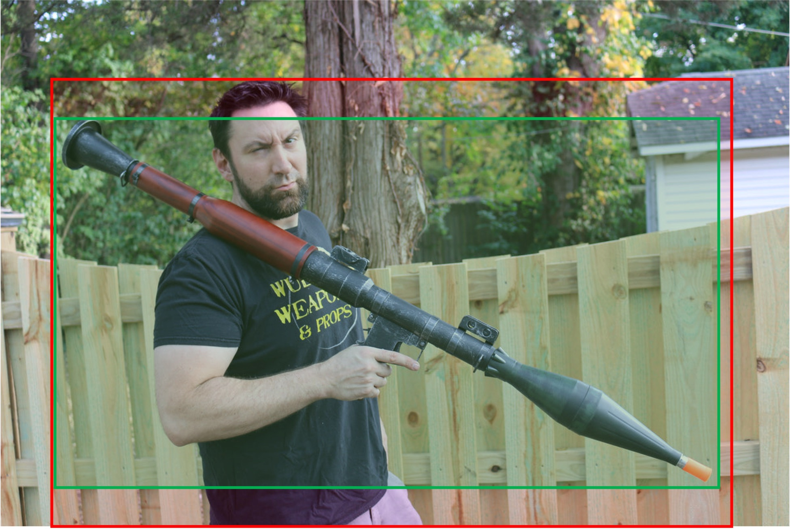

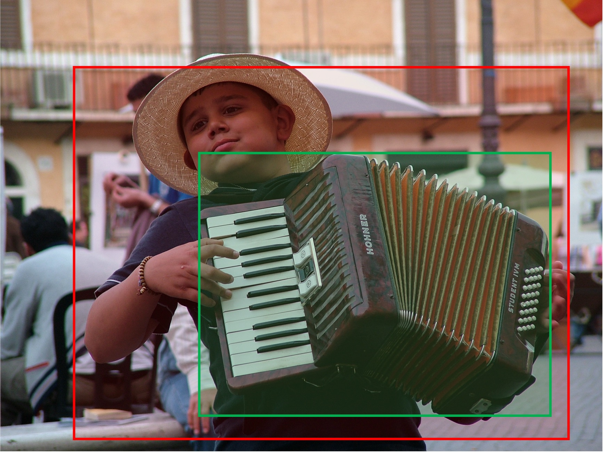

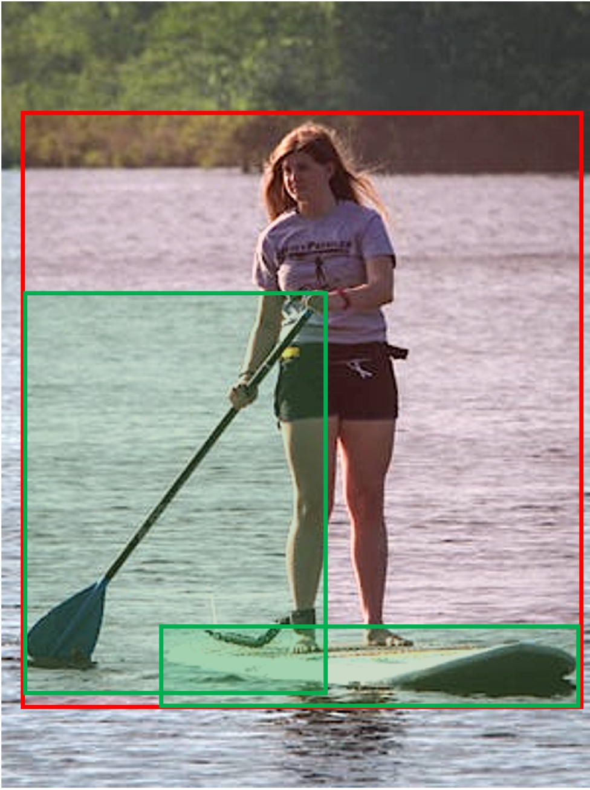

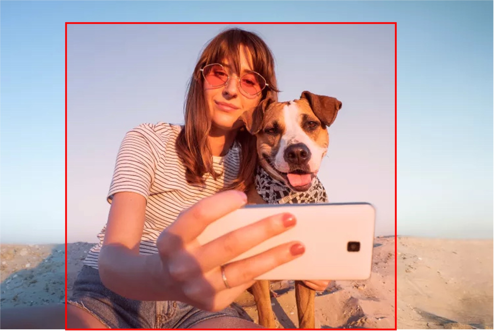

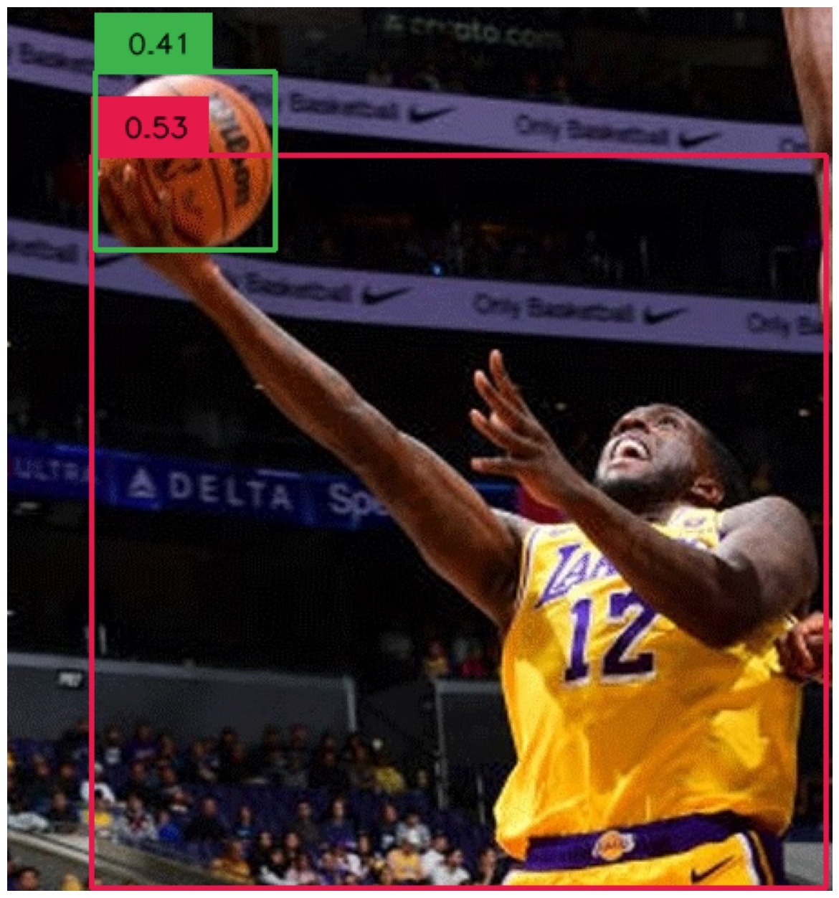

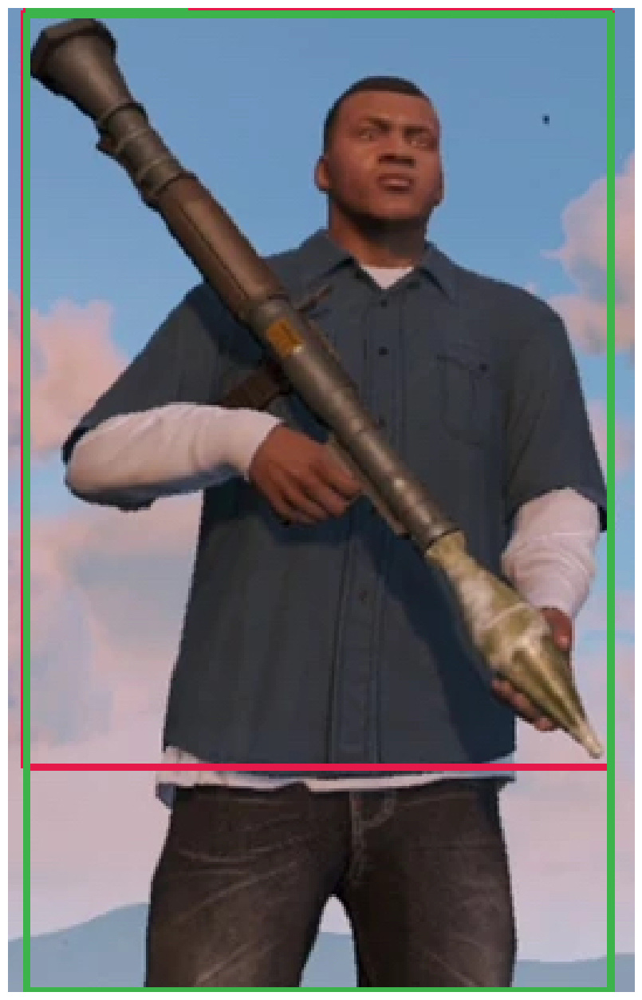

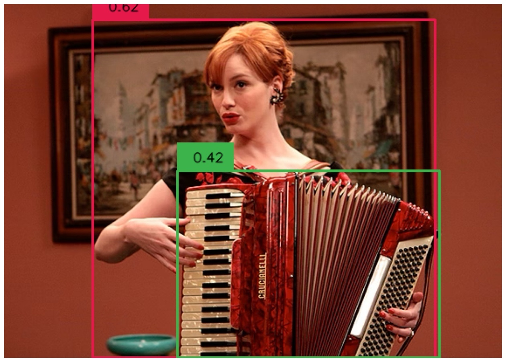

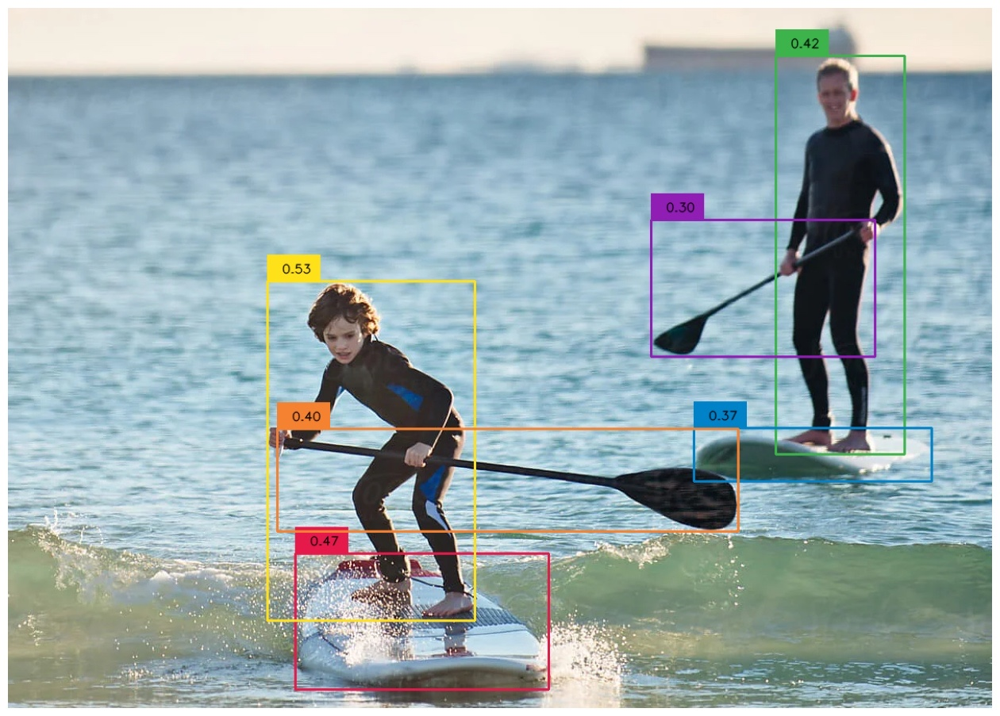

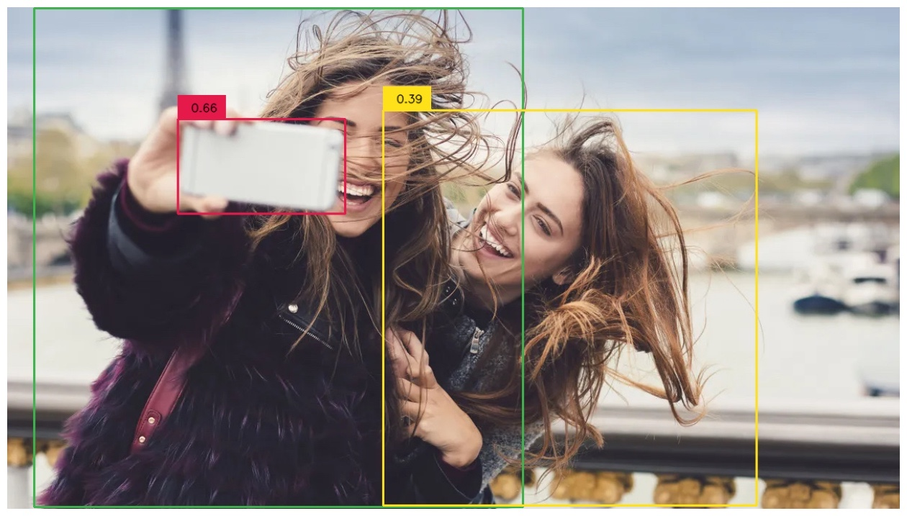

[Arxiv](https://arxiv.org/abs/2406.07221)