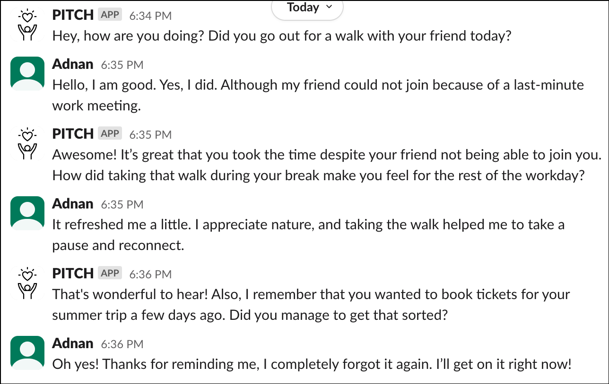

# 日常对话互动助力生产力与心理健康指导

发布时间：2024年06月11日

`Agent

这篇论文主要探讨了如何通过设计一个对话代理来提升生产力和心理健康，该代理利用自然对话的社交互动性来增强计划的执行。论文中提到的系统PITCH运用大型语言模型（LLMs）来促进日常计划的外化和反思，并提出了一种创新的轮换和情境感知提示策略以保持用户参与度。因此，这篇论文更符合Agent分类，因为它专注于开发和应用对话代理来解决实际问题。` `生产力提升` `心理健康`

> PITCH: Productivity and Mental Well-being Coaching through Daily Conversational Interaction

# 摘要

> 高效的任务规划对生产力和心理健康至关重要，但许多人发现制定实际计划并反思其效率颇具挑战。借助AI的进步，对话代理成为提升生产力的有力工具。我们的研究聚焦于通过对话明确计划，旨在强化意图并推动专注行动，从而正面影响生产力和心理健康。我们计划设计一个对话代理，通过提出深刻问题和反思提示，利用自然对话的社交互动性来增强计划的执行。尽管已有研究证实此类代理的有效性，但多数干预措施缺乏动态性，导致用户参与度随时间下降。为此，我们提出了一种创新的轮换和情境感知提示策略，确保用户每天获得多样化的支持。我们的系统PITCH运用大型语言模型（LLMs）来促进日常计划的外化和反思。本研究旨在探索对话代理在任务外化方面对生产力和心理健康的影响，并评估轮换策略在保持用户参与度方面的效果。

> Efficient task planning is essential for productivity and mental well-being, yet individuals often struggle to create realistic plans and reflect upon their productivity. Leveraging the advancement in artificial intelligence (AI), conversational agents have emerged as a promising tool for enhancing productivity. Our work focuses on externalizing plans through conversation, aiming to solidify intentions and foster focused action, thereby positively impacting their productivity and mental well-being. We share our plan of designing a conversational agent to offer insightful questions and reflective prompts for increasing plan adherence by leveraging the social interactivity of natural conversations. Previous studies have shown the effectiveness of such agents, but many interventions remain static, leading to decreased user engagement over time. To address this limitation, we propose a novel rotation and context-aware prompting strategy, providing users with varied interventions daily. Our system, PITCH, utilizes large language models (LLMs) to facilitate externalization and reflection on daily plans. Through this study, we investigate the impact of externalizing tasks with conversational agents on productivity and mental well-being, and the effectiveness of a rotation strategy in maintaining user engagement.

[Arxiv](https://arxiv.org/abs/2406.07485)