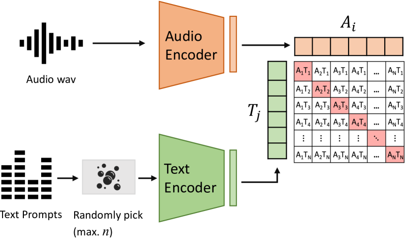
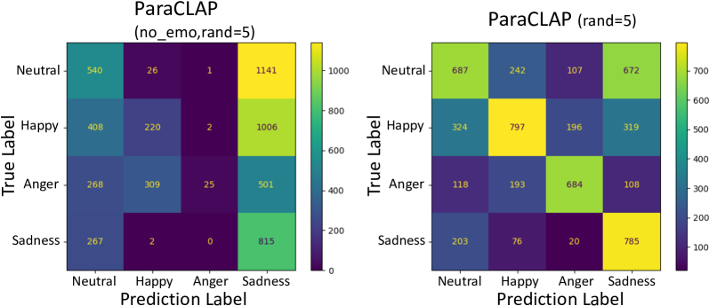
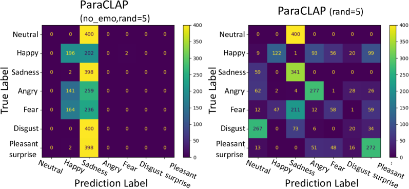

# ParaCLAP —— 探索计算副语言任务的通用语言-音频模型

发布时间：2024年06月11日

`LLM应用

解析：这篇论文主要讨论了对比语言-音频预训练（CLAP）模型在计算副语言（CP）任务中的应用，特别是通过定制化的训练策略和创新的音频-语言查询生成流程来提升模型性能。这表明论文关注的是大型语言模型（LLM）在特定任务中的实际应用，而不是理论研究或Agent的设计与应用，也不是关于检索增强生成（RAG）的讨论。因此，最合适的分类是LLM应用。` `音频分析` `计算副语言`

> ParaCLAP -- Towards a general language-audio model for computational paralinguistic tasks

# 摘要

> 对比语言-音频预训练（CLAP）近期崭露头角，成为提升音频分析泛化能力的一种手段。CLAP模型能应对多样化的语言查询，拓宽了音频模型的应用范围，不再局限于固定标签。但CLAP的预训练依赖于大量（音频，查询）对。尽管这类数据集在通用音频任务中已有所见，如字幕制作或声音事件识别，但针对计算副语言（CP）任务，尚无匹配音频与文本查询的数据集。因此，业界只能依赖于专为通用音频训练的CLAP模型，效果有限。本研究聚焦于为CP任务定制的CLAP模型ParaCLAP的训练策略，并创新性地设计了音频-语言查询的生成流程。实证表明，在多个计算副语言任务中，ParaCLAP的性能超越了现有的开源顶尖模型。

> Contrastive language-audio pretraining (CLAP) has recently emerged as a method for making audio analysis more generalisable. Specifically, CLAP-style models are able to `answer' a diverse set of language queries, extending the capabilities of audio models beyond a closed set of labels. However, CLAP relies on a large set of (audio, query) pairs for pretraining. While such sets are available for general audio tasks, like captioning or sound event detection, there are no datasets with matched audio and text queries for computational paralinguistic (CP) tasks. As a result, the community relies on generic CLAP models trained for general audio with limited success. In the present study, we explore training considerations for ParaCLAP, a CLAP-style model suited to CP, including a novel process for creating audio-language queries. We demonstrate its effectiveness on a set of computational paralinguistic tasks, where it is shown to surpass the performance of open-source state-of-the-art models.

[Arxiv](https://arxiv.org/abs/2406.07203)