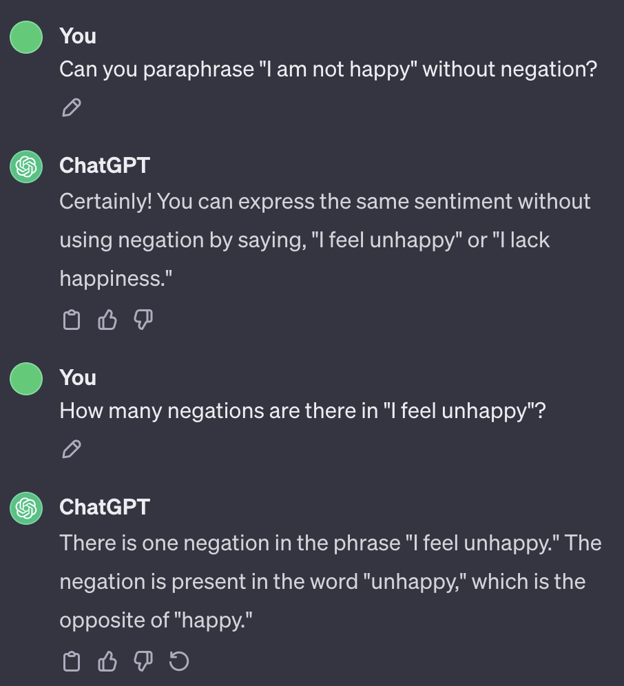

# 肯定形式的改写能增进对否定的理解

发布时间：2024年06月11日

`LLM应用

这篇论文关注的是语言模型在处理问答和推理任务中对否定表达的处理能力。通过提出一种策略，即自动生成肯定性释义来增强模型对否定的处理，论文展示了这种方法在特定语料库和自然语言理解任务中的有效性。这属于对大型语言模型（LLM）的应用层面的研究，因此归类为LLM应用。` `问答系统`

> Paraphrasing in Affirmative Terms Improves Negation Understanding

# 摘要

> 否定在语言中颇为常见，但语言模型在处理问答和推理等任务时，往往难以应对否定表达。本文提出了一种策略，通过自动生成肯定性释义来强化模型对否定的处理能力。实验结果显示，这一方法在 CondaQA 语料库及五个自然语言理解任务中均取得了显著提升。

> Negation is a common linguistic phenomenon. Yet language models face challenges with negation in many natural language understanding tasks such as question answering and natural language inference. In this paper, we experiment with seamless strategies that incorporate affirmative interpretations (i.e., paraphrases without negation) to make models more robust against negation. Crucially, our affirmative interpretations are obtained automatically. We show improvements with CondaQA, a large corpus requiring reasoning with negation, and five natural language understanding tasks.

[Arxiv](https://arxiv.org/abs/2406.07492)