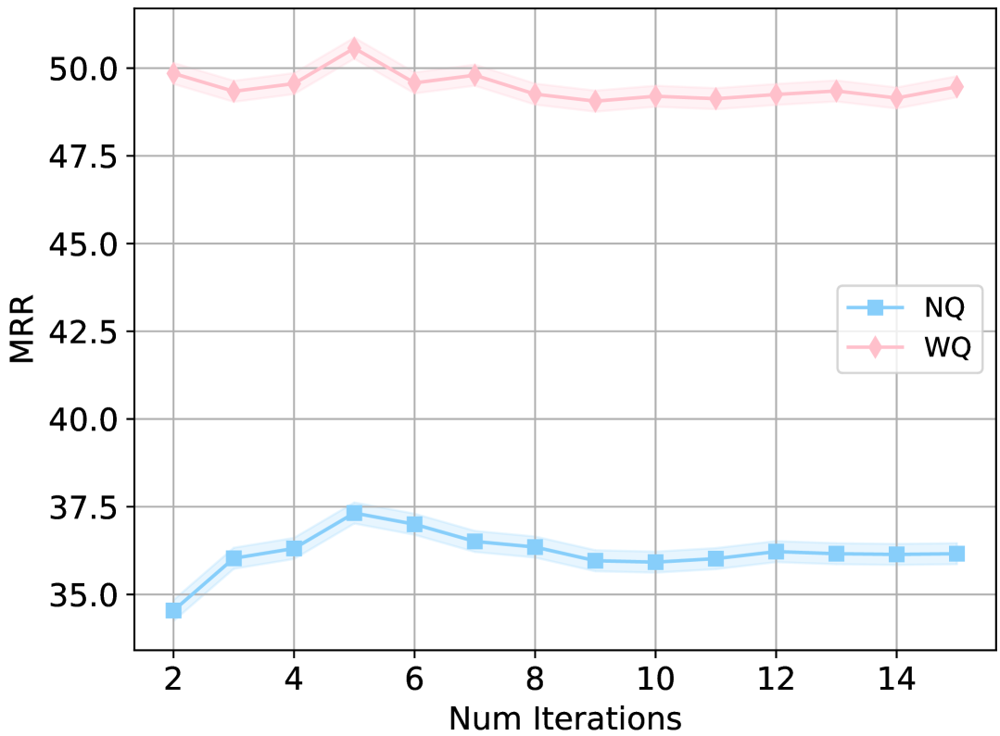

# 成本受限数据源检索中的渐进式查询扩展策略

发布时间：2024年06月11日

`RAG

理由：这篇论文主要讨论了结合经典伪相关反馈（PRF）技术和大型语言模型（LLMs）来开发一种新的查询扩展算法ProQE。该算法旨在提高查询检索的精准度，并考虑了成本效益。这种方法属于信息检索技术中的查询扩展领域，特别是利用了LLMs来改进这一过程。因此，它更符合RAG（Retrieval-Augmented Generation）分类，这一分类通常涉及使用模型来增强信息检索和生成过程。` `信息检索` `搜索引擎`

> Progressive Query Expansion for Retrieval Over Cost-constrained Data Sources

# 摘要

> 查询扩展技术历来用于提升查询检索的精准度。早期研究采用伪相关反馈（PRF）技术，通过从初步检索的文档中提取术语来增强查询，但这些文档可能含有噪声，影响排序效果。为规避此问题，新近研究利用大型语言模型（LLMs）生成额外内容以扩展查询，但这些方法易产生幻觉，且关注LLM使用成本。在某些实际场景中，由于语料库仅可通过按文档检索收费的API访问，检索成本可能成为主要负担。我们提出结合经典PRF技术与LLMs，开发出渐进式查询扩展算法ProQE，该算法在检索过程中迭代扩展查询。ProQE兼容稀疏与密集检索系统。实验结果显示，在四个数据集上，ProQE的性能超越了现有技术37%，且成本效益最佳。

> Query expansion has been employed for a long time to improve the accuracy of query retrievers. Earlier works relied on pseudo-relevance feedback (PRF) techniques, which augment a query with terms extracted from documents retrieved in a first stage. However, the documents may be noisy hindering the effectiveness of the ranking. To avoid this, recent studies have instead used Large Language Models (LLMs) to generate additional content to expand a query. These techniques are prone to hallucination and also focus on the LLM usage cost. However, the cost may be dominated by the retrieval in several important practical scenarios, where the corpus is only available via APIs which charge a fee per retrieved document. We propose combining classic PRF techniques with LLMs and create a progressive query expansion algorithm ProQE that iteratively expands the query as it retrieves more documents. ProQE is compatible with both sparse and dense retrieval systems. Our experimental results on four retrieval datasets show that ProQE outperforms state-of-the-art baselines by 37% and is the most cost-effective.

[Arxiv](https://arxiv.org/abs/2406.07136)