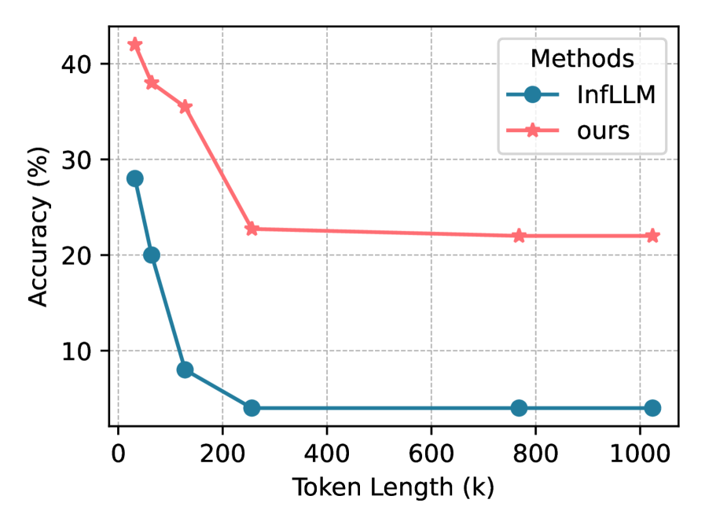

# QuickLLaMA：大型语言模型的智能查询加速推理

发布时间：2024年06月11日

`LLM应用

这篇论文介绍了一种名为Q-LLM的新系统，该系统旨在改进大型语言模型（LLMs）在理解和推理长上下文方面的能力。Q-LLM通过模仿人类认知处理长序列的方式，能够聚焦于与查询相关的记忆数据，从而在固定窗口内精准捕捉信息并给出精确答案。这种系统不需要额外训练，可以与现有的任何LLMs无缝集成，并且在多个测试中展示了优于当前最先进模型的性能。因此，这篇论文属于LLM应用类别，因为它专注于开发和应用新的技术来增强现有LLMs的功能。` `认知科学`

> QuickLLaMA: Query-aware Inference Acceleration for Large Language Models

# 摘要

> 大型语言模型（LLMs）在理解和推理长上下文方面至关重要，但它们在捕捉长距离依赖以深入理解语义上仍有挑战。为此，我们开发了Q-LLM，一种模仿人类认知处理长序列的系统。通过聚焦与查询相关的记忆数据，Q-LLM能在固定窗口内精准捕捉信息，并给出精确答案，无需额外训练，可与任何LLMs无缝集成。使用QuickLLaMA的Q-LLM能在30秒内读完《哈利·波特》并准确回答问题，性能比当前最先进的LLaMA3提升7.17%，在Mistral上提升3.26%。在Needle-in-a-Haystack任务中，Q-LLM在广泛认可的基准上超越了当前SOTA，Mistral上提升7.0%，LLaMA3上达到100%。代码地址：https://github.com/dvlab-research/Q-LLM。

> The capacity of Large Language Models (LLMs) to comprehend and reason over long contexts is pivotal for advancements in diverse fields. Yet, they still stuggle with capturing long-distance dependencies within sequences to deeply understand semantics. To address this issue, we introduce Query-aware Inference for LLMs (Q-LLM), a system designed to process extensive sequences akin to human cognition. By focusing on memory data relevant to a given query, Q-LLM can accurately capture pertinent information within a fixed window size and provide precise answers to queries. It doesn't require extra training and can be seamlessly integrated with any LLMs. Q-LLM using LLaMA3 (QuickLLaMA) can read Harry Potter within 30s and accurately answer the questions. Q-LLM improved by 7.17% compared to the current state-of-the-art on LLaMA3, and by 3.26% on Mistral on the $\infty$-bench. In the Needle-in-a-Haystack task, On widely recognized benchmarks, Q-LLM improved upon the current SOTA by 7.0% on Mistral and achieves 100% on LLaMA3. Our code can be found in https://github.com/dvlab-research/Q-LLM.

[Arxiv](https://arxiv.org/abs/2406.07528)