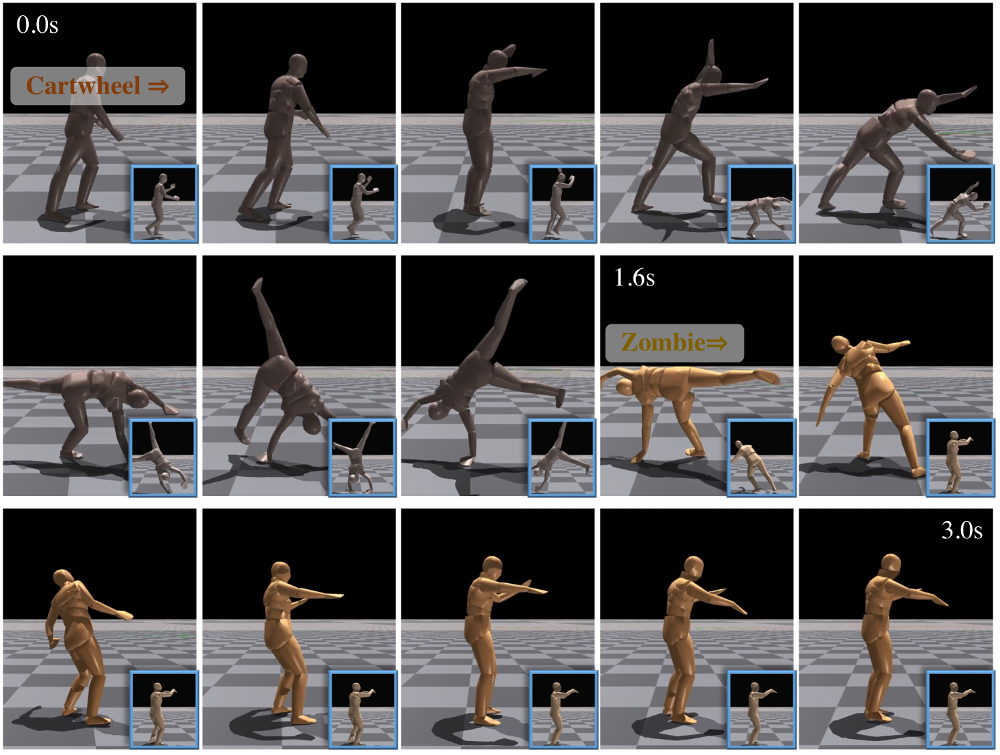
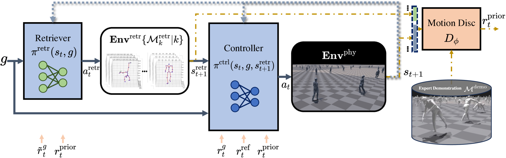
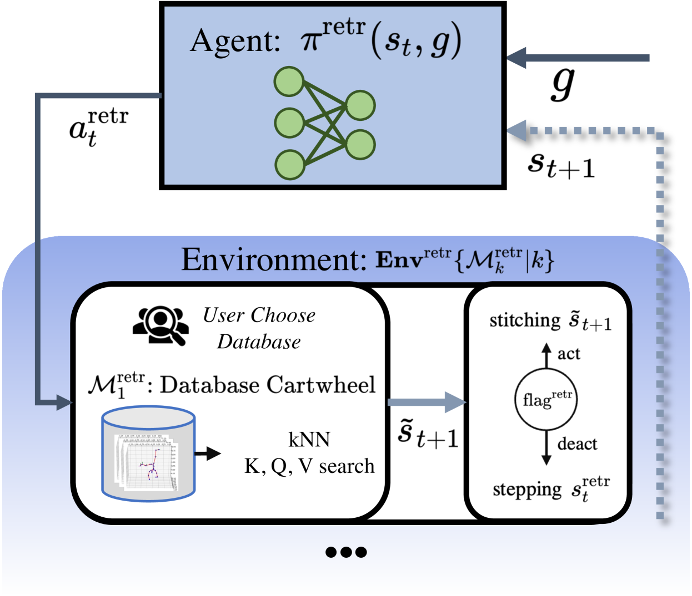
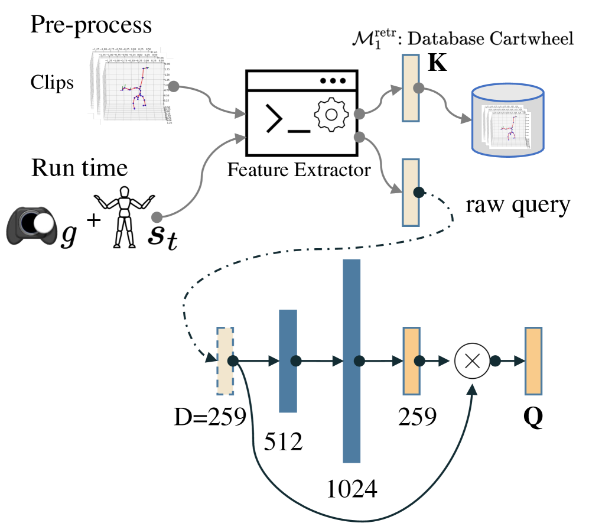
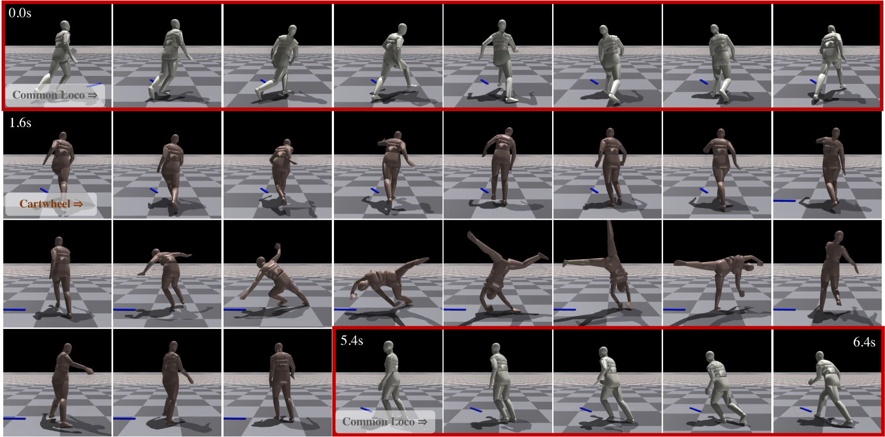
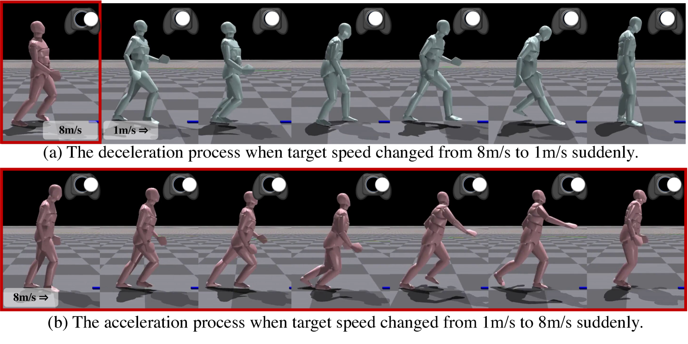
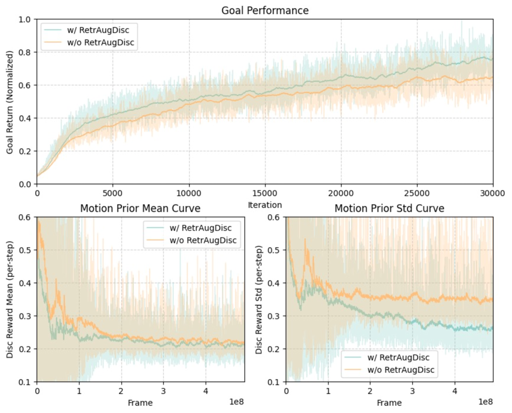

# RACon：利用检索技术增强模拟角色的移动控制

发布时间：2024年06月11日

`Agent

理由：这篇论文介绍了一种名为RACon的检索增强的模拟角色运动控制系统，该系统通过端到端分层强化学习来实现对模拟角色的运动控制。系统中的检索器能够从用户定制的数据库中选择合适的“运动专家”，以提高对用户指令的响应速度和动作的逼真度。这种系统可以被视为一个智能Agent，因为它能够根据外部输入（用户指令）做出反应，并执行相应的动作。此外，系统的设计强调了对用户控制的即时响应，这是Agent系统的一个重要特性。因此，这篇论文更适合归类到Agent分类中。` `计算机动画` `运动控制`

> RACon: Retrieval-Augmented Simulated Character Locomotion Control

# 摘要

> 在计算机动画领域，让模拟角色展现出栩栩如生的动作颇具挑战。现有的生成模型虽能适应多种动作，但在用户控制的即时响应上常显不足。为此，我们推出了RACon：一种检索增强的模拟角色运动控制系统。该系统采用端到端分层强化学习，结合检索器与运动控制器。检索器能从用户定制的数据库中精准挑选出“运动专家”，大幅提升系统对用户指令的响应速度。这些“专家”与控制信号一同输入控制器，驱动角色动作。我们还特别设计了检索增强型判别器，确保训练过程的稳定性。实证研究表明，RACon在运动控制的质量与效率上均超越了现有技术。更妙的是，通过实时切换检索数据库，它能灵活适应各种动作风格。

> In computer animation, driving a simulated character with lifelike motion is challenging. Current generative models, though able to generalize to diverse motions, often pose challenges to the responsiveness of end-user control. To address these issues, we introduce RACon: Retrieval-Augmented Simulated Character Locomotion Control. Our end-to-end hierarchical reinforcement learning method utilizes a retriever and a motion controller. The retriever searches motion experts from a user-specified database in a task-oriented fashion, which boosts the responsiveness to the user's control. The selected motion experts and the manipulation signal are then transferred to the controller to drive the simulated character. In addition, a retrieval-augmented discriminator is designed to stabilize the training process. Our method surpasses existing techniques in both quality and quantity in locomotion control, as demonstrated in our empirical study. Moreover, by switching extensive databases for retrieval, it can adapt to distinctive motion types at run time.

[Arxiv](https://arxiv.org/abs/2406.17795)