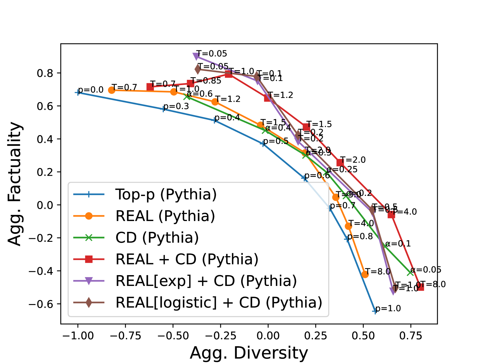
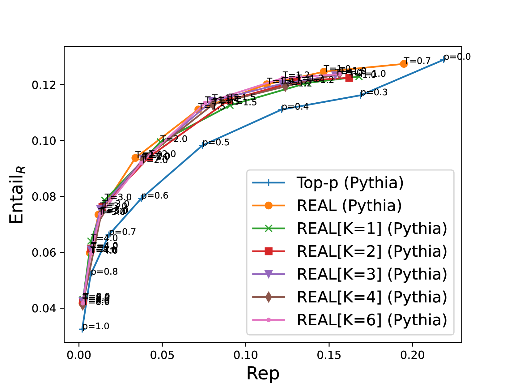
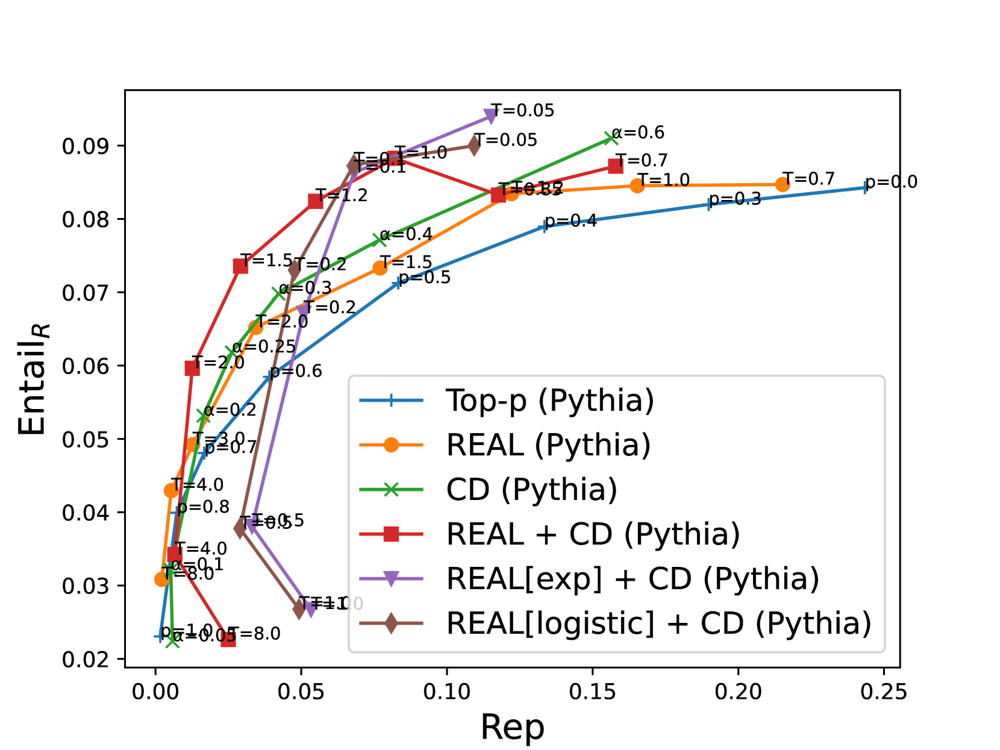
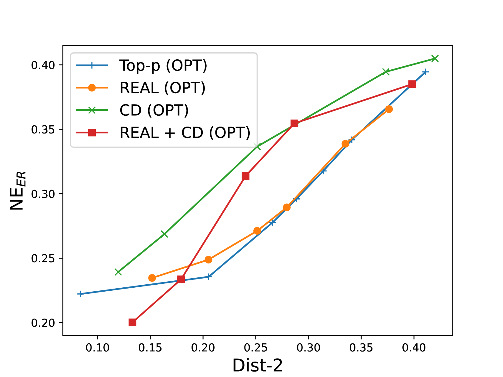

# REAL Sampling：借助渐近熵之力，提升开放式生成的真实性与多样性

发布时间：2024年06月11日

`LLM理论

理由：这篇论文主要探讨了大型语言模型（LLMs）的解码方法，特别是提出了REAL（残差熵自渐近线）采样法，这是一种新的解码策略，旨在平衡事实性与多样性。论文中还开发了Token级幻觉预测（THF）模型，用于预测LLM产生幻觉的风险，并据此调整解码策略。这些内容涉及LLM的理论研究和方法创新，因此归类为LLM理论。` `机器学习`

> REAL Sampling: Boosting Factuality and Diversity of Open-Ended Generation via Asymptotic Entropy

# 摘要

> 大型语言模型（LLMs）的解码方法常在事实性与多样性之间权衡难定。例如，核采样（top-p）中提高p阈值虽增多样性，却损事实性。本文提出的REAL（残差熵自渐近线）采样法，通过动态调整p阈值，既提升了事实性又保持了多样性。REAL采样能预测LLM产生幻觉的风险，适时调整p阈值以平衡两者。为此，我们开发了Token级幻觉预测（THF）模型，无需监督即可预测下一个token的不确定性。当LLM的不确定性超出预期时，THF模型会预警高幻觉风险，促使REAL采样降低p阈值。在FactualityPrompts测试中，基于70M THF模型的REAL采样显著提升了7B LLMs的事实性与多样性，得到了检索指标和人工评估的认可。结合对比解码，REAL采样超越了9种方法，生成的文本既比贪婪采样更真实，又比p=0.5的核采样更丰富多样。此外，预测的渐近熵在幻觉检测中亦显其无监督信号的价值。

> Decoding methods for large language models (LLMs) usually struggle with the tradeoff between ensuring factuality and maintaining diversity. For example, a higher p threshold in the nucleus (top-p) sampling increases the diversity but decreases the factuality, and vice versa. In this paper, we propose REAL (Residual Entropy from Asymptotic Line) sampling, a decoding method that achieves improved factuality and diversity over nucleus sampling by predicting an adaptive threshold of $p$. Specifically, REAL sampling predicts the step-wise likelihood of an LLM to hallucinate, and lowers the p threshold when an LLM is likely to hallucinate. Otherwise, REAL sampling increases the p threshold to boost the diversity. To predict the step-wise hallucination likelihood without supervision, we construct a Token-level Hallucination Forecasting (THF) model to predict the asymptotic entropy (i.e., inherent uncertainty) of the next token by extrapolating the next-token entropies from a series of LLMs with different sizes. If a LLM's entropy is higher than the asymptotic entropy (i.e., the LLM is more uncertain than it should be), the THF model predicts a high hallucination hazard, which leads to a lower p threshold in REAL sampling. In the FactualityPrompts benchmark, we demonstrate that REAL sampling based on a 70M THF model can substantially improve the factuality and diversity of 7B LLMs simultaneously, judged by both retrieval-based metrics and human evaluation. After combined with contrastive decoding, REAL sampling outperforms 9 sampling methods, and generates texts that are more factual than the greedy sampling and more diverse than the nucleus sampling with $p=0.5$. Furthermore, the predicted asymptotic entropy is also a useful unsupervised signal for hallucination detection tasks.

[Arxiv](https://arxiv.org/abs/2406.07735)