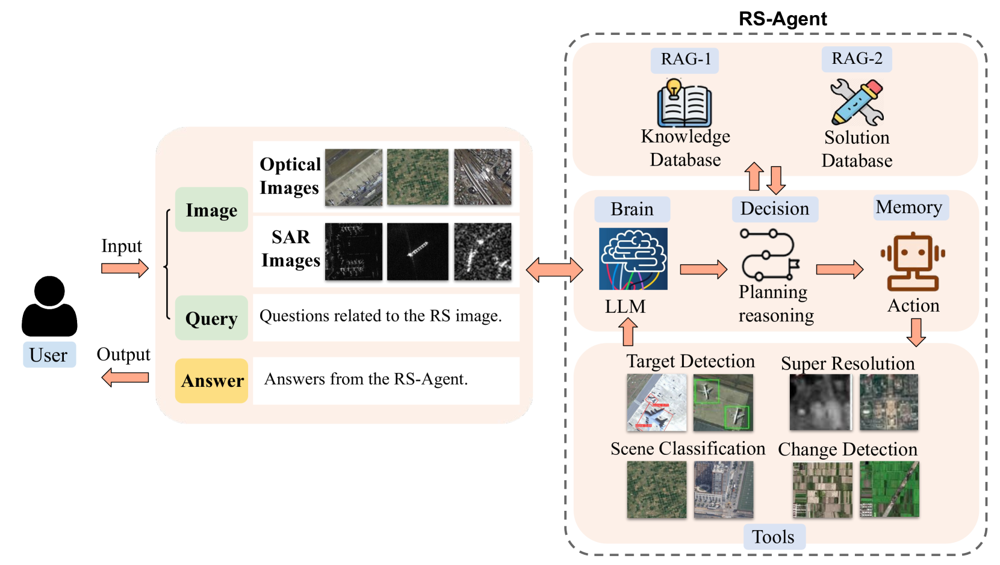
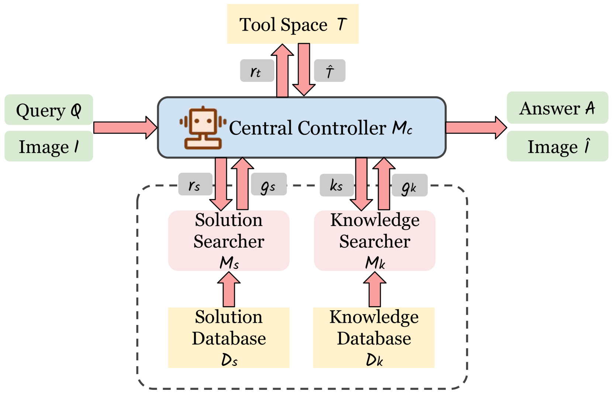
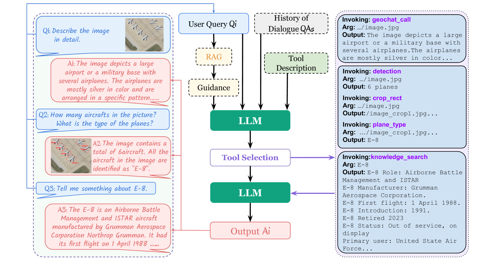

# 智能代理RS-Agent：遥感任务的自动化先锋

发布时间：2024年06月11日

`Agent

这篇论文介绍了一个名为RS-Agent的智能助手，它是由大型语言模型（LLM）驱动的，专门设计用于遥感领域的复杂应用。RS-Agent不仅整合了多种遥感图像处理工具，还具备多轮对话能力和丰富的知识库，以解答专业问题。论文中提到的测试结果表明，RS-Agent在多个遥感任务中表现出色。因此，根据其功能和应用领域，这篇论文应归类为Agent。` `智能助手`

> RS-Agent: Automating Remote Sensing Tasks through Intelligent Agents

# 摘要

> 随着LLMs和VLMs的进步，越来越多的模型在遥感领域大放异彩。但这些模型在应对复杂遥感应用时仍显力不从心，且缺乏专业领域的深度知识。为此，我们研发了RS-Agent，一款由LLM驱动的遥感智能助手。RS-Agent的核心是一个LLM，它如同智慧的“大脑”，能灵活应对各类问题。它还整合了多种高效的遥感图像处理工具，支持多工具协同和多轮对话。更重要的是，RS-Agent能借助丰富的知识库解答专业问题。我们在RSSDIVCS、RSVQA和DOTAv1等数据集上进行了测试，结果显示RS-Agent在场景分类、视觉问答和对象计数等多项任务中表现卓越。

> An increasing number of models have achieved great performance in remote sensing tasks with the recent development of Large Language Models (LLMs) and Visual Language Models (VLMs). However, these models are constrained to basic vision and language instruction-tuning tasks, facing challenges in complex remote sensing applications. Additionally, these models lack specialized expertise in professional domains. To address these limitations, we propose a LLM-driven remote sensing intelligent agent named RS-Agent. Firstly, RS-Agent is powered by a large language model (LLM) that acts as its "Central Controller," enabling it to understand and respond to various problems intelligently. Secondly, our RS-Agent integrates many high-performance remote sensing image processing tools, facilitating multi-tool and multi-turn conversations. Thirdly, our RS-Agent can answer professional questions by leveraging robust knowledge documents. We conducted experiments using several datasets, e.g., RSSDIVCS, RSVQA, and DOTAv1. The experimental results demonstrate that our RS-Agent delivers outstanding performance in many tasks, i.e., scene classification, visual question answering, and object counting tasks.

[Arxiv](https://arxiv.org/abs/2406.07089)