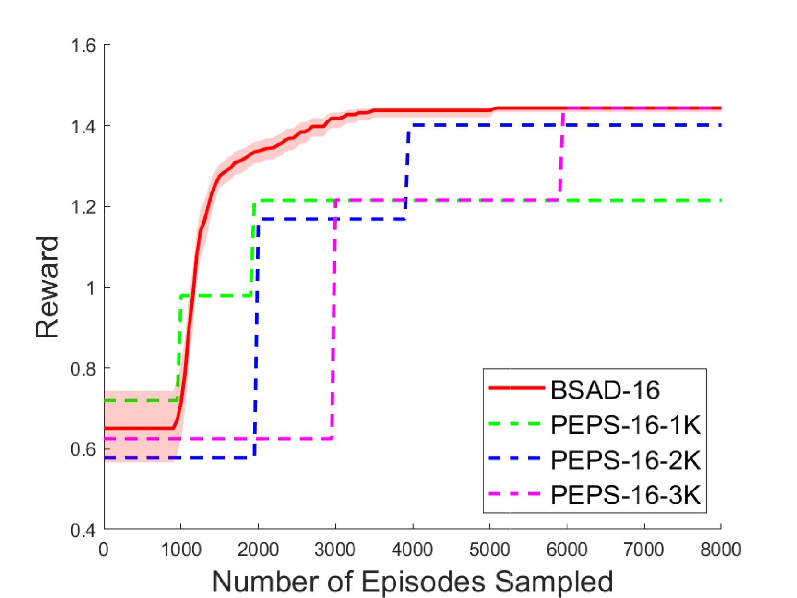
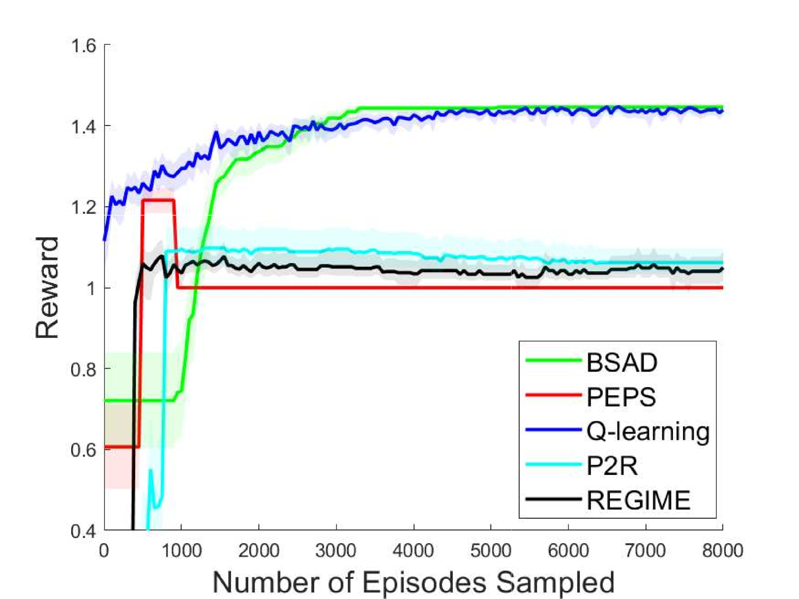

# 无需奖励推断，基于人类反馈的强化学习：探索无模型算法及其在实例上的依赖性分析

发布时间：2024年06月11日

`Agent

这篇论文主要探讨了在分集马尔可夫决策过程中的人类反馈强化学习（RLHF），并提出了一种新算法$\mathsf{BSAD}$，用于从人类偏好中直接识别最优策略。这种算法特别关注于如何通过人类反馈来优化决策过程，而不依赖于显式的奖励模型。这种方法涉及策略识别和优化，属于智能体（Agent）的行为和决策优化范畴。因此，将其归类为Agent。` `人工智能`

> Reinforcement Learning from Human Feedback without Reward Inference: Model-Free Algorithm and Instance-Dependent Analysis

# 摘要

> 本文探讨了在分集马尔可夫决策过程中的人类反馈强化学习（RLHF），并提出了一种名为$\mathsf{BSAD}$的无模型最佳策略识别算法。该算法跳过显式奖励模型推断，直接从人类偏好中后向识别最优策略，通过双臂老虎机子程序对决行动以选出更优者。$\mathsf{BSAD}$采用无奖励探索和自适应停止准则，确保在决策步骤中平衡状态访问，并在识别最优行动后立即回溯，其样本复杂度与经典RL相仿。此外，该算法可转化为具有对数后悔的探索-然后-承诺算法，并适用于折扣MDP。研究表明，RLHF在样本复杂度上并不比经典RL更难，且端到端RLHF能通过避免奖励推断中的问题（如过拟合和分布偏移）来提升性能。

> In this paper, we study reinforcement learning from human feedback (RLHF) under an episodic Markov decision process with a general trajectory-wise reward model. We developed a model-free RLHF best policy identification algorithm, called $\mathsf{BSAD}$, without explicit reward model inference, which is a critical intermediate step in the contemporary RLHF paradigms for training large language models (LLM). The algorithm identifies the optimal policy directly from human preference information in a backward manner, employing a dueling bandit sub-routine that constantly duels actions to identify the superior one. $\mathsf{BSAD}$ adopts a reward-free exploration and best-arm-identification-like adaptive stopping criteria to equalize the visitation among all states in the same decision step while moving to the previous step as soon as the optimal action is identifiable, leading to a provable, instance-dependent sample complexity $\tilde{\mathcal{O}}(c_{\mathcal{M}}SA^3H^3M\log\frac{1}δ)$ which resembles the result in classic RL, where $c_{\mathcal{M}}$ is the instance-dependent constant and $M$ is the batch size. Moreover, $\mathsf{BSAD}$ can be transformed into an explore-then-commit algorithm with logarithmic regret and generalized to discounted MDPs using a frame-based approach. Our results show: (i) sample-complexity-wise, RLHF is not significantly harder than classic RL and (ii) end-to-end RLHF may deliver improved performance by avoiding pitfalls in reward inferring such as overfit and distribution shift.

[Arxiv](https://arxiv.org/abs/2406.07455)