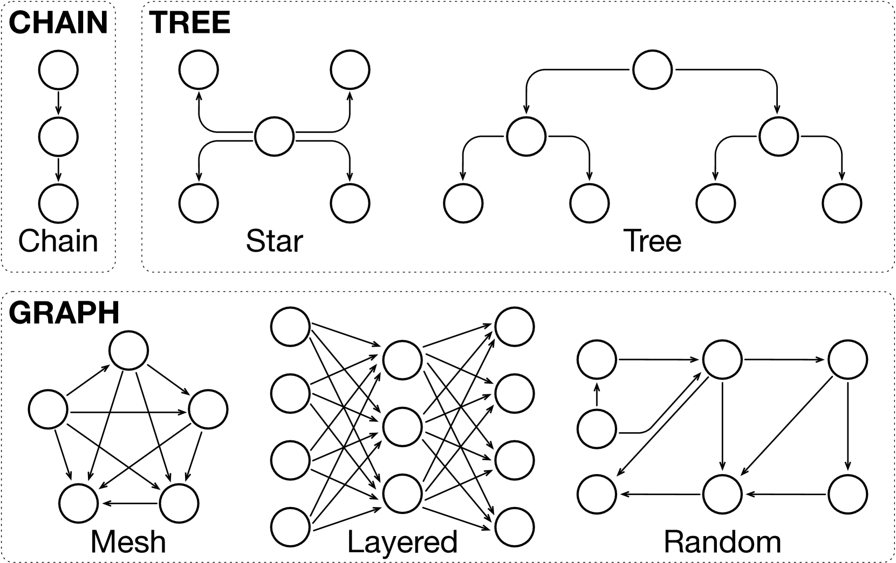
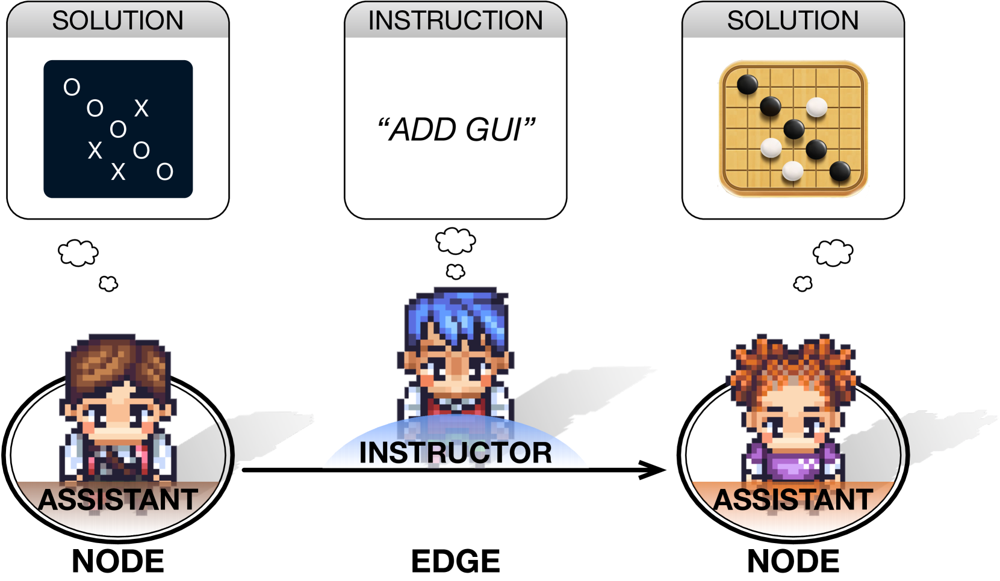
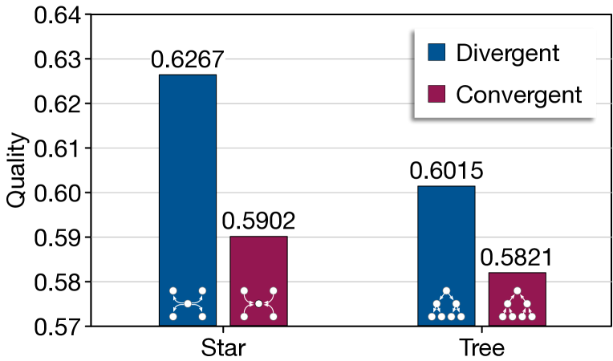
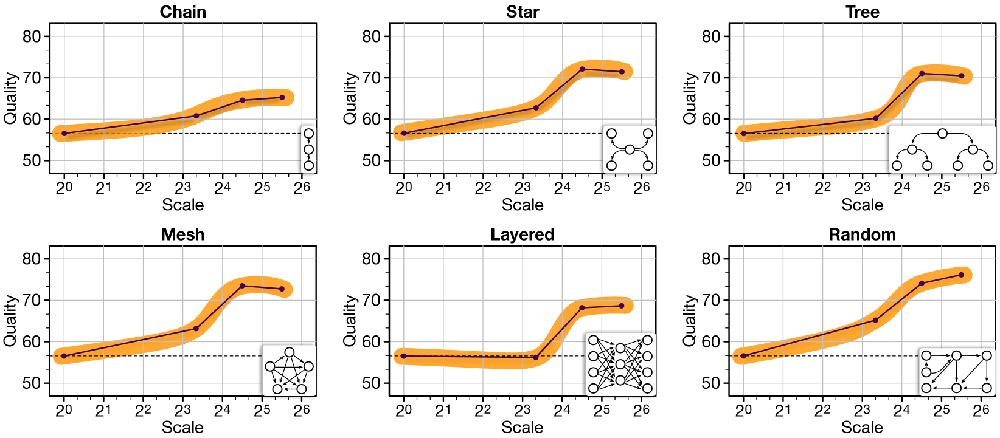

# 扩展基于大型语言模型的多智能体协作

发布时间：2024年06月11日

`Agent

这篇论文主要探讨了大型语言模型驱动的多代理协作技术，并提出了一个名为MacNet的多代理协作网络，通过优化代理间的交互推理来提升协作效果。研究重点在于代理数量的增加如何影响协作性能，并发现了协作缩放定律。因此，这篇论文更符合Agent分类，因为它专注于代理的行为和协作机制。` `人工智能` `网络协作`

> Scaling Large-Language-Model-based Multi-Agent Collaboration

# 摘要

> 大型语言模型驱动的多代理协作技术展示了集体智能超越个体能力的潜力。借鉴神经缩放定律，本研究探索了在多代理协作中增加代理数量是否能带来类似的能力涌现。我们提出的多代理协作网络（MacNet）通过有向无环图和拓扑排序优化代理间的交互推理，解决方案源自对话。实验证明，MacNet在多种网络拓扑中均优于基准模型，支持大规模代理协作。我们观察到小世界协作现象，并发现了协作缩放定律，揭示了随着代理增加，解决方案质量的逻辑增长，协作涌现比神经涌现更早出现。相关代码和数据将在https://github.com/OpenBMB/ChatDev公开。

> Pioneering advancements in large language model-powered agents have underscored the design pattern of multi-agent collaboration, demonstrating that collective intelligence can surpass the capabilities of each individual. Inspired by the neural scaling law, which posits that increasing neurons leads to emergent abilities, this study investigates whether a similar principle applies to increasing agents in multi-agent collaboration. Technically, we propose multi-agent collaboration networks (MacNet), which utilize directed acyclic graphs to organize agents and streamline their interactive reasoning via topological ordering, with solutions derived from their dialogues. Extensive experiments show that MacNet consistently outperforms baseline models, enabling effective agent collaboration across various network topologies and supporting cooperation among more than a thousand agents. Notably, we observed a small-world collaboration phenomenon, where topologies resembling small-world properties achieved superior performance. Additionally, we identified a collaborative scaling law, indicating that normalized solution quality follows a logistic growth pattern as scaling agents, with collaborative emergence occurring much earlier than previously observed instances of neural emergence. The code and data will be available at https://github.com/OpenBMB/ChatDev.

[Arxiv](https://arxiv.org/abs/2406.07155)