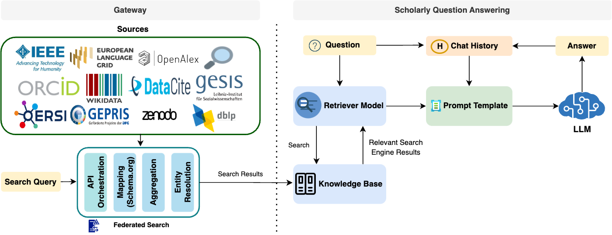
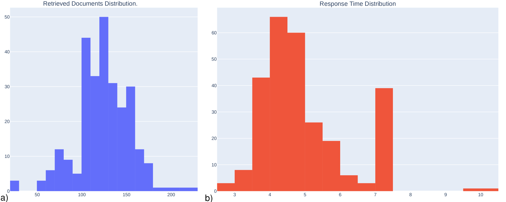
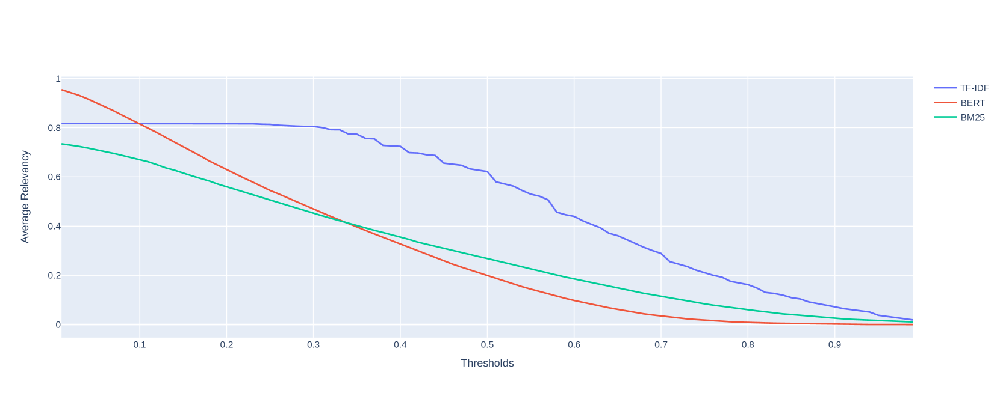

# 在NFDI4DataScience门户中，利用大型语言模型进行学术问答探索

发布时间：2024年06月11日

`RAG

理由：这篇论文介绍了一个基于NFDI4DataScience门户的学术问答系统，该系统采用了检索增强生成技术（RAG）。论文的重点在于描述如何利用RAG技术来增强学术问答系统的功能，这与RAG技术的应用直接相关。虽然系统背后使用了大型语言模型（LLM），但论文的主要焦点是RAG技术的应用，而不是LLM的理论或应用。因此，将其归类为RAG是合适的。` `学术研究` `问答系统`

> Scholarly Question Answering using Large Language Models in the NFDI4DataScience Gateway

# 摘要

> 本文推出了一款基于NFDI4DataScience门户的学术问答系统，该系统采用检索增强生成技术（RAG）。NFDI4DS门户作为基础框架，提供了一个直观统一的界面，方便用户通过联合搜索访问多个科学数据库。由大型语言模型（LLM）支持的RAG学术QA系统，不仅增强了搜索结果的交互性和过滤功能，还促进了与门户搜索的对话式体验。实验分析证实了该门户及学术QA系统的有效性。

> This paper introduces a scholarly Question Answering (QA) system on top of the NFDI4DataScience Gateway, employing a Retrieval Augmented Generation-based (RAG) approach. The NFDI4DS Gateway, as a foundational framework, offers a unified and intuitive interface for querying various scientific databases using federated search. The RAG-based scholarly QA, powered by a Large Language Model (LLM), facilitates dynamic interaction with search results, enhancing filtering capabilities and fostering a conversational engagement with the Gateway search. The effectiveness of both the Gateway and the scholarly QA system is demonstrated through experimental analysis.

[Arxiv](https://arxiv.org/abs/2406.07257)