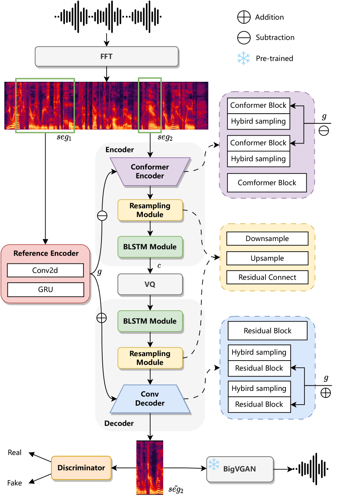
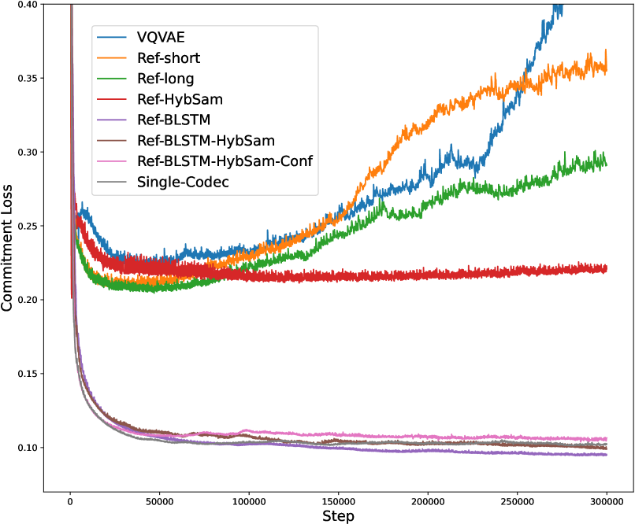

# 单编解码器：一种采用单码本技术，旨在实现高性能语音生成的语音编解码器。

发布时间：2024年06月11日

`LLM应用

这篇论文主要介绍了一种新的语音编解码器设计——单一编解码器（Single-Codec），它通过特定的技术手段提高了语音编解码的效率和鲁棒性，特别是在应用于大型语言模型（LLM）的文本到语音（TTS）系统中。论文的核心贡献在于提出了一种改进的编解码器设计，以优化LLM在TTS应用中的性能。因此，这篇论文应归类于LLM应用。` `语音处理` `通信技术`

> Single-Codec: Single-Codebook Speech Codec towards High-Performance Speech Generation

# 摘要

> 多码本语音编解码器虽使LLM能应用于TTS，但其多序列预测特性限制了效率与鲁棒性。为此，我们开发了单一编解码器（Single-Codec），一种单码本单序列设计，利用解耦VQ-VAE将语音分解为时间恒定嵌入与富含语音特征的离散序列。编码器通过BLSTM模块增强时间信息利用，通过混合采样减少失真，并通过重采样增强语音信息传递。与EnCodec和TiCodec等多码本方案相比，Single-Codec以304bps的低带宽实现更高重建质量。LLM-TTS实验证实，Single-Codec提升了语音的自然度和清晰度。

> The multi-codebook speech codec enables the application of large language models (LLM) in TTS but bottlenecks efficiency and robustness due to multi-sequence prediction. To avoid this obstacle, we propose Single-Codec, a single-codebook single-sequence codec, which employs a disentangled VQ-VAE to decouple speech into a time-invariant embedding and a phonetically-rich discrete sequence. Furthermore, the encoder is enhanced with 1) contextual modeling with a BLSTM module to exploit the temporal information, 2) a hybrid sampling module to alleviate distortion from upsampling and downsampling, and 3) a resampling module to encourage discrete units to carry more phonetic information. Compared with multi-codebook codecs, e.g., EnCodec and TiCodec, Single-Codec demonstrates higher reconstruction quality with a lower bandwidth of only 304bps. The effectiveness of Single-Code is further validated by LLM-TTS experiments, showing improved naturalness and intelligibility.

[Arxiv](https://arxiv.org/abs/2406.07422)