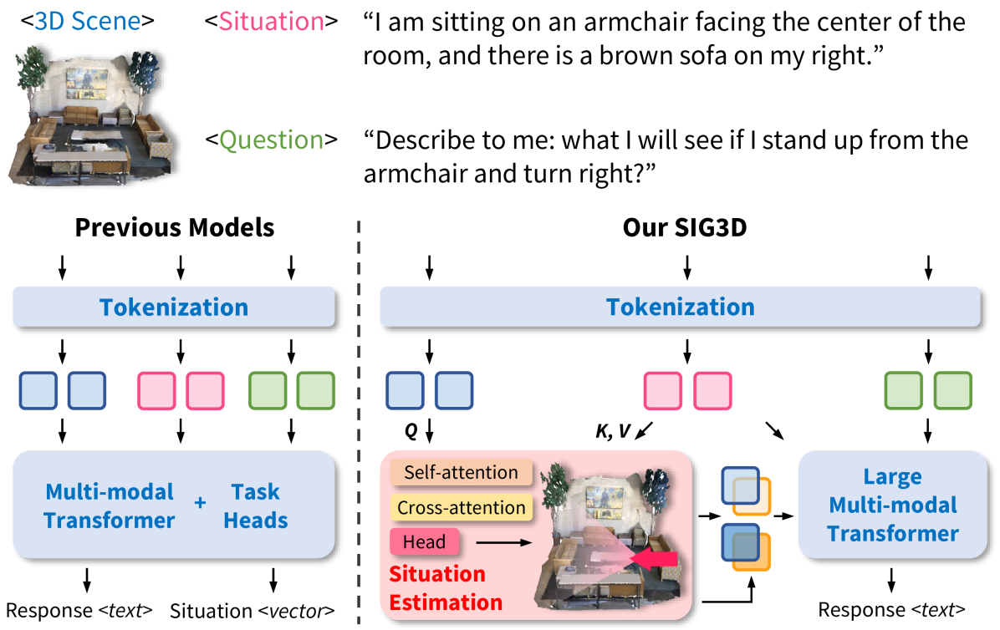
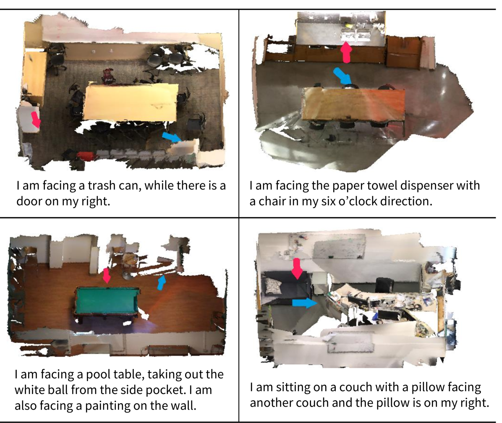
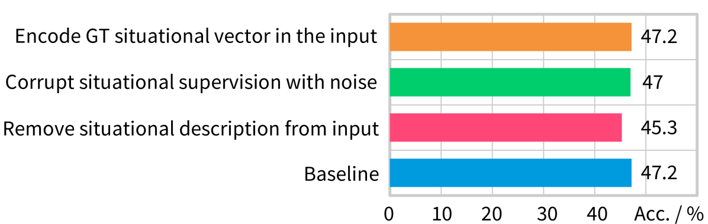
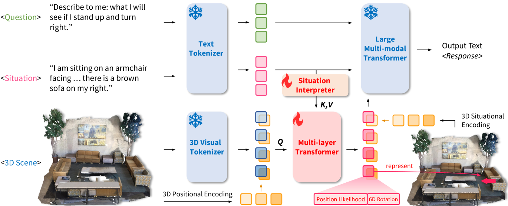
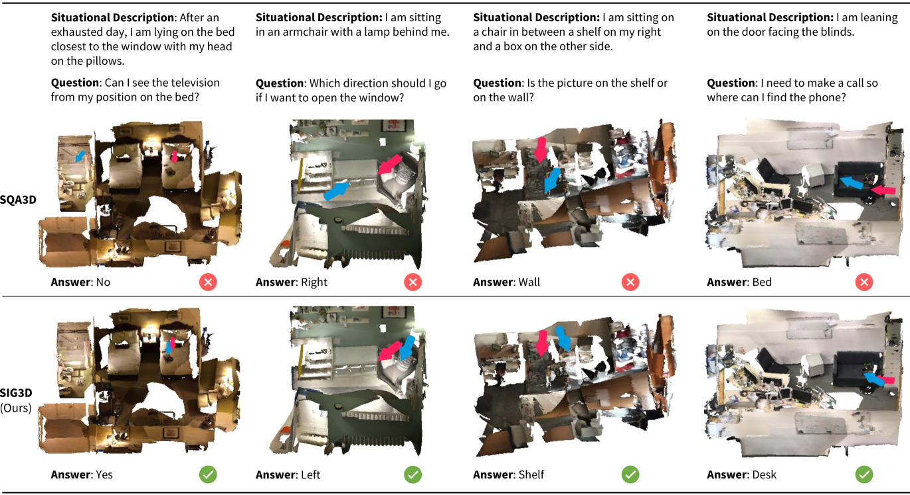
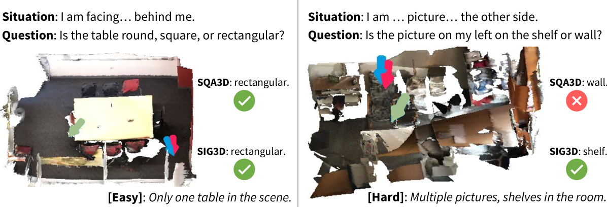
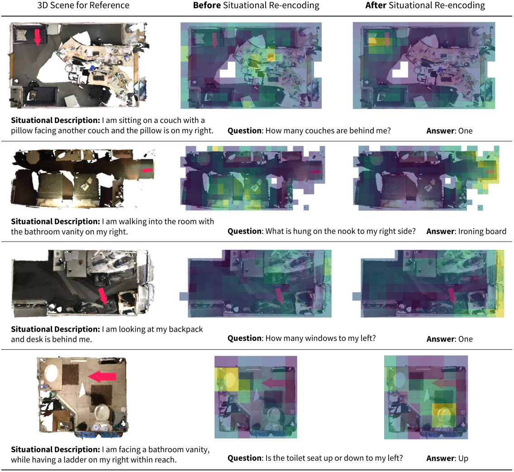
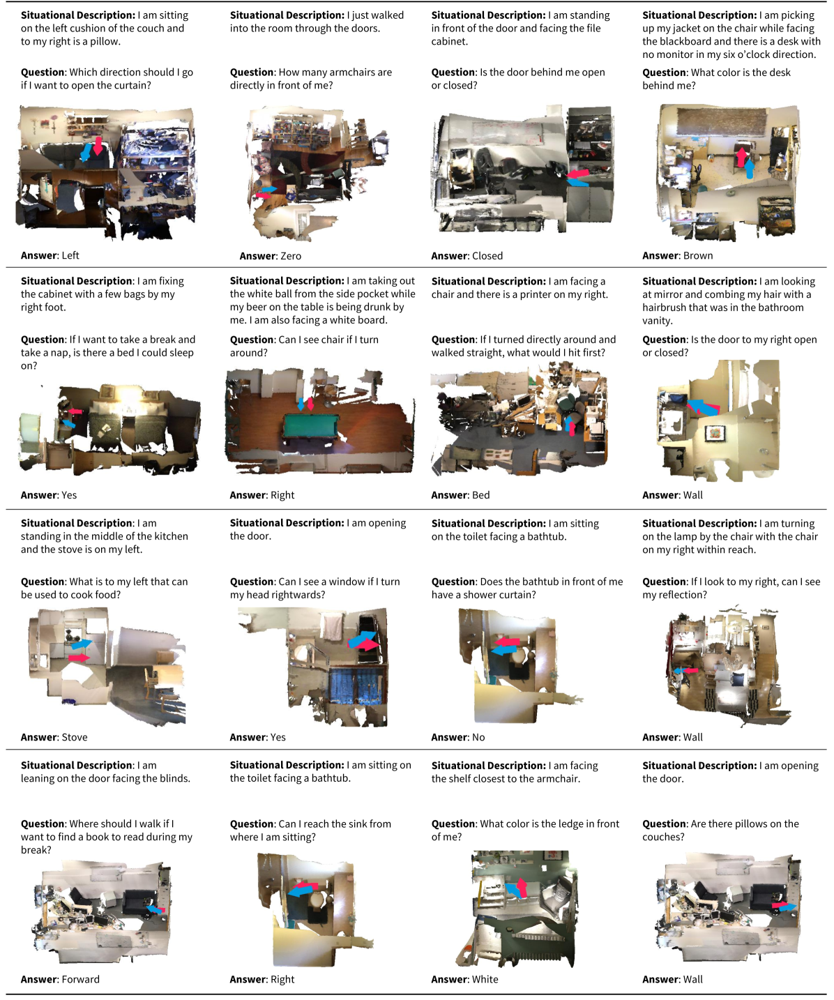
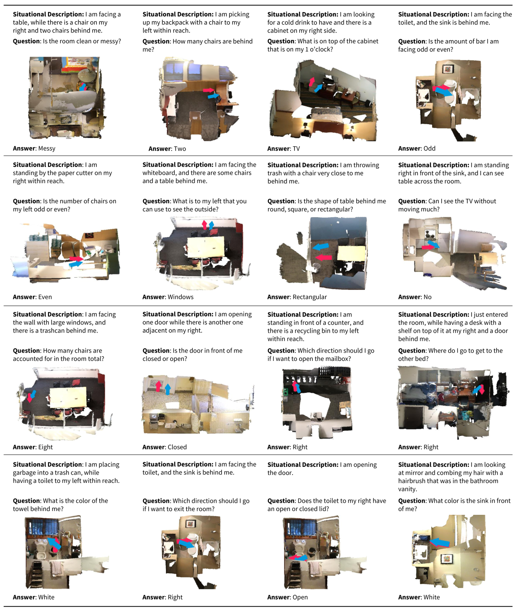
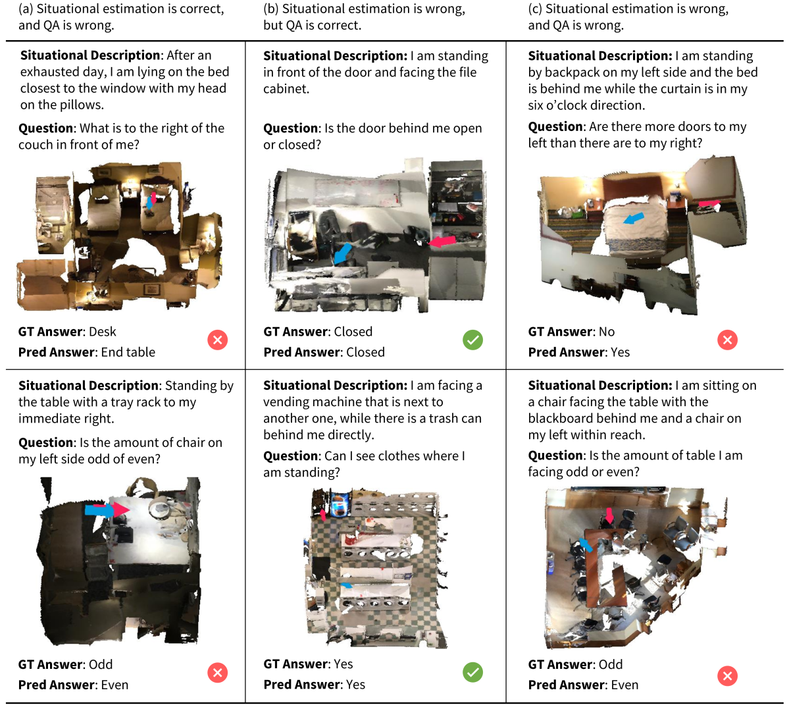

# 在三维视觉语言推理中，情境意识的重要性不容忽视。

发布时间：2024年06月11日

`Agent

这篇论文主要探讨了在3D空间中执行视觉语言推理任务的自主代理（Agent）的开发和性能提升。论文中提到的SIG3D模型是一个端到端的情境基础模型，专门设计用于3D视觉语言推理，这涉及到代理的自主定位和基于情境的开放式问题回答。这些特性与Agent的分类相符，因为它们关注的是具身AI代理在复杂环境中的推理和交互能力。` `机器人技术` `人工智能`

> Situational Awareness Matters in 3D Vision Language Reasoning

# 摘要

> 在3D空间中执行复杂的视觉语言推理任务，是家庭机器人和以人为中心的具身AI发展的重要里程碑。本研究指出，3D视觉语言推理的核心挑战在于情境意识，这涉及两个关键点：一是自主代理需根据语言提示定位自身；二是代理需从其计算的位置出发回答开放式问题。为此，我们开发了SIG3D，一种端到端的情境基础模型，专门用于3D视觉语言推理。该模型将3D场景转化为稀疏体素表示，并配备了一个基于语言的情境估计器及一个基于情境的问题回答模块。实验结果显示，SIG3D在情境估计和问题回答上的表现远超现有技术，情境估计准确性提升了超过30%。进一步的分析不仅验证了我们的设计选择，还揭示了视觉和文本令牌的独特作用，并强调了情境意识在3D问题回答中的关键地位。

> Being able to carry out complicated vision language reasoning tasks in 3D space represents a significant milestone in developing household robots and human-centered embodied AI. In this work, we demonstrate that a critical and distinct challenge in 3D vision language reasoning is situational awareness, which incorporates two key components: (1) The autonomous agent grounds its self-location based on a language prompt. (2) The agent answers open-ended questions from the perspective of its calculated position. To address this challenge, we introduce SIG3D, an end-to-end Situation-Grounded model for 3D vision language reasoning. We tokenize the 3D scene into sparse voxel representation and propose a language-grounded situation estimator, followed by a situated question answering module. Experiments on the SQA3D and ScanQA datasets show that SIG3D outperforms state-of-the-art models in situation estimation and question answering by a large margin (e.g., an enhancement of over 30% on situation estimation accuracy). Subsequent analysis corroborates our architectural design choices, explores the distinct functions of visual and textual tokens, and highlights the importance of situational awareness in the domain of 3D question answering.

[Arxiv](https://arxiv.org/abs/2406.07544)